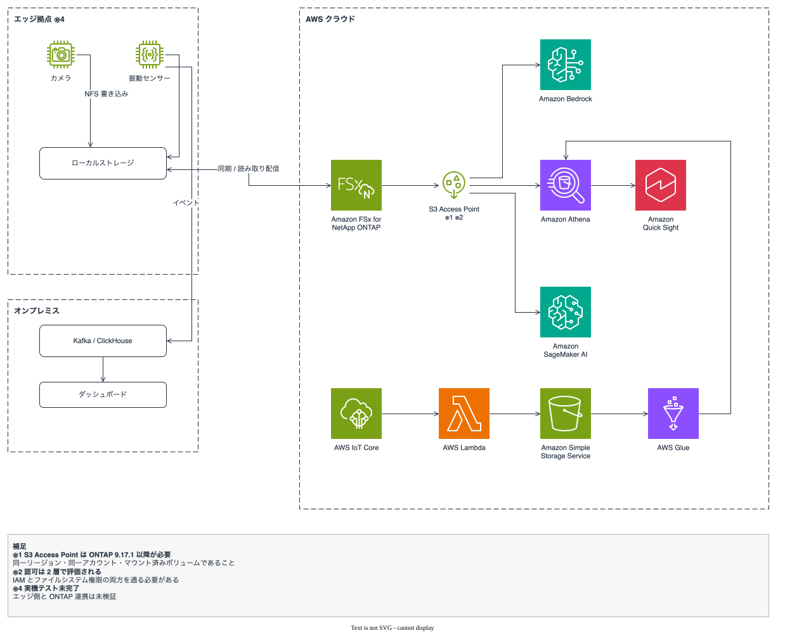

🌐 **日本語** | [English](README_en.md)

# ONTAP Edge-to-Cloud AI

[](https://github.com/Yoshiki0705/ontap-edge-to-cloud-ai/actions/workflows/test.yml)
[](https://opensource.org/licenses/MIT)
[](https://www.python.org/downloads/)
[](https://scorecard.dev/viewer/?uri=github.com/Yoshiki0705/ontap-edge-to-cloud-ai)

**TL;DR**: 工場や拠点の IoT デバイスが生成するデータを 1 か所に集約し、Kafka / ClickHouse で
分析し、AWS の AI サービスにつなぐ構成の**設計と、デプロイできるコード**を置いています。
ストレージ層は FSx for ONTAP を例にしていますが、S3 / EFS を使う場合の差分も併記しています。

## 何が入っているか

各行の成熟度は 3 段階。**実装あり** = このリポジトリにデプロイできるコードがある。
**設計のみ** = 設計は書いたがコードはない。**概念** = 構成案のみ。

| 領域 | 内容 | 成熟度 | 場所 |
|------|------|--------|------|
| エッジ収集 | カメラ撮影、センサー読み取り、Kafka publish、切断時のローカルバッファと復旧後リプレイ | 実装あり | [`edge/raspberry-pi/`](edge/raspberry-pi/) |
| イベントスキーマ | Kafka / ClickHouse / Databricks で共通に使う v3 スキーマ | 実装あり | [`edge/raspberry-pi/common/event_schema.py`](edge/raspberry-pi/common/event_schema.py) |
| ONTAP テレメトリ収集 | REST API のポーリングで性能・容量・健全性を取得 | 実装あり（実機未検証） | [`edge/raspberry-pi/sensors/ontap_telemetry.py`](edge/raspberry-pi/sensors/ontap_telemetry.py) |
| 2 段階 AI 画像分析 | 安価なモデルでスクリーニングし、疑いのみ高精度モデルへ | 実装あり | [`cloud/ai/image_analyzer/`](cloud/ai/image_analyzer/) |
| フィードバック記録 | AI 判定に対する人手ラベルの記録 | 実装あり | [`cloud/ai/feedback_recorder/`](cloud/ai/feedback_recorder/) |
| MQTT 取り込み | IoT Core → Lambda → S3 Access Point | 実装あり | [`cloud/iot_ingestion/`](cloud/iot_ingestion/) |
| 共有基盤 (CFn) | S3 / Kinesis / IAM / Glue / SNS | 実装あり | [`cloud/ingestion/template.yaml`](cloud/ingestion/template.yaml) |
| FSx for ONTAP (CFn) | ファイルシステム、SVM、ボリューム | 実装あり | [`cloud/fsxn/`](cloud/fsxn/) |
| ClickHouse スキーマ | Kafka engine テーブル、マテリアライズドビュー、ロールアップ、dead letter | 実装あり | [`cloud/clickhouse/ddl/`](cloud/clickhouse/ddl/) |
| ユースケース: 3D プリント品質監視 | テンプレート + Lambda + Athena クエリ + ONTAP セットアップ | 実装あり | [`usecases/3d-print-quality/`](usecases/3d-print-quality/) |
| ユースケース: 外観検査 | 上記のプロンプト差し替え派生 | 実装あり | [`usecases/visual-inspection/`](usecases/visual-inspection/) |
| ユースケース: ONTAP テレメトリ分析 | Glue クローラ + Athena クエリ | 実装あり | [`usecases/ontap-telemetry-analytics/`](usecases/ontap-telemetry-analytics/) |
| ローカルデモ | 物理機材なしでイベント経路を通す | 実装あり | [`local-demo/`](local-demo/) |
| Kafka / ClickHouse の配置 | トポロジーとトピック設計。IaC はない | 設計のみ | [kafka-integration](docs/ja/kafka-integration.md) |
| Databricks 連携 | 接続パス 4 種と Unity Catalog 設計 | 設計のみ | [databricks-integration](docs/ja/databricks-integration.md) |
| FlexCache / SnapMirror | エッジ書き込み経路と読み取り配信 | 設計のみ | [iot-greengrass-flexcache-integration](docs/ja/iot-greengrass-flexcache-integration.md) |
| Greengrass カスタム S3 クライアント | S3 Access Point への直接 PutObject | 設計のみ（手順あり） | [demo-guide-02](docs/demo-guides/demo-guide-02-greengrass-s3ap-client.md) |

設計として並べたパターンは [AWS パターンカタログ](docs/ja/aws-patterns/README.md) に 9 本あります
（成熟度ラベルと選び方付き）。実機での検証状況は
[このリポジトリについて](#このリポジトリについて) にまとめています。

## アーキテクチャ



図 1: 全体アーキテクチャ（[.drawio](docs/diagrams/architecture-overview.drawio) / [English](docs/images/architecture-overview-en.svg)）

**データの流れ:**
- **ペイロード** (画像、CSV、ログ): エッジ → NFS → ONTAP (保存)
- **イベント** (メタデータ): エッジ → Kafka → ClickHouse (分析)
- **AI 分析**: ONTAP → S3 AP → Bedrock / Lambda (品質判定)
- **バックアップ**: ClickHouse → ONTAP S3 (S3 互換ストレージ)

## 解決したい課題

工場や拠点では、IoT デバイス（カメラ、センサー、制御 PC 等）がデータを日々生成しています。
しかし多くの場合、これらのデータはデバイスごと・拠点ごとに分散し、サイロ化しています。

**よくある状況:**
- カメラの画像はプリンター内蔵クラウドに、センサーデータは Pi の SD カードに、設備ログは Windows PC にバラバラに保存
- 拠点 A と拠点 B のデータを横断して分析する手段がない
- 個別のデバイスデータは見えるが、全体像（相関分析、トレンド）が把握できない
- AI で分析したいが、データが散在していてパイプラインが組めない

さらに、エッジ / オンプレミス側には:
- データを横断的に分析するための基盤やツールが十分に整備されていない
- 組織横断でデータを統制・活用するための仕組み（ガバナンス、カタログ、アクセス制御）をゼロから構築する必要がある
- 分析基盤の構築自体に時間とコストがかかり、データ活用に着手できない

## このプロジェクトのアプローチ

分散した IoT データをストレージ層に集約し、Kafka + ClickHouse で分析、AWS の AI サービスで
画像判定を行うハイブリッドパイプラインです。

**データフロー:**
1. エッジデバイスは NFS でストレージに書き込む（ペイロード: 画像、CSV）
2. 同時に Kafka に構造化イベントを publish（メタデータ: いつ、どこで、何を）
3. ClickHouse が Kafka から取り込み、ダッシュボードと異常検知を提供
4. Amazon Bedrock (Lambda) が画像を分析し、品質判定を返す
5. Databricks が curated データセットを管理し、AI 学習データを生成

**Before → After:**

| | Before | After |
|---|--------|-------|
| データ | デバイスごとにサイロ化 | 集約され、Kafka で流通 |
| 分析 | 手段がない（ツールから構築が必要） | ClickHouse でダッシュボード表示 |
| 異常検知 | 人による目視（無人時は不可） | AI が自動検出・アラート（目標: 検知まで 60 秒以内。実機未計測） |
| 横断分析 | 不可能 | Databricks で全拠点の品質トレンドを統合 |

### 対象読者

- **IoT / エッジ開発者**: デバイスが生成するデータの集約・活用方法を探している方
- **データ活用推進者**: 分散したデータのサイロ化を解消し、組織横断で分析したい方
- **既存 ONTAP ユーザー**: ONTAP を IoT データの集約先として活用したい方
- **AWS ユーザー**: S3 以外のストレージソースから Athena / Bedrock / SageMaker を使いたい方

### ストレージ層の選択肢

コアのパターン（エッジ収集 → 集約 → AI 分析）は、集約先を変えても成立します。

| ストレージ | データフロー | 特徴 | 制約 |
|-----------|------------|------|------|
| **S3 直接** | エッジ → S3 → Athena/Bedrock | 最もシンプル。セットアップが容易。AWS ネイティブ統合。S3 Object Lock で改ざん防止。CloudFront でエッジキャッシュ配信可能 | NFS/SMB アクセス不可。既存ファイルワークフローとの統合に別途工夫が必要。イベント駆動は S3 Event Notifications で実現 |
| **EFS** | エッジ → NFS → EFS → Lambda/Bedrock | NFS マウント可能。Linux デバイスと親和性が高い。自動スケール。AWS Backup で保護 | SMB 非対応。S3 API 直接アクセス不可。イベント駆動は Lambda + CloudWatch で構築。リージョン間レプリケーションは EFS Replication で対応 |
| **ONTAP** | エッジ → NFS/SMB → ONTAP → S3 AP → AWS AI | NFS + SMB + S3 を同一データで提供。FPolicy でファイル到着トリガー。SnapMirror で差分同期。FlexCache でリモート拠点へ低遅延配信。ARP/AI でランサムウェア異常検知・自動 Snapshot 保護 | ONTAP 環境が必要。S3 AP は条件付き書き込み非対応で、[他にも制約がある](docs/ja/s3ap-compatibility-matrix.md)。運用に ONTAP の知識が必要 |

**どれを選ぶべきか:**
- データがまだない / 新規構築 → **S3 直接**が最もシンプル
- Linux デバイスから NFS で書きたい / VPC 内で完結 → **EFS**
- 既に ONTAP/NAS にデータがある / NFS+SMB 両方必要 / データコピーを避けたい → **ONTAP**

### エッジデバイス（選択肢）

| デバイス | 接続 | 用途 |
|---------|------|------|
| Raspberry Pi 5 | 有線 LAN (NFS) | カメラ撮影、センサー収集、エッジ推論 |
| USB カメラ (4K) | Pi 経由 | 外観検査、品質監視 |
| CSI カメラ (NoIR V2) | Pi 経由 | 暗所撮影、近赤外線 |
| 3D プリンター | 有線 LAN (SMB) | 印刷データ保存 |
| SORACOM S+ Camera | セルラー (オプション) | 有線 LAN がない現場 |
| SORACOM Air + Pi | セルラー (オプション) | 有線 LAN がない現場の接続 |
| 産業用センサー | Pi GPIO / I2C / SPI | 温湿度、振動、電流 |

### ONTAP プラットフォーム（選択肢）

| プラットフォーム | 配置 | 特徴 |
|----------------|------|------|
| FAS/AFF | オンプレミス | ハードウェアアプライアンス |
| ONTAP Select | オンプレミス / VM | ソフトウェア定義。汎用サーバーや VM 上で動作 |
| FSx for ONTAP | AWS クラウド | フルマネージド。SnapMirror 先、S3 AP 対応（ONTAP 9.17.1 以降） |

## クイックスタート

### 前提条件

- AWS CLI v2 + 認証設定済み
- Python 3.12+
- Bedrock モデルアクセス有効化
- ONTAP 9.13.1+（FPolicy、REST API）。S3 Access Points 利用時は **9.17.1 以降**
  （[出典](https://docs.aws.amazon.com/fsx/latest/ONTAPGuide/access-point-for-fsxn-restrictions-limitations-naming-rules.html)）

### デプロイ

```bash
# AWS インフラ
aws cloudformation deploy \
  --template-file cloud/ingestion/template.yaml \
  --stack-name edge-to-cloud-ai-poc \
  --parameter-overrides Environment=poc \
  --capabilities CAPABILITY_NAMED_IAM \
  --region ap-northeast-1

# エッジデバイス → edge/raspberry-pi/SETUP.md
```

物理機材がなくても [`local-demo/`](local-demo/) でイベント経路を通せます。
手順の全体は [デプロイガイド](docs/ja/deployment-guide.md) にあります。

## ドキュメント

| ドキュメント | 日本語 | English |
|------------|--------|---------|
| **AWS パターンカタログ**（9 パターン） | [aws-patterns](docs/ja/aws-patterns/README.md) | [aws-patterns](docs/en/aws-patterns/README.md) |
| **デプロイメントモデル**（規模・業種別の差分） | [deployment-models](docs/ja/deployment-models/README.md) | [deployment-models](docs/en/deployment-models/README.md) |
| Agentic AI on AWS | [agentic-ai-on-aws](docs/ja/agentic-ai-on-aws.md) | [agentic-ai-on-aws](docs/en/agentic-ai-on-aws.md) |
| Flexible AI Data Layer（将来展望） | [flexible-ai-data-layer](docs/ja/flexible-ai-data-layer.md) | [flexible-ai-data-layer](docs/en/flexible-ai-data-layer.md) |
| デプロイガイド | [deployment-guide](docs/ja/deployment-guide.md) | [deployment-guide](docs/en/deployment-guide.md) |
| S3 AP 互換性と制約 | [s3ap-compatibility-matrix](docs/ja/s3ap-compatibility-matrix.md) | [s3ap-compatibility-matrix](docs/en/s3ap-compatibility-matrix.md) |
| ユースケース調査 | [use-case-research](docs/ja/use-case-research.md) | [use-case-research](docs/en/use-case-research.md) |
| データスキーマ設計 | [data-schema-design](docs/ja/data-schema-design.md) | [data-schema-design](docs/en/data-schema-design.md) |
| Kafka 統合設計 | [kafka-integration](docs/ja/kafka-integration.md) | [kafka-integration](docs/en/kafka-integration.md) |
| Greengrass + FlexCache 連携 | [iot-greengrass-flexcache-integration](docs/ja/iot-greengrass-flexcache-integration.md) | [iot-greengrass-flexcache-integration](docs/en/iot-greengrass-flexcache-integration.md) |
| Databricks 連携 | [databricks-integration](docs/ja/databricks-integration.md) | [databricks-integration](docs/en/databricks-integration.md) |
| セキュリティ設計 | [security-design](docs/ja/security-design.md) | [security-design](docs/en/security-design.md) |
| 運用設計 | [operations-design](docs/ja/operations-design.md) | [operations-design](docs/en/operations-design.md) |
| デモシナリオ | [demo-scenarios](docs/ja/demo-scenarios.md) | [demo-scenarios](docs/en/demo-scenarios.md) |
| FAQ | [faq](docs/ja/faq.md) | [faq](docs/en/faq.md) |

アーキテクチャ図（公式アイコン、日英）: [docs/diagrams/](docs/diagrams/)

デモ手順（英語のみ）: [前提条件](docs/demo-guides/demo-guide-00-prerequisites.md) /
[IoT Core → Lambda → S3 AP](docs/demo-guides/demo-guide-01-iot-core-lambda-s3ap.md) /
[Greengrass → S3 AP クライアント](docs/demo-guides/demo-guide-02-greengrass-s3ap-client.md)

メンテナ向け: [品質ゲート](docs/agent/quality-gates.md) /
[サプライチェーンセキュリティ](docs/agent/supply-chain-security.md) /
[リファレンス doc の品質バー](docs/agent/reference-doc-quality.md) /
[テスト](TESTING.md) / [コントリビューション](CONTRIBUTING.md)

## このリポジトリについて

> **免責事項**: 本プロジェクトは個人の技術検証活動であり、所属組織の公式見解・推奨を示すものでは
> ありません。特定製品の購入を推奨するものでもありません。

### 現在の制約と限界

- **実機テスト未完了**: エッジデバイス（Raspberry Pi、カメラ）が未到着のため、エンドツーエンドの
  実機テストは未実施。クラウド側（Lambda、Bedrock）は動作確認済み
- **AI 精度は合成テストのみ**: プロンプトテストは公開画像と合成画像で実施（9/9 正解）。
  実環境（照明、カメラ角度、フィラメント色）での精度は未検証
- **ONTAP 連携は設計のみ**: FPolicy、SnapMirror、S3 AP の連携コードは実装済みだが、
  実 ONTAP 環境での動作確認は未実施（モックテストのみ）
- **単一デバイス構成**: 複数デバイスの同時運用、スケールアウトは未検証
- **Kafka / ClickHouse は準備中**: マネージドプラットフォームのデプロイ待ち。
  経路の検証は [`local-demo/`](local-demo/) で代替している

### ここまでで学んだこと

- **2 段階 AI 分析でコストを下げられる（試算）**: 全画像を高精度モデルで分析すると月 $259、
  安価なモデルでスクリーニングし異常疑いのみ高精度モデルに回すと月 $40 という**試算**になる。
  前提は 60 秒間隔・24 時間連続・異常率 10%・特定リージョンのモデル料金であり、実測値ではない。
  異常率が下がれば削減幅は小さくなる（[実際の欠陥率での試算](tests/sample_images/README.md)）。
  設計パターン自体は他の AI パイプラインにも応用できる
- **プロンプトだけで産業用画像判定が実用精度に達する**: カスタムモデル学習なしで、
  Claude Vision のプロンプトのみで 3D プリント欠陥を 9/9 正解。ただし実環境での検証はこれから
- **FSx for ONTAP S3 Access Points には制約がある**: 条件付き書き込み非対応、イベント通知非対応の
  ため、Iceberg / Delta Lake の直接書き込みはできず、FPolicy で補完する設計が必要。
  制約の一覧と各項目の根拠は [S3 AP 互換性と制約](docs/ja/s3ap-compatibility-matrix.md) にある
- **ONTAP REST API は IoT テレメトリ収集に使える**: 性能メトリクス、容量、健全性を 1 分間隔で
  取得できる。ポーリングベースだが PoC には足りる

### なぜこれを作ったか

SA / SE として現場を訪問する中で、「IoT デバイスやセンサーのデータが拠点ごと・デバイスごとに
バラバラで、横断的に分析できない」という声を繰り返し聞きました。データ自体は生成されているのに、
サイロ化によって活用できていない状況です。加えて、オンプレ側には分析基盤やガバナンスツールが
整備されておらず、「ツールを作るところから始める必要がある」ことが着手の障壁になっていました。

以下が揃ったことで「集約 → 横断分析」を低コストで組めるようになったと考え、検証を始めました。

- **FSx for ONTAP S3 Access Points**: 集約したデータにデータコピーなしで S3 API アクセス
- **マルチモーダル AI の成熟**: 汎用プロンプトで産業用画像判定が実用精度に到達
- **Raspberry Pi 5 (16GB)**: エッジでの前処理・軽量推論が現実的な性能に

最初の検証対象として **3D プリント品質監視** を選びました（視覚的にわかりやすく、失敗が頻繁に
起きるためテストデータが集まりやすい）。

## 関連プロジェクト

- [fsxn-lakehouse-integrations](https://github.com/Yoshiki0705/fsxn-lakehouse-integrations) — FSx for ONTAP S3 AP × Lakehouse 統合（**Kafka + ClickHouse + Databricks 側の実装はこちら**）
  - 連携の実体: [integrations/manufacturing-data-platform](https://github.com/Yoshiki0705/fsxn-lakehouse-integrations/tree/main/integrations/manufacturing-data-platform) — 製造データプラットフォーム連携
  - 同期ドキュメント: [Edge ↔ Lakehouse 同期](https://github.com/Yoshiki0705/fsxn-lakehouse-integrations/blob/main/integrations/manufacturing-data-platform/docs/ja/14_edge_lakehouse_sync.md) ([English](https://github.com/Yoshiki0705/fsxn-lakehouse-integrations/blob/main/integrations/manufacturing-data-platform/docs/en/14_edge_lakehouse_sync.md)) — スキーマ・トピック・責任分担の同期記録
- [FSx-for-ONTAP-S3AccessPoints-Serverless-Patterns](https://github.com/Yoshiki0705/FSx-for-ONTAP-S3AccessPoints-Serverless-Patterns) — FSx for ONTAP S3 AP サーバーレスパターン集（17 ユースケース）

## ライセンス

MIT
