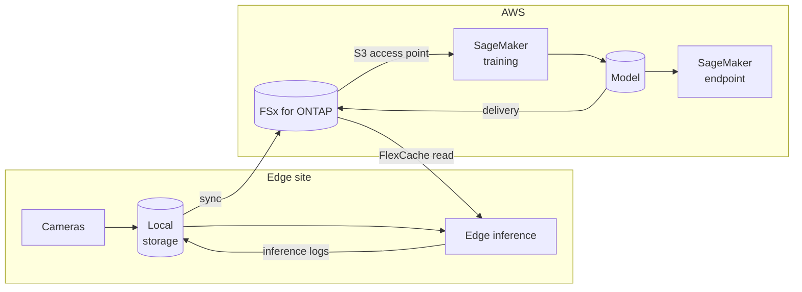

> 🌐 Language: [日本語](../../ja/aws-patterns/02-edge-ai-sagemaker.md) | **English**

# Pattern 02: Edge AI + SageMaker

> **Maturity**: design only / **Last verified**: 2026-08-19

Train your own model on aggregated data and place inference either in the cloud or at the edge.
Worth considering when a foundation model as in [Pattern 01](01-edge-ai-bedrock.md) does not fit on
accuracy, latency or per-call price.

## Implementation status

| Stage of the path | In this repository | Location |
|---|---|---|
| Edge capture → local storage | Implemented | [`edge/raspberry-pi/camera/`](../../../edge/raspberry-pi/camera/) |
| Preparing training data (labelling, splits) | None | — |
| Training on SageMaker | None | — |
| Model placement and inference | None | — |
| Model delivery to the edge | None | — |
| Collecting inference results and retraining | Partial (feedback recording only) | [`cloud/ai/feedback_recorder/`](../../../cloud/ai/feedback_recorder/) |

**There is no SageMaker code in this repository.** This is a design.

## Data flow

1. Several cameras write to local storage
2. Data syncs to the aggregation point
3. SageMaker reads training data through an S3 access point, without making a copy
4. The trained model is written back to a known path at the aggregation point
5. Cloud inference uses an endpoint; edge inference references the model through storage
6. Inference results return and become the next round of training data

## Storage

Storage design is the centre of this pattern. Training is a workload that reads the same data
repeatedly.

| Purpose | How to hold it | Why |
|---|---|---|
| Raw data | Consolidated in file storage | Cutting a dataset version does not require a copy |
| Training dataset | References to raw data plus a manifest | Duplicating bytes makes capacity grow linearly with versions |
| Model artefacts | A dedicated path at the aggregation point | Keeps one delivery route |
| Inference logs | Stored apart from raw data | They are handled differently as retraining input |

**Model delivery to the edge** has two shapes.

- **Push**: a distribution mechanism sends the model to the device; a copy accumulates per device
- **Reference**: the device reads the model through edge storage; one copy exists, in storage

Combined with block-granularity caching, the reference shape can be expected to transfer only the
ranges actually read. How much that is depends on how the inference runtime reads the model, and it
is **not measured in this configuration**.

## AI workflow

Four axes decide between a foundation model and your own. Not which is better — which suits which
conditions.

| Axis | Foundation model (Pattern 01) suits | Own model (this pattern) suits |
|---|---|---|
| Training data | Little, or unlabelled | Labelled data has accumulated |
| Nature of the judgement | A written explanation is wanted; subjects vary | Classes are fixed and the boundary is subtle |
| Latency | Seconds are enough | Milliseconds needed, or offline required |
| Cost shape | Per-call price is acceptable | Calls are frequent and fixed cost beats per-call |

Training and inference placement are separable decisions. Training in the cloud with inference at the
edge is the typical combination here. For inference spanning on-premises storage and the cloud,
[AWS publishes a worked configuration](https://aws.amazon.com/blogs/storage/hybrid-ml-inferencing-on-amazon-eks-with-amazon-fsx-for-netapp-ontap-and-on-premises-netapp/).

## Security

- **Scope of training data exposure.** Reading through an S3 access point keeps the bytes in file
  storage. Who can read what is set by both IAM and file system permissions
  ([two-layer authorization](../s3ap-compatibility-matrix.md))
- **Protecting model artefacts.** A model carries information about its training data; classify it
  the same way as the raw data
- **Model tampering at the edge.** With the reference shape, storage permissions can make it
  read-only
- **What appears in inference logs.** Retaining images versus only features changes the
  classification

## What drives cost

| Driver | How it acts |
|---|---|
| Training frequency and scale | Training instance hours, set by epochs and parallelism rather than data volume |
| How training data is held | Duplicated bytes grow with version count; references do not |
| Inference placement | A cloud endpoint runs continuously; edge inference is device-side fixed cost |
| Model delivery shape | Push transfers device count × model size; reference transfers only what is read |
| Data transfer | Moving training data across Regions adds transfer cost |

## Assumptions and constraints

- **There is no implementation here.** Read it as a design
- **SageMaker reading training data through an S3 access point is in the AWS list of supported
  services** ([source](https://docs.aws.amazon.com/fsx/latest/ONTAPGuide/using-access-points-with-aws-services.html)),
  but the S3 AP constraints — no conditional writes, no event notifications — shape how the
  training pipeline can be assembled
- **The edge inference runtime is a separate decision.** For running it as a Greengrass component,
  see [Pattern 09](09-edge-agentic-ai.md)
- **Model delivery cache efficiency is not measured.** "Only the ranges read are transferred" is an
  expectation from how the mechanism works, not a measurement in this configuration
- **Some SageMaker features are closed to new customers.** Before designing in labelling or model
  monitoring, check the status of the specific feature
  ([service availability](../../agent/service-lifecycle_en.md))

## References

- [Hybrid ML inferencing on Amazon EKS with FSx for ONTAP and on-premises NetApp](https://aws.amazon.com/blogs/storage/hybrid-ml-inferencing-on-amazon-eks-with-amazon-fsx-for-netapp-ontap-and-on-premises-netapp/)
- [Hybrid patterns for deployment (AWS whitepaper)](https://docs.aws.amazon.com/whitepapers/latest/hybrid-machine-learning/hybrid-patterns-for-deployment.html)
- [Using access points with AWS services](https://docs.aws.amazon.com/fsx/latest/ONTAPGuide/using-access-points-with-aws-services.html)
- Related: [Pattern 01](01-edge-ai-bedrock.md) (starting with a foundation model) /
  [Pattern 09](09-edge-agentic-ai.md) (the edge runtime)
