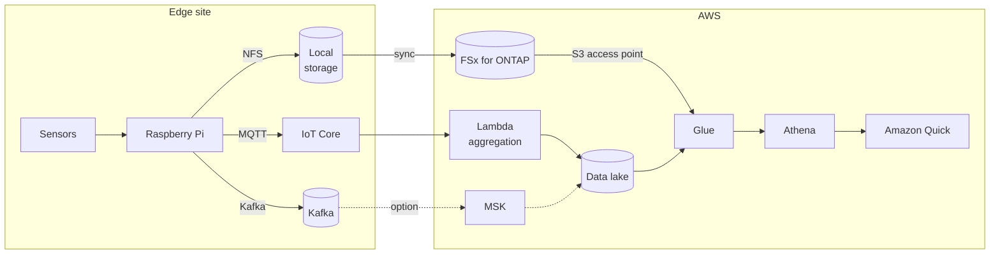

> 🌐 Language: [日本語](../../ja/aws-patterns/03-industrial-iot-analytics.md) | **English**

# Pattern 03: Industrial IoT analytics

> **Maturity**: implemented (partly) / **Last verified**: 2026-08-19

Time-series data from sensors flows onto an event bus, lands in a data lake, and is queried with
SQL. Suited to analysis of the "store first, ask questions later" shape.

## Implementation status

| Stage of the path | In this repository | Location |
|---|---|---|
| Sensor reads → event construction | Implemented | [`edge/raspberry-pi/sensors/`](../../../edge/raspberry-pi/sensors/) |
| Publishing to Kafka (with buffering while disconnected) | Implemented | [`edge/raspberry-pi/common/`](../../../edge/raspberry-pi/common/) |
| MQTT ingestion | Implemented | [`cloud/iot_ingestion/`](../../../cloud/iot_ingestion/) |
| Data lake foundation (S3 / Kinesis / Glue / SNS) | Implemented | [`cloud/ingestion/template.yaml`](../../../cloud/ingestion/template.yaml) |
| Glue crawler and Athena queries | Implemented | [`usecases/ontap-telemetry-analytics/`](../../../usecases/ontap-telemetry-analytics/) |
| Building MSK | None (Kafka assumed on an on-premises VM) | [kafka-integration](../kafka-integration.md) |
| Ingesting as Iceberg tables | None | See "Choosing the ingestion route" below |

## Data flow

1. Sensor values are read and structured as events
2. Low-frequency, small telemetry goes over MQTT; high-frequency or bulk data such as waveforms
   goes to Kafka
3. Lambda aggregates and writes to the data lake. Writing one object per event inflates object
   count, so batch by time window
4. Large payloads (waveforms, images) stay in file storage; the event carries only a reference
5. Glue derives the schema and Athena answers SQL
6. Visualization with Amazon Quick (available in ap-northeast-1)

## Storage

**Separate events from payloads.** Events are small and numerous; payloads are large and few.
Holding them the same way makes one of them inefficient.

| Kind | How to hold it | Partitioning |
|---|---|---|
| Events (metadata) | Batched into a columnar format | Time plus device ID |
| Payloads (waveforms, images) | File storage | Device ID then time hierarchy |
| Aggregates | A separate table | Matched to the analysis grain |

Changing the partition design later is expensive. Details are in the
[data schema design](../data-schema-design.md).

### Choosing the ingestion route

There are several ways to land Kafka events in a data lake. Stated symmetrically.

| Route | Suits | Trade-off |
|---|---|---|
| Aggregate and write in Lambda | You want to own the transform logic; one consumer | Batching window, retry and deduplication are hand-written |
| MSK Express brokers streaming tables | You want the Kafka topic materialised as an Iceberg table | Requires Kafka to be MSK; fixes the table format to Iceberg |
| Insert a stream processing engine | Aggregation or joins belong in the stream | One more thing to operate |

MSK Express brokers write records from a Kafka topic as Parquet and commit them to the table
([source](https://docs.aws.amazon.com/AmazonS3/latest/userguide/s3-tables-streaming-msk.html)),
which removes a separately operated connector pipeline.

## AI workflow

This pattern is the analytics foundation itself. AI enters in two ways.

- **Training from accumulated data**: aggregates built in Athena become training data
  ([Pattern 02](02-edge-ai-sagemaker.md))
- **Anomaly detection**: detecting anomalies in the time series. For equipment condition monitoring,
  a managed anomaly detection built for industrial equipment is an option — but some predictive
  maintenance services have been sunset, so check availability first
  ([service availability](../../agent/service-lifecycle_en.md))

## Security

- **Do not trust device-supplied identifiers.** Device IDs and MQTT topic levels are chosen by the
  publisher. Validate before they reach a path, an S3 key or a SQL statement. The implementation is
  [`cloud/iot_ingestion/identifiers.py`](../../../cloud/iot_ingestion/identifiers.py)
- **Do not maintain catalog and data permissions twice.** Lake Formation table permissions have been
  extended to cover access to the underlying S3 data ([security design](../security-design.md))
- **Device authentication.** Certificate-based, revocable per device
- **The boundary with the OT network.** Keep the sensor-side network separate from the path to the
  cloud

## What drives cost

| Driver | How it acts |
|---|---|
| Size of each write | Many small objects make request count and metadata overhead dominant |
| Bytes scanned | Athena bills scanned bytes; partitioning and a columnar format lower it |
| Retention and tiering | Whether ageing data moves to a cheaper tier |
| How Kafka is held | Self-operated is fixed cost; managed is a monthly charge sized to the configuration |
| Where the transform runs | Lambda invocations, or stream processing engine hours |

## Assumptions and constraints

- **There is no MSK IaC in this repository.** Kafka is written up assuming an on-premises VM
  ([kafka-integration](../kafka-integration.md))
- **Whether Data Firehose accepts an S3 access point is unverified**
  ([§4](../s3ap-compatibility-matrix.md)). A design that assumes Firehose's managed Parquet
  conversion and buffering may not be available on this route
- **The IoT Core S3 action is likewise unverified.** This repository routes through Lambda
- **Where an existing system only speaks SFTP**, AWS Transfer Family can write into file storage
  ([source](https://docs.aws.amazon.com/en_us/transfer/latest/userguide/fsx-s3-access-points.html))
- **ListObjectsV2 is slower** through an S3 access point than on native S3. The multiplier is not
  measured in this configuration

## References

- [Streaming tables with Amazon MSK](https://docs.aws.amazon.com/AmazonS3/latest/userguide/s3-tables-streaming-msk.html)
- [Query files with SQL using Amazon Athena (FSx for ONTAP)](https://docs.aws.amazon.com/fsx/latest/ONTAPGuide/tutorial-query-data-with-athena.html)
- [Access your FSx for ONTAP file systems with Transfer Family](https://docs.aws.amazon.com/en_us/transfer/latest/userguide/fsx-s3-access-points.html)
- Related: [Pattern 04](04-near-realtime-manufacturing.md) (latency in seconds) /
  [Pattern 08](08-unified-namespace.md) (starting from the OT namespace)
