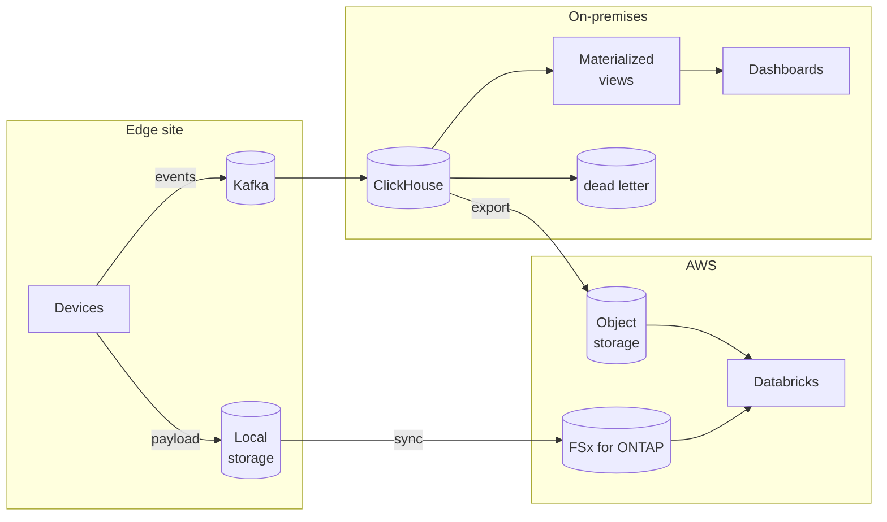

> 🌐 Language: [日本語](../../ja/aws-patterns/04-near-realtime-manufacturing.md) | **English**

# Pattern 04: Near real-time manufacturing analytics

> **Maturity**: implemented (partly) / **Last verified**: 2026-08-19

Ingest straight from the event bus into a columnar database and keep dashboard latency in seconds.
Used where the data lake route in [Pattern 03](03-industrial-iot-analytics.md) is not fast enough.

## Implementation status

| Stage of the path | In this repository | Location |
|---|---|---|
| Publishing to Kafka | Implemented | [`edge/raspberry-pi/common/`](../../../edge/raspberry-pi/common/) |
| ClickHouse ingestion tables (Kafka engine) | Implemented | [`cloud/clickhouse/ddl/`](../../../cloud/clickhouse/ddl/) |
| Materialized views and rollups | Implemented | Same |
| Anomaly events and dead letter | Implemented | Same |
| Dashboard definitions | Implemented | [`cloud/clickhouse/grafana/`](../../../cloud/clickhouse/grafana/) |
| Building ClickHouse / Kafka | None (assumed on an on-premises VM) | [kafka-integration](../kafka-integration.md) |
| Handover to Databricks | None | [databricks-integration](../databricks-integration.md) |

To exercise the path with no physical hardware, use [`local-demo/`](../../../local-demo/).

## Data flow

1. Devices publish events to Kafka
2. ClickHouse ingests through a Kafka engine table
3. Materialized views maintain the aggregates that dashboards read
4. Messages that fail to parse land in a dead letter table rather than stopping ingestion
5. Aggregated features export on a schedule to the curation layer
6. Large payloads stay on the file storage side and are joined by reference

## Storage

In this pattern **the same data exists in three places in three shapes.** The point is not to blur
their roles.

| Place | What it holds | How to think about retention |
|---|---|---|
| Kafka | Recent events, for reprocessing | Retention is set by how far back you want to replay. Not a durable store |
| ClickHouse | Raw events and aggregates for analysis | Raw short, aggregates long; rollups reduce grain |
| Object / file storage | Long-term retention and payloads | This is the source of truth |

**Not making ClickHouse the source of truth** is the decision that matters. Treat the columnar
database as a read-optimised replica for analysis, and keep it in a state where losing it means
rebuilding rather than losing data.

## AI workflow

This pattern serves the shaping of data handed to AI more than AI itself.

- **Feature generation**: aggregates built by rollups become features for training
- **Combining with immediate verdicts**: feed the image verdicts from
  [Pattern 01](01-edge-ai-bedrock.md) in as events and correlate them with sensor values
- **Curation layer**: a layered structure such as bronze, silver and gold separates raw data from
  training data ([databricks-integration](../databricks-integration.md))

### Choosing between this and Iceberg tables

Instead of loading a Kafka topic into a columnar database, it can be materialised as an Iceberg
table. Stated symmetrically.

| Aspect | Ingest into ClickHouse | Materialise as an Iceberg table |
|---|---|---|
| Suits | Second-scale dashboards, frequent aggregate queries | Analysis from several engines, long-term retention |
| Operations | One more database to run | Table format is fixed to Iceberg |
| Latency | Short from ingest to aggregate | Depends on the commit interval |
| Readers | ClickHouse clients | Any Iceberg-capable engine |

Having both is viable: the columnar database for dashboards, Iceberg for cross-cutting analysis.

## Security

- **Exposure of the on-premises database.** If the cloud reads ClickHouse directly, decide between a
  private path and going through an export
- **Permissions on the export target.** What the curation layer reads is a separate permission
  design from the raw data
- **Contents of the dead letter table.** Messages that failed to parse contain unexpected values;
  decide how they are handled before logging them
- **Per-topic authorization in Kafka.** Bound what each consumer can read at the topic level

## What drives cost

| Driver | How it acts |
|---|---|
| ClickHouse retention | Directly sets disk. Rollups let raw retention be short |
| Kafka retention | Also disk. Set by the replay requirement |
| Export frequency | Transfer volume and object count; batching lowers both |
| Curation layer compute | Cluster hours, adjusted by batch interval |
| Holding data three times | This design keeps the same data in three places, so decide up front which one is short |

## Assumptions and constraints

- **Building ClickHouse and Kafka is out of scope here.** Both are designed assuming an on-premises
  VM
- **Whether an S3 access point can be registered as a Unity Catalog external location is
  unverified.** This document previously stated it was impossible; the claim was withdrawn because
  no source for the mechanism could be found
  ([databricks-integration](../databricks-integration.md)). That verdict decides between reading
  from file storage directly and going through an export
- **ClickHouse scheduled execution differs by deployment shape.** Before building a scheduled
  export, confirm scheduling is available in the configuration you run
- **Second-scale latency is not measured.** "Keep latency in seconds" is a design goal, not a
  measurement in this configuration

## References

- [databricks-integration](../databricks-integration.md) — connection paths and Unity Catalog design
- [kafka-integration](../kafka-integration.md) — topology and topic design
- [Streaming tables with Amazon MSK](https://docs.aws.amazon.com/AmazonS3/latest/userguide/s3-tables-streaming-msk.html)
- Related: [Pattern 03](03-industrial-iot-analytics.md) (batch-leaning analysis) /
  [Flexible AI Data Layer](../flexible-ai-data-layer.md) (table formats and catalog interoperability)
