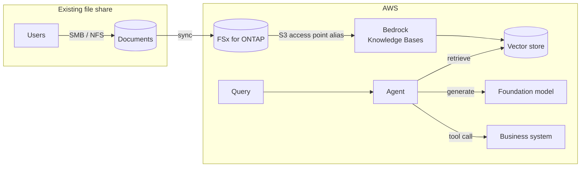

> 🌐 Language: [日本語](../../ja/aws-patterns/05-agentic-rag.md) | **English**

# Pattern 05: Agentic RAG

> **Maturity**: design only (official walkthrough exists) / **Last verified**: 2026-08-19

Make documents that already sit on a file share available to generative AI without copying them.
The subject is existing assets: drawings, work instructions, inspection reports.

## Implementation status

| Stage of the path | In this repository | Location |
|---|---|---|
| Consolidating documents into file storage | None | — |
| Creating the S3 access point | Partial (the FSx template exists) | [`cloud/fsxn/`](../../../cloud/fsxn/) |
| Creating and syncing the knowledge base | None | See the official walkthrough below |
| Retrieval and model invocation | None | — |
| Multi-step retrieval by an agent | None | [Agentic AI on AWS](../agentic-ai-on-aws.md) |

**There is no implementation here.** But **AWS publishes an official walkthrough** (below), which is
why the label is "design only" rather than "concept".

## Data flow

Drawn with the official icons: [SVG](../../images/pattern-05-agentic-rag-en.svg) (source [pattern-05-agentic-rag-en.drawio](../../diagrams/pattern-05-agentic-rag-en.drawio), regenerated as described in [docs/diagrams/](../../diagrams/))

1. Documents already live on a file share, and users keep using it over SMB or NFS
2. Data syncs to the aggregation point, or the aggregation point serves as the share directly
3. The S3 access point alias is given as the knowledge base data source. Knowledge Bases accepts the
   alias in place of a bucket name
4. Ingestion chunks and embeds the content into a vector store
5. A query retrieves, and the model answers grounded in what was retrieved
6. Where multiple steps are needed, an agent alternates retrieval and tool calls

**A single retrieval and multi-step agentic retrieval are different things.** The former suits
questions one search answers; the latter suits questions where deciding what to look up comes first.

## Storage

| Subject | How to hold it | Note |
|---|---|---|
| Original documents | Left on the file share | Not making a copy is the point of this pattern |
| Vector representations | Vector store | A separate lifecycle from the originals; decide what happens when an original is deleted |
| Intermediate chunks | Handled by the ingestion process | Whether they persist is a knowledge base setting |
| Access records | Stored separately | Needed to trace which document grounded which answer |

Handle **vectors surviving a deleted original** in the design. Decide the route and interval by
which a deletion reaches search results.

## AI workflow

- **Chunk granularity** determines answer quality more than anything else. Documents containing
  drawings or tables can lose meaning under prose-oriented splitting
- **Showing the grounding.** Without which document and where in it, a user cannot verify the answer
- **Retrieval scope by permission.** Letting every document be searched unconditionally mixes
  information the user should not see into answers. This is the largest design trap here
- **If it becomes an agent**, memory across turns and tool connections need designing. The building
  blocks and the decisions are in [Agentic AI on AWS](../agentic-ai-on-aws.md)

## Security

**The asymmetry of permissions deserves the most attention in this pattern.**

On a file share, different users see different documents. If a knowledge base ingests every document
under one identity, retrieval loses that distinction, and content from documents a user cannot
access may appear in an answer.

Three directions address it, each with a trade-off.

| Direction | Effect | Trade-off |
|---|---|---|
| One knowledge base per permission boundary | The boundary is explicit | Operationally heavy as the count grows; documents in several boundaries are duplicated |
| Post-filter the retrieval results | A single knowledge base suffices | Depends on the filter being correct; the embeddings are still built from every document |
| Restrict ingestion to documents that can be shared | Simplest and safest | Narrows the scope |

Beyond that, S3 access point authorization is evaluated in two layers, IAM and file system
permissions ([source](../s3ap-compatibility-matrix.md)). For a configuration with Active Directory
integration,
[AWS publishes the procedure](https://aws.amazon.com/blogs/storage/enabling-ai-powered-analytics-on-enterprise-file-data-configuring-s3-access-points-for-amazon-fsx-for-netapp-ontap-with-active-directory/).

## What drives cost

| Driver | How it acts |
|---|---|
| Volume of documents ingested | Number of embeddings generated; the first sync is the largest |
| Re-sync frequency | Changes with whether only the delta can be ingested |
| Vector store shape | Differs between a continuously running configuration and usage-based |
| Query count and input size | Retrieved chunks are billed as input tokens |
| Chunk size | Larger raises input per call; smaller raises the number of retrievals |

## Assumptions and constraints

- **AWS publishes an official walkthrough**:
  [Build a RAG application using Amazon Bedrock Knowledge Bases](https://docs.aws.amazon.com/fsx/latest/ONTAPGuide/tutorial-build-rag-with-bedrock.html).
  The data source is the S3 access point alias
- **The documentation disagrees with itself.** The Bedrock-side data source page states that only
  general purpose S3 buckets are supported, while the FSx for ONTAP guide gives the alias-based
  procedure ([Bedrock side](https://docs.aws.amazon.com/bedrock/latest/userguide/s3-data-source-connector.html)).
  Follow the FSx for ONTAP guide when building
- **S3 access points do not support event notifications.** A route that detects an added document and
  re-syncs automatically cannot be built as-is; use scheduled sync or FPolicy
- **ONTAP 9.17.1 or later, the same Region and the same account are required**
  ([constraint list](../s3ap-compatibility-matrix.md))
- **ListObjectsV2 latency** affects the crawl during ingestion, and is not measured in this
  configuration

## References

- [Build a RAG application using Amazon Bedrock Knowledge Bases](https://docs.aws.amazon.com/fsx/latest/ONTAPGuide/tutorial-build-rag-with-bedrock.html)
- [Configuring S3 Access Points for FSx for ONTAP with Active Directory](https://aws.amazon.com/blogs/storage/enabling-ai-powered-analytics-on-enterprise-file-data-configuring-s3-access-points-for-amazon-fsx-for-netapp-ontap-with-active-directory/)
- [Connect a data source to your knowledge base](https://docs.aws.amazon.com/bedrock/latest/userguide/data-source-connectors.html)
- Related: [Agentic AI on AWS](../agentic-ai-on-aws.md) /
  [Pattern 06](06-video-analytics.md) (making video searchable)
