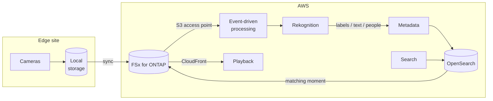

> 🌐 Language: [日本語](../../ja/aws-patterns/06-video-analytics.md) | **English**

# Pattern 06: Video analytics

> **Maturity**: design only / **Last verified**: 2026-08-19

Extract metadata from camera footage with image recognition and index it in a search engine so that
material can be found later. Where [Pattern 01](01-edge-ai-bedrock.md) judges the frame in front of
it, this one finds the relevant moment in accumulated footage.

## Implementation status

| Stage of the path | In this repository | Location |
|---|---|---|
| Camera capture → local storage | Implemented (still images) | [`edge/raspberry-pi/camera/`](../../../edge/raspberry-pi/camera/) |
| Storing and segmenting video | None | — |
| Metadata extraction by image and video recognition | None | — |
| Indexing into a search engine | None | — |
| Search interface | None | — |
| Video delivery | None | See "delivery" below |

**There is no implementation here.** Capture and storage of still images is what exists.

## Data flow

1. Cameras write video or still images to local storage
2. Data syncs to the aggregation point
3. Recognition runs against new files
4. Labels, detected text and time positions are extracted as metadata
5. Metadata is indexed in the search engine. **The video itself is not indexed**
6. A hit in the metadata points back to the moment in the original footage
7. Playback goes through content delivery

**The design point is not indexing the heavy thing.** The search target is metadata; the video stays
where it is, as the referent.

## Storage

| Subject | How to hold it | Why |
|---|---|---|
| Original video | File storage | Large, and rarely read after writing. Capacity billing suits it |
| Extracted metadata | Search engine plus a durable copy | Do not make the search engine the source of truth |
| Thumbnails | A separate path | Read often in listings; a different access profile from the original |
| Transcoded for delivery | A separate path if needed | Not mixed with the original |

Video access frequency drops over time. Design tiering from the start.

## AI workflow

What you extract changes the design.

| Extracted | Used for | Note |
|---|---|---|
| Labels (objects, scenes) | Searching by what appears | Set a confidence threshold; too low and false positives enter the index |
| Detected text | Reading labels, signs, dockets | Accuracy varies with orientation and lighting |
| People and faces | Tracking, access control | **Check regulation and internal policy first.** Do not proceed on a technical decision alone |
| Time position | Jumping to the moment inside footage | The metadata has to carry the position |

For **semantic search** — natural-language queries such as "a person in a red shirt" — the
configuration converts extracted metadata into embeddings and searches those. AWS
[publishes a worked example](https://aws.amazon.com/blogs/machine-learning/semantic-image-search-for-articles-using-amazon-rekognition-amazon-sagemaker-foundation-models-and-amazon-opensearch-service/).

## Security

- **Footage containing people is handled differently.** Before designing in face or person
  detection, confirm the applicable regulation and your organisation's policy. This is not a
  technical decision. This document raises the question and does not offer a legal judgement
- **Permissions on the search interface.** Design who can search which site and which period;
  the bounding has to happen on the metadata side
- **Protecting the delivery path.** If using content delivery, restrict references with a signed
  mechanism
- **The basis for the retention period.** Video tends to become "keep it a long time, just in case".
  Write down why the retention period is what it is

## What drives cost

| Driver | How it acts |
|---|---|
| The unit recognition runs on | Every frame, at an interval, or only on motion. The largest adjustment |
| Stored volume | Resolution × frame rate × retention. Tiering lowers it |
| Search engine shape | Index size and node configuration. Metadata-only does not scale with video volume |
| Delivery volume | Playback count times video size |
| Transcoding | Processing time, where delivery formats are produced |

## Assumptions and constraints

- **There is no implementation here.** Read it as a design
- **File additions cannot start the flow as an event.** S3 access points do not support event
  notifications, so recognition is triggered by FPolicy, a call from the writer, or polling
  ([constraint list](../s3ap-compatibility-matrix.md))
- **AWS publishes a walkthrough for video delivery through an S3 access point**
  ([source](https://docs.aws.amazon.com/fsx/latest/ONTAPGuide/using-access-points-with-aws-services.html))
- **Handling video at the edge is bandwidth-bound.** Continuous transfer over cellular is not
  realistic, so the design has to segment at the edge or transfer only on an event
- **Support has ended for some earlier edge video analytics services.** Check availability before
  designing one in ([service availability](../../agent/service-lifecycle_en.md))
- **ListObjectsV2 latency** affects walking large file counts, and is not measured in this
  configuration

## References

- [Semantic image search using Rekognition, SageMaker foundation models and OpenSearch Service](https://aws.amazon.com/blogs/machine-learning/semantic-image-search-for-articles-using-amazon-rekognition-amazon-sagemaker-foundation-models-and-amazon-opensearch-service/)
- [Intelligently search media assets with Amazon Rekognition and OpenSearch](https://aws.amazon.com/blogs/architecture/intelligently-search-media-assets-with-amazon-rekognition-and-amazon-es/)
- [Using access points with AWS services](https://docs.aws.amazon.com/fsx/latest/ONTAPGuide/using-access-points-with-aws-services.html)
- Related: [Pattern 01](01-edge-ai-bedrock.md) (judging in the moment) /
  [Pattern 05](05-agentic-rag.md) (making documents searchable)
