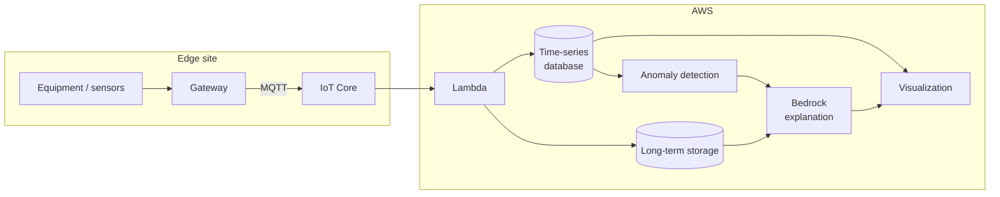

> 🌐 Language: [日本語](../../ja/aws-patterns/07-digital-twin.md) | **English**

# Pattern 07: Digital twin

> **Maturity**: implemented (partly) / **Last verified**: 2026-08-19

Hold equipment state as a time series, show current values and history, and have generative AI write
the explanation for a change. The aim is showing "what it is doing now" and "why it got there" in one
place.

## Implementation status

| Stage of the path | In this repository | Location |
|---|---|---|
| Device → IoT Core (MQTT) | Implemented | [`cloud/iot_ingestion/`](../../../cloud/iot_ingestion/) |
| Aggregation and storage in Lambda | Implemented | Same |
| Equipment telemetry collection | Implemented (storage system REST API) | [`edge/raspberry-pi/sensors/`](../../../edge/raspberry-pi/sensors/) |
| Writing to a time-series database | None | See "choosing a time-series database" below |
| Asset model (structural representation of equipment) | None | [Pattern 08](08-unified-namespace.md) |
| Generating explanations | None | [Agentic AI on AWS](../agentic-ai-on-aws.md) |
| Visualization layer | None | — |

## Data flow

1. A gateway collects equipment and sensor values and sends them over MQTT
2. Lambda receives them and writes to both the time-series database and long-term storage
3. The visualization layer shows current values and recent history
4. Anomaly detection finds threshold breaches and pattern deviations
5. On detection, history and equipment information are passed in to generate an explanation
6. The generated explanation appears in the visualization layer

**Keep the time-series database and long-term storage separate.** The first is fast reads over recent
data; the second is retention for audit and retraining. Different roles.

## Storage

| Subject | How to hold it | Retention |
|---|---|---|
| Current values and recent history | Time-series database | The analysis window, weeks to months |
| Long-term history | Columnar format in long-term storage | Set by audit and retraining requirements |
| Equipment structure | Asset model or master data | With a change history |
| Generated explanations | Stored against the detection event | So that "why it judged that" can be traced later |

**Cardinality decides the design.** Most time-series databases have their performance and sizing set
by series count — device × metric × tag combinations. Estimate what happens as equipment count grows
before building.

### Choosing a time-series database

**Amazon Timestream for LiveAnalytics closed new customer access on 2025-06-20**
([source](https://docs.aws.amazon.com/timestream/latest/developerguide/AmazonTimestreamForLiveAnalytics-availability-change.html)).
Existing customers' workloads continue. It cannot be chosen for something new.

The options for a new build, stated symmetrically.

| Option | Suits | Trade-off |
|---|---|---|
| Amazon Timestream for InfluxDB | You want time-series database features as such, with cardinality under 10 million series | Instance sizing is required; exceeding the cardinality limit degrades performance |
| Streaming → object storage + Iceberg → SQL | An analytics platform already exists and you want to consolidate onto it | Time-series functions and fast last-value reads have to be built |
| A columnar database ([Pattern 04](04-near-realtime-manufacturing.md)) | Dashboard latency in seconds | One more database to operate |

AWS recommends Timestream for InfluxDB as a migration target from LiveAnalytics when cardinality is
under 10 million
([source](https://docs.aws.amazon.com/timestream/latest/developerguide/timestream-influxdb-target.html)).
For higher cardinality, an InfluxDB 3 configuration is also an option
([source](https://docs.aws.amazon.com/timestream/latest/developerguide/influxdb3.html)).

## AI workflow

The role of generative AI here is **explanation, not judgement**. Detection itself is statistics or
machine learning; the model turns "what happened and what to do" into something a person can read.

- **What goes into the input.** A slice of the time series, the equipment structure, similar past
  cases. Too little input and only generalities come back
- **How the output is treated.** An explanation is supporting information, not the decision about
  what to do. Present it so that it reads that way
- **Reproducibility.** The same input does not guarantee the same explanation. Store the output and
  what it was based on
- **Going agentic.** Isolating a cause across several pieces of equipment needs retrieval and tool
  calls designed ([Agentic AI on AWS](../agentic-ai-on-aws.md))

## Security

- **Validate device-supplied identifiers.** Device IDs and topic levels are publisher-controlled.
  Used directly as a series key, they create series you did not intend
- **Writing back to control systems.** If the visualization can operate equipment, put that on a
  different permission boundary from reading. Starting read-only is the safer order
- **Confidentiality of equipment structure.** How much equipment exists, and of what kind, can itself
  be sensitive
- **Where generated explanations are stored.** They describe equipment faults, so classify them the
  same way as telemetry

## What drives cost

| Driver | How it acts |
|---|---|
| Send interval and series count | Write volume. Cardinality also drives sizing |
| Time-series database retention | Storage. Push long-term history to another tier |
| Instance configuration | Continuously running, so sizing sets the monthly charge |
| Explanation generation count | Per detection, or batched daily |
| Number of visualization users | Some delivery shapes charge per user |

## Assumptions and constraints

- **The time-series database has to be reselected.** LiveAnalytics is not open to new customers
  (above)
- **The asset model is a premise of this pattern, and there is no implementation.** If starting from
  the OT namespace, read [Pattern 08](08-unified-namespace.md) first
- **Whether the IoT Core S3 action accepts an S3 access point is unverified**
  ([§4](../s3ap-compatibility-matrix.md)). This repository routes through Lambda
- **Some industrial-equipment features are closed to new customers.** Check availability before
  designing in equipment monitoring features
  ([service availability](../../agent/service-lifecycle_en.md))
- **The visualization layer is available in ap-northeast-1** (checked against the AWS regional
  availability data on 2026-08-19). Re-check for other Regions

## References

- [Timestream for LiveAnalytics availability change](https://docs.aws.amazon.com/timestream/latest/developerguide/AmazonTimestreamForLiveAnalytics-availability-change.html)
- [Timestream for InfluxDB as a migration target](https://docs.aws.amazon.com/timestream/latest/developerguide/timestream-influxdb-target.html)
- [What is Timestream for InfluxDB?](https://docs.aws.amazon.com/timestream/latest/developerguide/timestream-for-influxdb.html)
- Related: [Pattern 03](03-industrial-iot-analytics.md) (store and query with SQL) /
  [Pattern 08](08-unified-namespace.md) (equipment namespace and model)
