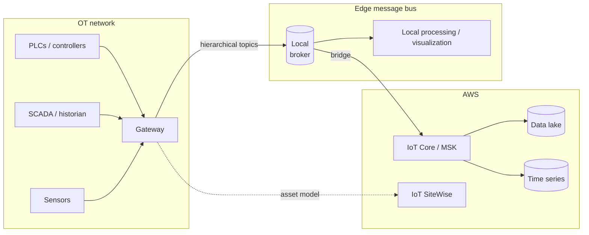

> 🌐 Language: [日本語](../../ja/aws-patterns/08-unified-namespace.md) | **English**

# Pattern 08: Unified namespace / industrial data fabric

> **Maturity**: design only / **Last verified**: 2026-08-19

Take data leaving each machine by its own route and arrange it into a hierarchical namespace on a
single message bus. **Worth reading before the other patterns when collection itself is not in
place.**

This pattern was not among the seven requested; it was added from research. This repository already
uses Kafka as a general-purpose event bus, but had no written principle for topic design or
namespace, which is the gap it fills.

## Implementation status

| Stage of the path | In this repository | Location |
|---|---|---|
| Event schema (v3) | Implemented | [`edge/raspberry-pi/common/event_schema.py`](../../../edge/raspberry-pi/common/event_schema.py) |
| Publishing to Kafka | Implemented | Same |
| MQTT ingestion | Implemented | [`cloud/iot_ingestion/`](../../../cloud/iot_ingestion/) |
| Designing the hierarchical namespace | None | Below |
| Connecting OT protocols such as OPC UA | None | — |
| Asset model | None | — |
| Representing device lifecycle state | None | Below |

## Separating the concept from the implementation

**A unified namespace (UNS) is a design concept, not a product feature.** Rather than every system,
device and application connecting directly to each other, all of them connect to a single shared
broker: producers publish, and consumers subscribe to what they need.

| Concept | Source | Implementation on AWS |
|---|---|---|
| A single hierarchical view on one message bus | [Definition of UNS](https://softwaretoolbox.com/resources/what-is-unified-namespace) / [Azure IoT Operations' UNS walkthrough](https://learn.microsoft.com/en-us/azure/iot-operations/discover-manage-assets/howto-build-unified-namespace) | An MQTT broker, IoT Core, or MSK |
| A standardised topic namespace with device state management | [Sparkplug B](https://softwaretoolbox.com/resources/what-is-sparkplug-b), an Eclipse Foundation specification | Topic design plus the event schema |
| Semantic asset modelling | [OPC Foundation Cloud Reference Architecture](https://opcfoundation.org/wp-content/uploads/2025/04/OPCF-Cloud-Reference-Architecture-ONLINE.pdf) | IoT SiteWise asset models |
| A bidirectional edge-to-cloud bridge | The MQTT bridge in Azure IoT Operations | A bridge between IoT Core and a local broker |

AWS also publishes guidance for an industrial data fabric
([source](https://aws.amazon.com/solutions/guidance/industrial-data-fabric-with-highbyte-intelligence-hub-on-aws/)).

## Data flow



1. OT equipment connects to a gateway, which absorbs the per-device protocols
2. The gateway publishes to hierarchical topics
3. Local consumers — visualization, control logic — subscribe from the same bus
4. A bridge carries data to the cloud. **Not sending everything** is the point
5. In the cloud it branches into long-term storage and time-series analysis

## Designing the namespace

**The topic hierarchy is the namespace.** Changing it later affects every consumer, so it is decided
first.

The typical ordering of elements:

```
<enterprise> / <site> / <area> / <line> / <cell> / <machine> / <data kind>
```

Three things have to be decided.

| Decision | What informs it |
|---|---|
| Depth of the hierarchy | Too shallow and subscribers cannot narrow; too deep and relocating a machine changes a lot |
| Physical or logical as the axis | Physical is legible but breaks on reorganisation; logical is stable but needs a mapping |
| Data kind in the hierarchy or in the payload | In the hierarchy, subscribers can filter; in the payload, the hierarchy stays stable |

### Device lifecycle state

MQTT alone does not make "is the device connected" visible from the topic. Sparkplug B defines
connection and disconnection as explicit messages — birth and death certificates.

The v3 event schema in this repository has no such state transition. **No breaking change is made
here.** As the delta if it were adopted, three items for consideration:

- Make site, area, line and machine explicit levels in the topic hierarchy
- Represent device connection state as an event
- Decide whether to send only on change (report by exception)

The current schema is documented in the [data schema design](../data-schema-design.md).

## AI workflow

An arranged namespace changes the AI-side design.

- **Context comes with the input.** Because "which machine produced this" follows from the structure,
  assembling the context passed to a model gets easier
- **Cross-cutting correlation becomes expressible.** Aggregation per line or per area follows the
  namespace structure
- **Connecting to an asset model.** Holding equipment structure adds information to pass into the
  explanation generation in [Pattern 07](07-digital-twin.md)

## Security

- **The boundary with the OT network matters most.** The gateway has a foot on both sides, so a
  compromise there becomes a path that can reach control systems. Consider whether the traffic can
  be constrained to one direction
- **Per-topic authorization.** Bound what each device may publish and subscribe to. The hierarchy
  design also sets the granularity available for this
- **Validate device-supplied values.** Topic levels are chosen by the publisher. Validate before
  using a level directly in a path or a SQL statement
  ([`identifiers.py`](../../../cloud/iot_ingestion/identifiers.py))
- **What gets sent to the cloud.** Sending everything exports the OT-side configuration wholesale.
  Choose explicitly what leaves

## What drives cost

| Driver | How it acts |
|---|---|
| Messages sent to the cloud | Filtering at the bridge changes the order of magnitude |
| How the broker is held | Self-operated is fixed cost; managed bills connections and messages |
| Number of gateways | One per area, or consolidated |
| Send-on-change | Far fewer than periodic sends, though the saving shrinks on equipment whose values move constantly |
| Asset model size | Some delivery shapes bill by model and property count |

## Assumptions and constraints

- **There is no namespace implementation here.** Kafka publishing and the schema exist; the hierarchy
  design and OT protocol connections do not
- **OT protocol support is equipment-dependent.** Which protocols are handled differs by gateway
  product and managed service. Check existing equipment first
- **Some industrial features are closed to new customers.** Check availability before designing in
  edge processing or visualization features
  ([service availability](../../agent/service-lifecycle_en.md))
- **Where a concept's source is a product's documentation, the concept and that implementation are
  not the same thing.** The table above keeps them apart
- **Whether to adopt Sparkplug B is not decided.** Only the delta against the current schema is
  stated

## References

- [Guidance for Industrial Data Fabric on AWS](https://aws.amazon.com/solutions/guidance/industrial-data-fabric-with-highbyte-intelligence-hub-on-aws/)
- [Connecting an industrial universal namespace to AWS IoT SiteWise](https://aws.amazon.com/blogs/architecture/connecting-an-industrial-universal-namespace-to-aws-iot-sitewise-using-highbyte-intelligence-hub/)
- [MQTT-enabled V3 gateways for AWS IoT SiteWise Edge](https://docs.aws.amazon.com/en_us/iot-sitewise/latest/userguide/mqtt-enabled-v3-gateway.html)
- [Implementing a unified namespace with MQTT Sparkplug](https://www.hivemq.com/blog/implementing-unified-namespace-uns-mqtt-sparkplug/)
- Related: [Pattern 03](03-industrial-iot-analytics.md) (analysis after collection) /
  [Pattern 07](07-digital-twin.md) (using the asset model)
