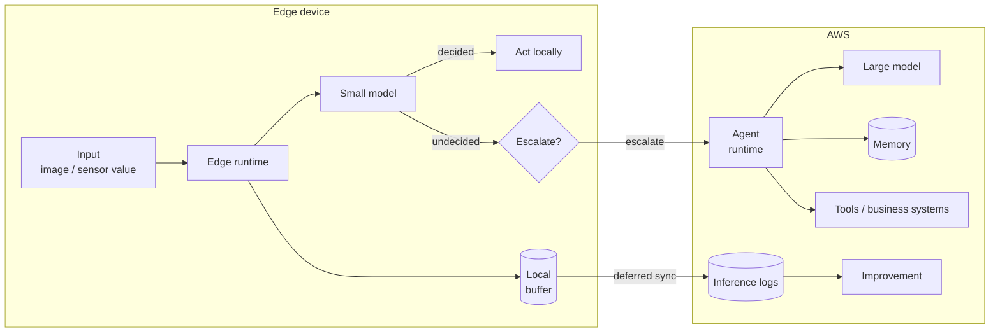

> 🌐 Language: [日本語](../../ja/aws-patterns/09-edge-agentic-ai.md) | **English**

# Pattern 09: Edge agentic AI

> **Maturity**: design only (official guidance exists) / **Last verified**: 2026-08-19

Complete part of the decision on a small model running on the device, and escalate only what it
cannot handle to a large model in the cloud. Worth considering where the network is unreliable, where
latency requirements are tight, or where data cannot leave the site.

This pattern was not among the seven requested; it was added from research. Because AWS publishes
guidance for distributing agents to device fleets with Greengrass, the label is "design only" rather
than "concept".

## Implementation status

| Stage of the path | In this repository | Location |
|---|---|---|
| Installing the edge runtime | None | — |
| Placing the local model | None | — |
| Local inference | None | — |
| The escalation decision | None | Below |
| Cloud-side agent runtime | None | [Agentic AI on AWS](../agentic-ai-on-aws.md) |
| Collecting inference logs | Partial (the feedback recording frame only) | [`cloud/ai/feedback_recorder/`](../../../cloud/ai/feedback_recorder/) |

**There is no implementation here.**

## Data flow

1. The edge runtime receives the input
2. The local small model attempts the decision first
3. When it decides, the action completes locally, with no round trip to the cloud
4. When it does not, the escalation decision applies
5. Escalated work is handled by a cloud agent, using memory and tool connections
6. All inference logs buffer locally and sync when connectivity returns

**Do not make escalation a fallback for errors.** What is handled locally and what goes to the cloud
is a division decided at design time.

## Storage

| Subject | How to hold it | Note |
|---|---|---|
| Model files | Referenced through edge storage, or distributed to the device | With the reference shape there is one copy ([Pattern 02](02-edge-ai-sagemaker.md)) |
| Inference logs | Buffered locally, synced later | Decisions continue while disconnected, so the record needs a route that does not lose them |
| Local state | On the device | Separate what may be lost on restart from what must not |
| Cloud-side memory | The agent's memory mechanism | Retention across sessions is designed in [Agentic AI on AWS](../agentic-ai-on-aws.md) |

## AI workflow

**Four axes decide escalation.** Which you weight moves the boundary.

| Axis | Handle locally | Escalate to the cloud |
|---|---|---|
| Latency | An immediate response is required | Seconds are acceptable |
| Data sensitivity | It cannot leave the site | Sending it is acceptable |
| Model capability | Limited scope such as classification or thresholds | Multi-step reasoning, broad knowledge needed |
| Cost | Calls are frequent and fixed cost wins | Calls are infrequent and per-call price suffices |

**Order of decision**: cut first on whether data may leave, then on latency, then adjust on
capability and cost. Sensitivity is not something a technical adjustment can close.

In the literature this division is treated as routing, estimating input difficulty and assigning it
to a small or large model
([survey on edge SLM and cloud LLM collaboration](https://arxiv.org/html/2507.16731v1)).
**The reduction and improvement percentages in those papers are not measurements in this
configuration and are not quoted here.** They are used only to organise the axes.

## Security

- **Assume a model on a device can be taken.** Where physical access is possible, assume the model
  file can be obtained
- **What is sent on escalation.** Sending the image itself versus only extracted features changes the
  data classification. Do not let the implementation undo a boundary drawn on sensitivity
- **Device credentials.** No long-lived keys; use something revocable
- **Auditing decisions completed locally.** A decision that never reaches the cloud is invisible from
  outside until logs sync. Where audit requirements exist, confirm the sync delay is acceptable
- **The update path for the edge runtime.** The route that updates models and code is also an attack
  route

## What drives cost

| Driver | How it acts |
|---|---|
| Escalation rate | Directly sets cloud call volume. The largest adjustment |
| Device hardware | The fixed cost of local inference, proportional to device count |
| Model delivery shape | Push transfers device count × model size; reference transfers only what is read |
| Log sync volume | Full logs versus summaries changes transfer volume |
| Cloud-side runtime | Differs between serverless and instances in your own account |

## Assumptions and constraints

- **There is no implementation here.** Read it as a design
- **AWS publishes guidance**:
  [Deploying AI agents to device fleets using AWS IoT Greengrass](https://docs.aws.amazon.com/solutions/deploying-ai-agents-to-device-fleets-using-aws-iot-greengrass/),
  covering a configuration that uses a local small model
- **Edge runtime options have widened.** A lightweight runtime for resource-constrained devices and
  installation without root are available
  ([source](https://docs.aws.amazon.com/greengrass/v2/developerguide/greengrass-v2-whats-new.html)).
  Existing text here that assumes a Raspberry Pi 5 (16GB) may extend to smaller devices
- **Local model performance is not measured in this configuration.** Which model size gives a usable
  response time on which device has to be measured on hardware
- **Earlier-generation edge runtimes have been sunset.** Check availability before designing one in
  ([service availability](../../agent/service-lifecycle_en.md))
- **The cloud-side agent runtime is a separate design.** Its building blocks are in
  [Agentic AI on AWS](../agentic-ai-on-aws.md)

## References

- [Deploying AI agents to device fleets using AWS IoT Greengrass](https://docs.aws.amazon.com/solutions/deploying-ai-agents-to-device-fleets-using-aws-iot-greengrass/)
- [Edge AI and global inference distribution (AWS Prescriptive Guidance)](https://docs.aws.amazon.com/prescriptive-guidance/latest/agentic-ai-serverless/edge-ai.html)
- [Perform machine learning inference (AWS IoT Greengrass)](https://docs.aws.amazon.com/greengrass/v2/developerguide/perform-machine-learning-inference.html)
- [Implement RAG while meeting data residency requirements using AWS hybrid and edge services](https://aws.amazon.com/blogs/machine-learning/implement-rag-while-meeting-data-residency-requirements-using-aws-hybrid-and-edge-services/)
- Related: [Pattern 01](01-edge-ai-bedrock.md) (judging in the cloud) /
  [Pattern 02](02-edge-ai-sagemaker.md) (training and delivering models) /
  [Agentic AI on AWS](../agentic-ai-on-aws.md)
