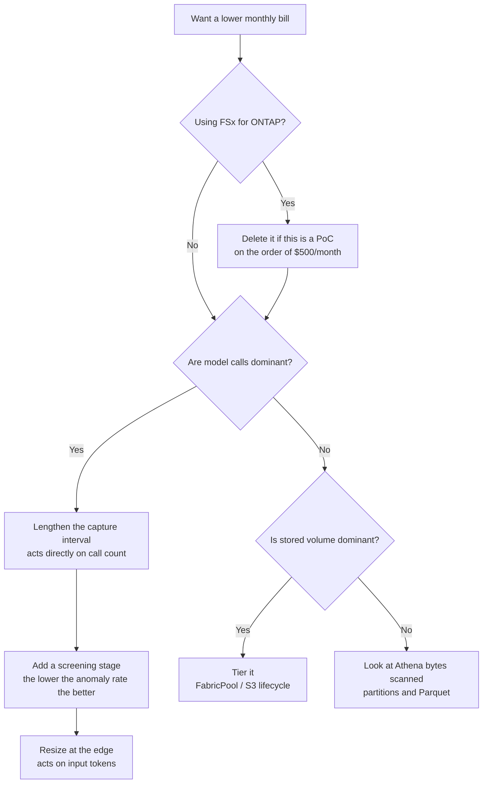

> 🌐 Language: [日本語](../ja/cost-model.md) | **English**

# Cost model

> **Prices retrieved**: 2026-08-19 / **Region**: ap-northeast-1

## Conclusion

**FSx for ONTAP is the only thing here whose order of magnitude will hurt you.** The PoC
configuration — 1 TiB SSD, 128 MBps, Multi-AZ — is **$500.61/month**, calculated from unit
prices that were looked up. Everything else is single or double-digit dollars at PoC scale,
and only the model rates depend strongly on how you use them.

This repository used to carry three different monthly figures for the same assumptions
(60-second intervals, a 10% anomaly rate). **$40, $75 and $259 are withdrawn.** They came
from different unit prices, and none of them can be reproduced. Formulas are here instead.
Put your own rates into them.

## Pricing basis

| Item | Value |
|---|---|
| Retrieved | 2026-08-19 |
| Region | ap-northeast-1 (Asia Pacific, Tokyo) |
| Method | AWS Price List Query API (`AmazonFSx`) |
| Unit price effectiveDate | 2026-07-01 |
| Price list publicationDate | 2026-08-05 |
| Billing model | On-demand. Savings Plans and Reserved are not considered |

**If the date above looks old to you, it is old.** Prices change. The formulas below are
written so that substituting a rate is all that is needed. Re-derive with the
[AWS Pricing Calculator](https://calculator.aws/) or the
[Price List API](https://docs.aws.amazon.com/awsaccountbilling/latest/aboutv2/price-changes.html).

## Worth knowing the magnitude of — FSx for ONTAP

Forget to delete it and the bill reaches three figures. When the PoC is done, remove it with
[`scripts/teardown.sh`](../../scripts/teardown.sh).

| Billing axis | Unit price (ap-northeast-1, retrieved 2026-08-19) | PoC configuration | Monthly |
|---|---|---|---|
| SSD storage (Multi-AZ) | $0.300 / GB-month | 1024 GiB | $307.20 |
| Throughput capacity (Multi-AZ) | $1.511 / MBps-month | 128 MBps | $193.41 |
| **Total** | | | **$500.61** |

The formula:

```
monthly = storage_capacity(GiB) × $0.300 + throughput(MBps) × $1.511
        = 1024 × 0.300 + 128 × 1.511
        = 307.20 + 193.41
        = 500.61
```

Single-AZ, HDD and the capacity pool tier (FabricPool) carry different rates. Backups and
provisioned IOPS add to this. The formula covers those two axes and nothing else.

> **Note**: capacity is provisioned in GiB and billed in GB-month units. The formula above
> ignores that difference. Use the Pricing Calculator when the estimate has to be exact.

## Formula only — Bedrock model rates

**No absolute figures here**, for two reasons.

1. **They move quickly.** A model generation change moves the rate with it. A number written
   here becomes wrong at the next generation and a reader cannot tell that it has.
2. **The Price List API does not attribute a rate to a model.**
   `AmazonBedrockFoundationModels` returns token rates for ap-northeast-1 with an **empty**
   `operation` field. The values are retrievable — $2, $5 and $10 per 1M input tokens — but
   which one is Haiku and which is Sonnet cannot be determined from the API. There is no
   path to recompute automatically, so there is no path to generate this either.

The formula:

```
per_image = Σ(over stages) [ input_tokens ÷ 1,000,000 × input_rate
                           + output_tokens ÷ 1,000,000 × output_rate ]

monthly = captures_per_day × 30
          × [ screening_cost + anomaly_rate × detail_cost ]
```

How much a second stage saves **is decided by the anomaly rate**. The higher it is, the more
often stage two runs and the smaller the gap to a single-stage design. At a 100% anomaly rate
two stages cost *more*, because the screening call becomes pure overhead.

### The token counts are not known yet

The token counts the formula needs went unrecorded here for a long time:
`cloud/ai/image_analyzer/handler.py` discarded the `usage` block of the Bedrock response.
That is fixed, and `InputTokens` / `OutputTokens` now reach CloudWatch.

But **there is still no record of actual token counts**, because the stack has never been
deployed (see the [verification status](verification-status.md)). The formula is usable; the
values to substitute have to be measured in your own environment.

### Emitting the CostPerImage metric

Rates are passed as environment variables. Baking them into code would reproduce exactly the
staleness described above.

| Environment variable | Meaning |
|---|---|
| `SCREENING_INPUT_USD_PER_MTOK` | Screening stage, per million input tokens |
| `SCREENING_OUTPUT_USD_PER_MTOK` | Screening stage, output |
| `DETAIL_INPUT_USD_PER_MTOK` | Detail stage, input |
| `DETAIL_OUTPUT_USD_PER_MTOK` | Detail stage, output |

With all four set, `CostPerImage` appears in the `EdgeToCloud/PrintQuality` namespace. With
any one missing it is **not emitted**: a total covering only some stages would look like a
cheap image rather than a missing rate. Token counts are emitted either way.

## The other services

At PoC scale — one device, 60-second intervals — everything besides the two above adds up to
single or double-digit dollars. No absolute figures; only what moves them.

| Service | What drives the cost |
|---|---|
| AWS Lambda | Invocations × duration × memory. The capture interval acts directly on this |
| Amazon S3 | Stored volume and PUT count. Lifecycle tiering brings it down |
| Amazon Kinesis Data Streams | ON_DEMAND bills ingest and shard hours. At low traffic PROVISIONED can be cheaper |
| Amazon Data Firehose | Ingested volume (per-GB processing). Aggregating in Lambda removes the hop entirely |
| Amazon Athena | Bytes scanned. Partitioning and a columnar format bring it down |
| AWS Glue Crawler | Runs × duration. Daily to weekly brings it down |
| Amazon SNS | Notification count. Small at PoC scale |
| AWS IoT Core | Message count. Basic Ingest avoids the per-rule charge |

## Withdrawn figures

Claims whose basis could not be reproduced. Recording what was removed lets someone who read
an earlier version see the difference.

| Withdrawn claim | Why |
|---|---|
| $40/month for two stages ($259 single-stage) | Under the same assumptions the formula in `tests/sample_images/README.md` gives $78/month, so $40 assumed roughly half the unit price. Neither rate has a source |
| $0.005–0.011 per image | Hand-calculated from list prices. No token counts were recorded, so it cannot be reproduced. It sat in a table of measured results and read as measured |
| The $75 / $54 / $360 scenario table | The same unit-price problem. The formulas stay; the amounts are gone |
| Totals of ~$570–730 / ~$70–230 | The sum of each row's range, with no arithmetic shown |
| A total of about ¥1,500–4,000/month | Dollar rows and a yen row summed with no exchange rate |
| A default flush interval of 30-90s | No source. A neighbouring row in the same diagram said "not measured" |

## Where to push when you want the bill lower



## Managing cost in stages

1. **Before deploying**: put your own rates into the formulas here and get the magnitude. If
   FSx for ONTAP is in scope, decide the deletion date now
2. **Right after deploying**: set an alert with
   [AWS Budgets](https://docs.aws.amazon.com/cost-management/latest/userguide/budgets-managing-costs.html).
   About 1.5× the estimate is a practical PoC threshold
3. **After a day of operation**: fix the per-image token count from the observed
   `InputTokens` / `OutputTokens` and feed it back into the formula
4. **Once the rates are settled**: set the four environment variables above so
   `CostPerImage` is emitted. The alarm thresholds in the
   [operations design](operations-design.md) assume that metric
5. **When the PoC ends**: remove it with [`scripts/teardown.sh`](../../scripts/teardown.sh).
   The data-lake bucket is retained by `DeletionPolicy` and needs removing separately

## FAQ

**Q: Why is there no monthly total table?**
A: There was one. It summed each row's range with no arithmetic shown, and the same
assumptions produced three different answers elsewhere in the repository. If you need a
total, put your configuration into the Pricing Calculator. This document is limited to what
drives cost and what will hurt if you get the magnitude wrong.

**Q: What is the `+` in `~$500+/month`?**
A: Billing axes the formula above does not include: backups, provisioned IOPS, the capacity
pool tier, and cross-Region transfer. Two axes alone at 1 TiB / 128 MBps / Multi-AZ give
$500.61, so a real bill is higher than that.

**Q: Does the free tier apply?**
A: What it covers and on what terms changes. New-account plans changed in 2025, and copying
the conditions into this document would date it. Check
[AWS Free Tier](https://aws.amazon.com/free/) for the current terms. FSx for ONTAP is not
included in the free tier.

**Q: Is two stages always cheaper?**
A: No. The anomaly rate decides. When it is high, stage two runs nearly every time and the
screening call is pure added cost. At a 100% anomaly rate it is more expensive than a single
stage. Put your own anomaly rate into the formula.

**Q: Is there a billing record for this repository?**
A: No. There is no record of the stack being deployed, so all that exists is an estimate from
list prices (see the [verification status](verification-status.md)).

## Related documents

- [Verification status](verification-status.md) — which figures rest on what
- [Deployment guide](deployment-guide.md) — the build procedure; §8 refers here
- [Operations design](operations-design.md) — metrics and alarms, including `CostPerImage`
- [S3 AP compatibility and limits](s3ap-compatibility-matrix.md) — where a path choice affects cost
- [AWS pattern catalog](aws-patterns/README.md) — what drives cost per pattern
