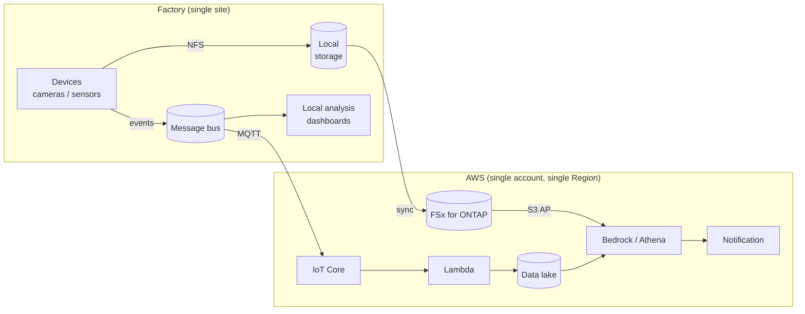

> 🌐 Language: [日本語](../../ja/deployment-models/model-a-single-factory.md) | **English**

# Model A: single factory

> Last verified: 2026-08-19

One site, from a handful to a few dozen devices. This is the scale the implementation in this
repository assumes.

**Hardware testing for this configuration is incomplete**
([README](../../../README_en.md#about-this-repository)). The cloud side is verified; the edge side and
ONTAP integration are not.

## Data flow

**Two paths exist** and that is the defining feature. Payload — images, waveforms — takes the file
path; events — metadata — take the message path. They stay separate even at one site. The reasoning is
in [Pattern 03](../aws-patterns/03-industrial-iot-analytics.md).

## Storage flow

| Stage | Where it sits | How to think about retention |
|---|---|---|
| Immediately after capture or measurement | Edge local storage | Until the sync completes; enough to survive a network outage |
| Aggregation | FSx for ONTAP | The analysis window |
| Structured data for analysis | Data lake | Partitioned by time and device |
| Ageing data | A cheaper tier | Moved once access frequency drops |

**Tiering tends to be deferred at one site.** Introducing it after data has accumulated means
migrating existing paths. Design tiering in from the start.

**Put a site identifier in from the start.** Even with one site, carry a site identifier in the event
schema and the storage paths. It changes how much has to be rewritten when moving to
[Model B](model-b-multi-factory.md).

## AI workflow

At one site, consolidating AI calls in the cloud is the simple choice.

| Decision | Default at this scale | What changes it |
|---|---|---|
| Where inference runs | Cloud | Unreliable network or tight latency → [Pattern 09](../aws-patterns/09-edge-agentic-ai.md) |
| Model choice | A foundation model, no training | Labelled data has accumulated → [Pattern 02](../aws-patterns/02-edge-ai-sagemaker.md) |
| Number of stages | Two, screening with a cheap model | A high anomaly rate weakens the benefit of two stages |
| Human feedback | Record it | Without it, neither the threshold nor the prompts have a basis to improve on |

**The capture interval is the strongest lever at this scale.** Decide how often a judgement is
actually needed before choosing a model.

## Security controls

The whole is in the [security design](../security-design.md). What has to be decided at this scale:

| Item | How to think about it at this scale |
|---|---|
| Network separation | Keep the OT side and the cloud-bound path apart. Devices do not reach the internet directly |
| Device authentication | Manual provisioning works while the count is small — but decide the revocation procedure from the start |
| Account structure | A single account is fine to begin with, but keep production and verification separate |
| Permission granularity | Writable assuming a single user. For several teams, start designing from [§15](../security-design.md) |
| Data classification | Classify on the assumption that product shapes appear in images. One site still needs classification |

**Revocation is the easy thing to miss at this scale.** With a few devices, registering by hand works;
but without a procedure for cutting one off when it is compromised, that work begins at the moment of
the incident.

## What drives cost

Figures live in the [deployment guide](../deployment-guide.md). Here, what moves them.

| Driver | How it acts at this scale |
|---|---|
| Minimum size of the aggregation point | File storage bills on capacity, so the fixed cost of the minimum configuration tends to dominate |
| Capture and measurement frequency | Directly sets AI call volume. The strongest lever |
| Bytes scanned in the data lake | Lowered by partition design, which matters even at one site |
| Retention | Grows linearly without tiering |
| Holding data twice | Do not keep payloads in both file and object storage |

**Fixed cost is a large share at this scale.** With few devices, the minimum configuration of the
aggregation point and managed services matters more than the usage-proportional part. When starting
small, exercising the path in [`local-demo/`](../../../local-demo/) before building the cloud side
avoids paying for idle resources.

## Assumptions and constraints

- **Hardware testing is incomplete.** Edge-side performance and reliability are unverified
- **Only a single-device configuration has been exercised.** Running several devices concurrently is
  unverified
- **Kafka and ClickHouse assume an on-premises VM** and have no IaC
  ([kafka-integration](../kafka-integration.md))
- **ONTAP integration is mock-tested only.** FPolicy, SnapMirror and S3 AP have not run against a real
  system
- **S3 access points require ONTAP 9.17.1 or later**
  ([constraint list](../s3ap-compatibility-matrix.md))
- **Device provisioning is not automated.** This becomes the first problem as device count grows

## References

- [Deployment guide](../deployment-guide.md) — the actual build steps
- [Pattern catalog](../aws-patterns/README.md) — choosing the AI path
- [Security design](../security-design.md)
- [Model B: multiple factories](model-b-multi-factory.md) — what changes as sites are added
