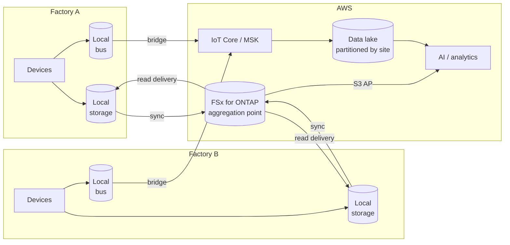

> 🌐 Language: [日本語](../../ja/deployment-models/model-b-multi-factory.md) | **English**

# Model B: multiple factories

> Last verified: 2026-08-19

Several sites, each producing data, with analysis wanted across them.

**Running multiple sites has not been verified in this repository.** This is designed as an extension
of [Model A](model-a-single-factory.md).

## Three things differ from A

| What changes | A | B |
|---|---|---|
| Site identification | Implicit, there is only one | Explicit, and needed on every path |
| Aggregation point | The site is the aggregation point | The aggregation point is outside the sites, with a sync route per site |
| Blast radius | If the site stops, everything stops | One site's failure must not propagate to the others |

**Everything else is the same as A.** The AI paths, the kinds of storage, and the security principles
do not change.

## Data flow



1. Each site writes locally and uses it locally — in-site visualization stays in the site
2. Data syncs to the aggregation point. **Each site's sync is independent**
3. Events cross to the cloud through a bridge. Not everything: choose what cross-site analysis needs
4. Cross-site analysis runs at the aggregation point
5. Aggregated output — trained models, reference values — is delivered back to each site

**Becoming bidirectional is the biggest difference from A.** Beyond site → aggregation point, a
delivery route from the aggregation point back to the sites is needed.

## Storage flow

| Route | Example mechanism | Suits |
|---|---|---|
| Site → aggregation point (payload) | Block-level differential sync | Sites keep writing independently; bandwidth is limited |
| Site → aggregation point (write cache) | A write-back cache | The aggregation point should be authoritative, and writes continue through an outage |
| Aggregation point → site (read) | A read cache | Distributing trained models or reference data to several sites |
| Events | A message bus bridge | Metadata only; no bytes carried |

The comparison is detailed in
[FlexCache versus SnapMirror](../iot-greengrass-flexcache-integration.md).
**Using write-back carries version requirements and a production caveat** (same document).

### Put the site into the partitioning

```
/{data kind}/site={site id}/year={YYYY}/month={MM}/day={DD}/device={device id}/
```

**Placing site high in the partitioning makes per-site queries and deletions cheap.** Placing time
high instead makes cross-site queries faster. Which to favour follows from the dominant query
pattern. Changing it later is expensive.

## AI workflow

Two more decisions appear as sites are added.

| Decision | Options | Trade-off |
|---|---|---|
| One model per site, or one shared | Shared: more training data / per-site: fits local quirks | A shared model loses accuracy to per-site differences in lighting and equipment; per-site multiplies the model count |
| Where inference runs | Aggregation point / each site | The aggregation point is one place to operate; the site survives an outage |

**Per-site differences do affect accuracy.** Lighting, camera mounting, equipment models, material
lots. A model that was accurate at one site dropping at another is ordinary. Design for per-site
evaluation data before crossing sites.

## Security controls

| Item | What changes in B |
|---|---|
| Isolation between sites | Site A's credentials must not read site B's data. Make the permission design correspond to the partition design |
| Device count | Manual provisioning breaks down. Automatic certificate issuance and revocation become necessary |
| Networking | Decide between a private connection per site and going over the internet from each site |
| Failure isolation | An anomaly at one site must not propagate to the others through the aggregation point |
| Audit logs | Records for operations spanning sites, which presumes clock synchronisation |

**Make the permission design correspond to the partition design.** Having the site in the data lake
path means nothing if permissions are not cut on the site. Using the layers in
[security design §15](../security-design.md), decide where the site boundary is enforced.

## What drives cost

| Driver | How it acts differently in B |
|---|---|
| Number of sites | Fixed cost — edge storage, gateways — scales with site count |
| Sync bandwidth | Change volume with differential sync, total volume without. This is where the order of magnitude changes |
| Events sent to the cloud | Whether the bridge filters. Grows as sites × devices |
| Read delivery | Volume of models and reference data distributed; a reference shape transfers only what is read |
| Aggregation point sizing | Still one, however many sites. Capacity and throughput sizing matter |

**In A fixed cost dominated; in B sync and transfer take a larger share.** Measuring per-site transfer
volume before adding sites makes estimation possible. It is unmeasured in this repository.

## Moving from A to B

In order of expense.

1. **Adding a site identifier** — the most expensive. It touches the event schema, storage paths,
   queries and dashboards. Putting it in during A avoids this entirely
2. **Changing the partition design.** Existing data has to be reorganised
3. **Rebuilding the permission design.** From a single-user assumption to a per-site boundary
4. **Automating device provisioning.** Ready before the count at which manual breaks down
5. **Adding the delivery route** from the aggregation point back to sites — a route A does not have

## Assumptions and constraints

- **Running multiple sites has not been verified.** Read it as a design
- **Cross-site data sync is unverified.** Sync delay and behaviour on failure are unconfirmed
- **Per-site accuracy differences are unmeasured**
- **Per-site transfer volume is unmeasured**, so estimating for a given site count is not possible
- **Device provisioning automation is unimplemented**
- **Using a write-back cache carries a production version caveat**
  ([iot-greengrass-flexcache-integration](../iot-greengrass-flexcache-integration.md))

## References

- [Model A: single factory](model-a-single-factory.md) — the shared part
- [FlexCache versus SnapMirror](../iot-greengrass-flexcache-integration.md) — choosing the sync mechanism
- [Pattern 08: unified namespace](../aws-patterns/08-unified-namespace.md) — namespaces that include the site
- [Security design](../security-design.md)
