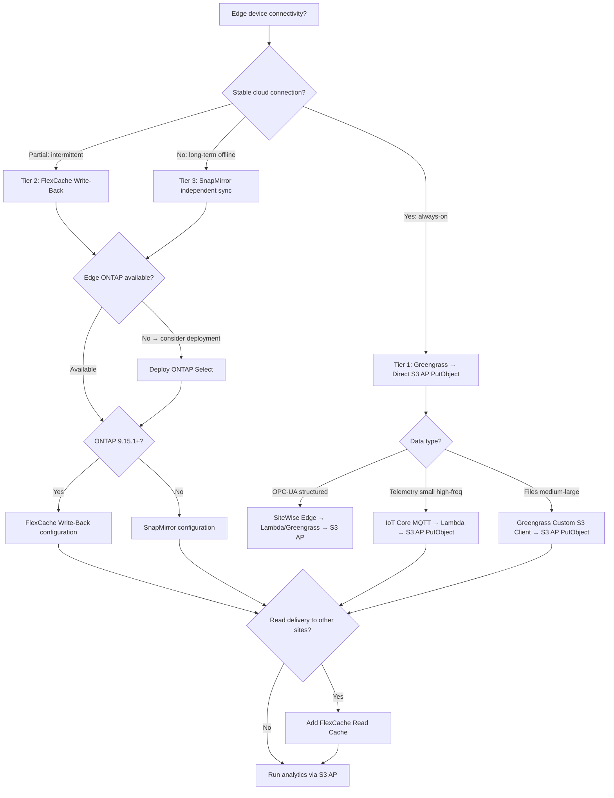

> 🌐 Language: [日本語](../ja/iot-greengrass-flexcache-integration.md) | **English**

# AWS IoT Services × FSx for ONTAP S3 Access Points / FlexCache Integration Scenarios

> Created: 2026-07-27
> Project: edge-to-cloud-ai
> Parent project: [fsxn-lakehouse-integrations](https://github.com/Yoshiki0705/fsxn-lakehouse-integrations)
> Related document: [S3 AP + FlexCache / SnapMirror Design Considerations](https://github.com/Yoshiki0705/fsxn-lakehouse-integrations/blob/main/docs/en/s3ap-flexcache-snapmirror-considerations.md)

---

## Executive Summary

**Using FSx for ONTAP S3 Access Points as the direct data ingestion endpoint — without routing through S3 standard buckets** — eliminates the overhead inherent to IoT/edge workloads (small file per-object costs, cross-region transfer costs, double storage). Additionally, **FlexCache write-back (ONTAP 9.15.1+)** serves as the edge local write buffer, achieving both offline resilience and low-latency local writes.

**Key conclusions:**

1. **FSx for ONTAP S3 AP is the sole data aggregation point** — no S3 standard bucket intermediary. PutObject writes directly to FSx for ONTAP volumes; the same data is accessible via NFS/SMB/S3 multiprotocol
2. **FlexCache write-back is the edge write buffer** — writes to edge ONTAP (ONTAP Select / FAS / AFF) FlexCache Cache Volume in write-back mode, asynchronously flushed to Origin (FSx for ONTAP). Offline-resilient + local-speed writes
3. **FlexCache read cache provides data burst delivery** — delivers Origin-aggregated data to GPU/HPC workloads at multiple sites with low latency
4. **Greengrass custom S3 client component** — uses the AWS SDK directly to PutObject to an S3 AP ARN, instead of Stream Manager, which requires an S3 bucket name (unverified, [compatibility and constraints](./s3ap-compatibility-matrix.md) §4)

---

## 1. Why S3 Standard Buckets Are Problematic for IoT Workloads

### 1.1 S3 Standard Bucket Challenges

| Challenge | Details | IoT Impact |
|-----------|---------|------------|
| Per-object billing | PUT $0.005/1000 requests, GET $0.0004/1000 | 1 write/sec × 100 devices = ~$13/month (PUT only) + reads |
| Small file inefficiency | Object metadata overhead, consistency checks | 1KB telemetry × millions = metadata ratio exceeds payload |
| Cross-region transfer | $0.02/GB (S3 cross-region replication) | Per-object transfer costs for multi-site distribution |
| Double storage | S3 + FSx for ONTAP holding same data → DataSync copy needed | 2x storage cost + transfer latency |
| LIST performance degradation | LIST response latency increases with object count per prefix | Time-series IoT data exploration degrades |
| No filesystem semantics | No locking/directories/ACLs/multiprotocol | NFS/SMB clients require translation layer |

### 1.2 How FSx for ONTAP S3 AP Resolves These

| S3 Standard Bucket Problem | FSx for ONTAP S3 AP Solution |
|---------------------------|------------------------------|
| Per-object billing | FSx for ONTAP is capacity-billed (SSD/HDD). No per-API-call charges |
| Small file inefficiency | ONTAP inline deduplication + compression. B-tree filesystem metadata |
| Cross-region transfer | FlexCache: caches only accessed blocks (differential). SnapMirror: block-level differential replication |
| Double storage | S3 AP IS the FSx for ONTAP volume. No intermediate bucket |
| LIST performance | ONTAP directory B-tree provides fast readdir even with millions of files. S3 AP ListObjectsV2 leverages this |
| Filesystem semantics | NFS/SMB/S3 multiprotocol. Simultaneous access to same data |

---

## 2. Overall Architecture

```
┌─────────────────────────────────────────────────────────────────────────────────────┐
│                    FSx for ONTAP (Origin) — Single Data Aggregation Point             │
│                                                                                     │
│  Volume: /iot-data                                                                  │
│    ├── S3 Access Point ──────> Athena / Glue ETL / SageMaker / Bedrock              │
│    ├── NFS mount ────────────> EC2 / ECS / Lambda (processing)                      │
│    └── FlexCache Origin ─────> Read cache delivery to multiple sites                │
│                                                                                     │
└───────────┬─────────────────────────────────┬───────────────────────────────────────┘
            │                                 │
     Write Paths (Ingest)               Read Delivery (Burst)
            │                                 │
  ┌─────────┼─────────────────┐    ┌──────────┼──────────────────────────┐
  │         │                 │    │          │                          │
  ▼         ▼                 ▼    ▼          ▼                          ▼
┌────────┐ ┌────────────────┐ ┌──────────┐ ┌──────────────┐ ┌──────────────────────┐
│Tier 1  │ │Tier 2          │ │Tier 3    │ │On-Prem ONTAP │ │FSx for ONTAP         │
│Direct  │ │FlexCache       │ │SnapMirror│ │FlexCache     │ │(other region)        │
│S3 AP   │ │Write-Back      │ │Edge→Cloud│ │Read Cache    │ │FlexCache Read Cache  │
│Write   │ │(edge write buf)│ │(indep.)  │ │ → GPU infer  │ │ → analytics jobs     │
└────────┘ └────────────────┘ └──────────┘ └──────────────┘ └──────────────────────┘
    │              │                │
    ▼              ▼                ▼
┌────────────────────────────────────────────────────────┐
│              Edge / IoT Devices                         │
│                                                        │
│  ┌──────────────────┐  ┌────────────────────────────┐  │
│  │ IoT Greengrass   │  │ ONTAP Select / FAS (Edge)  │  │
│  │ Custom S3 Client │  │ FlexCache Cache Volume     │  │
│  │ Component        │  │ (write-back mode)          │  │
│  │  → PutObject     │  │  → NFS local write         │  │
│  │    to S3 AP ARN  │  │  → async flush to Origin   │  │
│  └──────────────────┘  └────────────────────────────┘  │
│                                                        │
│  ┌──────────────────┐  ┌────────────────────────────┐  │
│  │ IoT Core MQTT    │  │ Sensors / Cameras / PLCs   │  │
│  │  → Lambda        │  │  → NFS/SMB write to edge   │  │
│  │  → PutObject     │  │    ONTAP                   │  │
│  │    to S3 AP      │  │                            │  │
│  └──────────────────┘  └────────────────────────────┘  │
└────────────────────────────────────────────────────────┘
```

---

## 3. Write Paths (Ingest Tier) Details

### Tier 1: Direct S3 AP Write (Greengrass Custom Component)

**Target**: Edge devices with stable network connectivity

- Greengrass custom component uses boto3 / AWS SDK to PutObject directly to FSx for ONTAP S3 AP ARN
- Local disk buffer + exponential backoff retry for resilience
- Stream Manager is not used: it requires an S3 bucket name, and whether an access point ARN
  passes is **untested here** ([compatibility and constraints](./s3ap-compatibility-matrix.md) §4)

**IoT Core MQTT → Lambda → S3 AP path:**
- Telemetry (small, high-frequency) sent via IoT Core MQTT
- IoT Core rules engine → Lambda function → Lambda PutObject to S3 AP
- Amazon Data Firehose requires an S3 bucket ARN. **Unverified** ([compatibility and constraints](./s3ap-compatibility-matrix.md) §4),
  so this design does not use it

> **Cost optimization note**: Avoiding Amazon Data Firehose eliminates processing fees ($0.029/GB). Lambda costs are invocation-based, optimizable via IoT Core Basic Ingest + batch window aggregation.

### Tier 2: FlexCache Write-Back (Edge Local Write → Async Origin Flush)

**Target**: Intermittent connectivity / low-latency local write requirements

- Edge ONTAP (ONTAP Select / FAS / AFF C-Series) hosts FlexCache Cache Volume in write-back mode
- IoT devices write via NFS to the local cache and are acknowledged from the edge, without
  waiting for a WAN round trip (LAN-local latency; not measured in this configuration)
- Data asynchronously flushed to Origin (FSx for ONTAP) at block level
- **Offline resilient**: writes continue to the local cache during a network outage, with a
  differential flush on reconnection. Data not yet flushed exists only at the edge, so a
  cache-side disk failure loses it — RAID or HA on the edge system is a precondition

**FlexCache Write-Back IoT value:**

| Property | Effect |
|----------|--------|
| Local write response | Returns without waiting for a WAN round trip (LAN-local write latency; not measured in this configuration) |
| Async Origin flush | Limited WAN bandwidth doesn't affect local write performance |
| Offline resilience | Write continues to local cache during network outage |
| Block-level differential transfer | Far more efficient than per-object S3 replication |
| Inline deduplication/compression | Maximizes storage efficiency for small file bulk writes |
| XLD (exclusive lock delegation) | Guarantees per-file write consistency |

**Requirements:**
- Both Origin (FSx for ONTAP) and Cache (edge ONTAP) must be ONTAP 9.15.1 or later
  ([FlexCache write-back interoperability](https://docs.netapp.com/us-en/ontap/flexcache-writeback/flexcache-write-back-interoperability.html))
- NetApp states that **9.15.1 does not carry all the fixes write-back needs and is not
  recommended for production workloads**, and recommends the latest P release
  ([guidelines](https://docs.netapp.com/us-en/ontap/flexcache-writeback/flexcache-write-back-guidelines.html) /
  [FAQ](https://docs.netapp.com/us-en/ontap/flexcache-writeback/faq-flexcache-write-back.html)).
  Treat 9.15.1 as the floor, not the choice
- SVM peering + inter-cluster network (VPN / Direct Connect)
- Same-file concurrent writes limited to 1 Cache by XLD — mitigate with per-device directory design

### Tier 3: SnapMirror (Edge Independent Storage → Cloud Sync)

**Target**: Fully independent edge storage (long-term offline, large local processing)

- Edge ONTAP operates as independent source → SnapMirror async replication to FSx for ONTAP
- Suitable when edge is the authoritative data master
- FSx for ONTAP destination requires SnapMirror break before S3 AP attachment

**FlexCache write-back vs SnapMirror selection:**

| Axis | FlexCache Write-Back | SnapMirror |
|------|---------------------|------------|
| Data model | Cache ← Origin (Origin authoritative) | Source → Destination (Source authoritative) |
| Write target | Write to Cache → flush to Origin | Write to Source → replicate to Destination |
| S3 AP usage | Origin side only (= FSx for ONTAP side) | Source side only. Dest requires break first |
| Offline resilience | Local write continues, auto-flush on reconnect | SnapMirror updates pause, resume on reconnect |
| Fit scenario | Edge → cloud aggregation (Origin is cloud) | Edge is independent master, cloud is replica |
| ONTAP version | 9.15.1+ (both sides) | 9.x (broad compatibility) |

---

## 4. Read Delivery (Burst) — FlexCache Read Cache

Delivers Origin-aggregated data to workloads at multiple sites with low latency.

| Delivery Target | Data Type | FlexCache Effect |
|----------------|-----------|-----------------|
| Factory GPU servers | Quality inspection images + inference data | WAN bandwidth savings, local-speed batch inference |
| Other-region SageMaker | Training datasets | Minimizes cross-region transfer via caching |
| Multi-cloud GPU | Large-scale training data | Unified ONTAP data fabric delivery |
| Edge AI devices | ML model files (GGUF etc.) | Efficient delivery of multi-GB models at block level |
| QA team workstations | Quality image database | Local-speed image browsing |

> **Model delivery note**: FlexCache caches at block granularity rather than whole files, so a
> large model file can be expected to transfer only the ranges actually read. How much that is
> depends on how the inference runtime reads the model — whether it mmaps the whole file or reads
> incrementally — and it is **not measured in this configuration**. The design of referencing the
> model over NFS instead of an OTA push does avoid keeping two copies.

---

## 5. Edge / Cache Side Challenges and Additional Services

### 5.1 Edge Challenge Matrix

| Challenge | Problem with S3 Standard Bucket | Solution with FSx for ONTAP S3 AP + FlexCache | Additional Service |
|-----------|--------------------------------|-----------------------------------------------|-------------------|
| Offline resilience | Writes fail immediately | FlexCache write-back: local write continues | ONTAP Select (edge ONTAP) |
| Small file efficiency | Per-object overhead | ONTAP inline dedup + compression | FabricPool (cold data tiering) |
| Local processing | S3 GET from cloud required | NFS local mount for immediate access | Greengrass ML Inference |
| Bandwidth constraints | Full object transfer | FlexCache block differential / SnapMirror differential | SORACOM Canal (private connectivity) |
| Multiprotocol | S3 API only | NFS + SMB + S3 simultaneous access | IoT SiteWise (OPC-UA → structured) |
| Data gravity | Cloud↔edge round-trips | Edge ONTAP for local processing closure | Greengrass component-based model delivery |

### 5.2 Where the Additional Services Sit

```
┌─────────────────── Edge ──────────────────────┐   ┌─────────── Cloud ────────────────┐
│                                               │   │                                  │
│  ┌─────────────────────────────────────────┐  │   │  ┌────────────────────────────┐  │
│  │ ONTAP Select (software-defined)         │  │   │  │ FSx for ONTAP              │  │
│  │ - Runs on general-purpose servers       │  │   │  │ - Origin (aggregation)     │  │
│  │ - FlexCache write-back capable          │  │   │  │ - S3 AP (analytics access) │  │
│  │ - SnapMirror capable                    │  │   │  │ - FlexCache origin         │  │
│  │ - Scales from a 1 TB minimum            │  │   │  │ - FabricPool (tiering)     │  │
│  └─────────────────────────────────────────┘  │   │  └────────────────────────────┘  │
│                                               │   │                                  │
│  ┌─────────────────────────────────────────┐  │   │  ┌────────────────────────────┐  │
│  │ IoT Greengrass V2                       │  │   │  │ AWS analytics / AI         │  │
│  │ - Custom S3 client → S3 AP              │  │   │  │ - Athena (SQL on S3 AP)    │  │
│  │ - ML inference (SageMaker Neo)          │  │   │  │ - Glue ETL (S3 AP R/W)     │  │
│  │ - IoT Core MQTT (telemetry)             │  │   │  │ - SageMaker (training)     │  │
│  └─────────────────────────────────────────┘  │   │  │ - Bedrock (generative AI)  │  │
│                                               │   │  │ - Rekognition (images)     │  │
│  ┌─────────────────────────────────────────┐  │   │  └────────────────────────────┘  │
│  │ IoT SiteWise Edge gateway               │  │   │                                  │
│  │ - OPC-UA → structured series            │  │   │  ┌────────────────────────────┐  │
│  │ - Runs on Greengrass                    │  │   │  │ IoT Core                   │  │
│  │ - Writes to edge ONTAP over NFS         │  │   │  │ - MQTT broker              │  │
│  └─────────────────────────────────────────┘  │   │  │ - Rules → Lambda → S3 AP   │  │
│                                               │   │  │ - Device Shadow            │  │
│  ┌─────────────────────────────────────────┐  │   │  │ - Device Defender          │  │
│  │ SORACOM (cellular connectivity)         │  │   │  └────────────────────────────┘  │
│  │ - Air: LTE-M / NB-IoT / 4G              │  │   │                                  │
│  │ - Canal: private connectivity           │  │   │  ┌────────────────────────────┐  │
│  │ - Funnel: direct to Kinesis             │  │   │  │ Lambda (aggregate/convert) │  │
│  └─────────────────────────────────────────┘  │   │  │ - IoT Core → PutObject     │  │
│                                               │   │  │   to S3 AP                 │  │
│  ┌─────────────────────────────────────────┐  │   │  │ - Batch aggregation (30s)  │  │
│  │ FabricPool (ONTAP tiering)              │  │   │  │ - Parquet conversion       │  │
│  │ - SSD (performance tier)                │  │   │  └────────────────────────────┘  │
│  │ - S3-compatible (capacity tier)         │  │   │                                  │
│  │ - Tiers cold IoT data                   │  │   │                                  │
│  └─────────────────────────────────────────┘  │   │                                  │
│                                               │   │                                  │
└───────────────────────────────────────────────┘   └──────────────────────────────────┘
```

### 5.3 FabricPool for IoT Data Tiering

IoT data access frequency decreases over time. FabricPool automatically tiers data from SSD to capacity pool (S3-compatible storage), optimizing FSx for ONTAP costs.

| Data Freshness | Tier | Access Pattern |
|---------------|------|----------------|
| Last 24h | SSD (performance) | Real-time analytics, edge ML data |
| 1-30 days | SSD (hot portion) / capacity pool | Dashboards, trend analysis |
| 30+ days | Capacity pool (auto-tiered) | Archive, compliance |

> **Tiering note**: FSx for ONTAP capacity pool storage costs approximately 1/5 of SSD tier. Most IoT data follows a "write, access for a few days, then archive" pattern, making FabricPool auto-tiering highly cost-effective.

---

## 6. Use Case Scenarios

### 6.1 Manufacturing Quality Inspection (3D Print / Visual)

| Item | Details |
|------|---------|
| Edge device | Raspberry Pi 5 + Camera / NVIDIA Jetson |
| Edge storage | ONTAP Select (FlexCache write-back) |
| Write path | Camera → Greengrass → NFS write to edge ONTAP Cache Vol → async flush to FSx Origin |
| Cloud analysis | Bedrock Claude Vision (GetObject via S3 AP) / Rekognition |
| FlexCache read | Quality image database delivered to QA team workstations |
| Data tiering | Images older than 30 days → FabricPool capacity pool |

### 6.2 Predictive Maintenance (Vibration/Temperature/Current)

| Item | Details |
|------|---------|
| Edge device | Raspberry Pi 5 + ADXL345/MAX6675/ACS712 |
| Telemetry path | MQTT → IoT Core → Lambda (30s batch + Parquet) → PutObject to S3 AP |
| Bulk data | Greengrass Custom Component → PutObject to S3 AP (waveform data) |
| Cloud training | SageMaker accesses Origin data directly via S3 AP |
| Model delivery | New model → Origin `/models/` → FlexCache read cache → edge NFS reference |

### 6.3 OPC-UA / SCADA Integration (Ignition + SiteWise)

| Item | Details |
|------|---------|
| Data source | PLCs (Siemens/Allen-Bradley/Mitsubishi) + Ignition Historian |
| Edge gateway | SiteWise Edge (on Greengrass) + Ignition OPC-UA |
| Edge storage | ONTAP FAS (on-prem) — Ignition Historian DB + NFS file store |
| Cloud sync | SnapMirror (edge ONTAP → FSx for ONTAP) / FlexCache write-back |
| Cloud analysis | S3 AP → Athena (stats) + SageMaker (predictive) + Bedrock (anomaly explanation) |

### 6.4 Edge AI Agent (GGUF Model Delivery)

| Item | Details |
|------|---------|
| Edge device | NVIDIA Jetson Orin / x86 + GPU |
| Model storage | FSx for ONTAP Origin `/models/{name}/latest.gguf` |
| Model delivery | FlexCache read cache → edge ONTAP NFS mount → Jetson model load |
| Inference log collection | Edge ONTAP FlexCache write-back → Origin → S3 AP → analytics |

---

## 7. Selection Flowchart



---

## 8. Directory Design (S3 AP + FlexCache Optimized)

```
/iot-data/                              ← FSx for ONTAP Origin Volume root (S3 AP attached)
  ├── ingest/                           ← Write target from IoT devices
  │   └── {device-id}/                  ← Per-device isolation (XLD conflict avoidance)
  │       └── year={YYYY}/
  │           └── month={MM}/
  │               └── day={DD}/
  │                   └── hour={HH}/
  │                       ├── {uuid}.parquet   ← Telemetry batch
  │                       ├── {uuid}.jpg       ← Quality inspection image
  │                       └── ...
  ├── processed/                        ← Glue ETL / Lambda processed (S3 AP R/W)
  │   └── {use-case}/
  │       └── year={YYYY}/month={MM}/
  │           └── *.parquet
  ├── models/                           ← ML models (SageMaker → S3 AP write)
  │   └── {model-name}/
  │       ├── latest.gguf              ← FlexCache read cache delivers to edge
  │       └── v{X.Y.Z}/
  └── reference/                        ← Master data (low-frequency updates)
      └── device-registry.json
```

**Design rules:**
1. **Per-device directory isolation**: FlexCache write-back XLD is granted per-file to one Cache only. Per-device directories prevent XLD conflicts
2. **Hive partition format**: Athena partition pruning auto-applied via S3 AP queries
3. **FlexGroup constituent distribution**: Many subdirectories → even distribution across FlexGroup constituents → improved FlexCache efficiency
4. **`/models/` is read-only delivery**: Optimal FlexCache read cache use case, write-around mode

---

## 9. Anti-Patterns

| Pattern | Problem | Mitigation |
|---------|---------|------------|
| Route through S3 standard bucket as Landing Zone | Per-object billing + double storage + DataSync delay | PutObject directly to FSx for ONTAP S3 AP |
| Use Greengrass Stream Manager for S3 AP | Requires an S3 bucket name (unverified, [detail](./s3ap-compatibility-matrix.md) §4) | Custom S3 client component (boto3) |
| Amazon Data Firehose → S3 AP | Requires an S3 bucket ARN (unverified, [detail](./s3ap-compatibility-matrix.md) §4) | IoT Core → Lambda → PutObject to S3 AP |
| Attach S3 AP to FlexCache Cache Volume | ONTAP S3 NAS bucket only supports Origin FlexVol/FlexGroup | Attach S3 AP to Origin side only |
| Write-back from multiple Caches to same file | XLD conflict → performance degradation | Per-device directory isolation |
| All devices write to single directory | FlexGroup constituent skew + FlexCache cache inefficiency | Device ID + time partition distribution |
| Extremely short TTL on FlexCache write-back | Increased Origin flush frequency → WAN bandwidth pressure | Use defaults (30-90s) |
| Plan FlexCache write-back without edge ONTAP | FlexCache requires ONTAP (Cache) on edge side | Consider ONTAP Select / FAS / AFF C-Series |
| Deploy GGUF models via OTA | Multi-GB deploy = long time + double storage | FlexCache read cache via NFS reference |

---

## 10. FAQ

### Q1: Can Greengrass Stream Manager upload directly to FSx for ONTAP S3 AP?

**A**: **Not confirmed.** Stream Manager's `S3ExportTaskDefinition` requires an S3 bucket name, and
no statement was found about it accepting an access point ARN — but this project has not tried it
([compatibility and constraints](./s3ap-compatibility-matrix.md) §4). This design uses a Greengrass custom component calling
boto3 to PutObject to the S3 AP ARN, which means local disk buffering and retry are hand-written.

### Q2: Can IoT Core rules write directly to FSx for ONTAP S3 AP?

**A**: The IoT Core S3 rule action specifies a bucket name and does not currently support S3 AP ARN directly. Recommended path: Lambda rule action → Lambda PutObject to S3 AP ARN.

### Q3: Can Amazon Data Firehose deliver to FSx for ONTAP S3 AP?

**A**: **Not confirmed.** Firehose's S3 Destination requires a `BucketARN`, and whether an access
point ARN passes is unverified ([compatibility and constraints](./s3ap-compatibility-matrix.md) §4).
This design aggregates in Lambda and calls PutObject against the S3 AP. Where Kafka is in the path,
materialising into an Iceberg table with MSK Express brokers streaming tables is another option.

### Q4: What ONTAP version supports FlexCache write-back?

**A**: The floor is ONTAP 9.15.1, and both origin and cache must be at or above it
([interoperability](https://docs.netapp.com/us-en/ontap/flexcache-writeback/flexcache-write-back-interoperability.html)).
Meeting the floor is not sufficient, though: NetApp states that 9.15.1 "does not have all the
necessary fixes and improvements for FlexCache write-back, and is not recommended for production
workloads", and recommends the latest P release
([guidelines](https://docs.netapp.com/us-en/ontap/flexcache-writeback/flexcache-write-back-guidelines.html)).
Do not pick 9.15.1 exactly for production.

### Q5: Is data lost if network disconnects during FlexCache write-back?

**A**: No. In write-back mode, data commits to stable storage at the edge cache first. Writes continue locally during network outage. On reconnect, block-level differential flush to Origin resumes automatically. However, local disk failure at the cache could cause data loss — consider RAID/HA configuration on edge ONTAP.

### Q6: Can S3 AP writes (PutObject) and NFS writes coexist on the same volume?

**A**: Yes. FSx for ONTAP S3 AP is based on the ONTAP S3 NAS bucket mechanism, supporting NFS/SMB/S3 simultaneous access. However, concurrent writes to the same file (S3 PutObject + NFS write) follow last-writer-wins semantics. Isolate access paths via directory design.

### Q7: What if there's no ONTAP at the edge?

**A**:
- **Stable connectivity**: Greengrass custom S3 client component → direct PutObject to S3 AP (Tier 1)
- **Offline resilience needed**: Consider ONTAP Select deployment (commodity x86 server, minimum 1TB). FlexCache write-back for edge buffer + cloud aggregation
- **Small PoC**: Greengrass local disk buffer + retry for basic offline resilience

---

## 11. Phased Implementation Steps

### Phase 1: S3 AP Direct Ingest PoC (1-2 weeks)

- [ ] Create FSx for ONTAP single volume + attach S3 AP
- [ ] Set up Raspberry Pi 5 + Greengrass V2
- [ ] Develop custom S3 client component (boto3 PutObject → S3 AP ARN)
- [ ] Verify Athena query via S3 AP
- [ ] Verify IoT Core MQTT → Lambda → S3 AP PutObject telemetry path

### Phase 2: FlexCache Read Delivery (1-2 weeks)

- [ ] Create FlexCache Cache Volume on other-region or on-prem ONTAP
- [ ] Verify write-around mode NFS mount + read access
- [ ] Validate TTL settings (Origin write → Cache visibility timing)
- [ ] Configure Cache Hit Rate monitoring

### Phase 3: FlexCache Write-Back Edge Buffer (2-4 weeks)

- [ ] Deploy ONTAP Select at edge (or use existing FAS)
- [ ] Create FlexCache Cache Volume in write-back mode
- [ ] E2E verify: IoT device → NFS → write-back Cache → Origin flush
- [ ] Simulate network disconnection → confirm local write continuity
- [ ] Verify differential flush on reconnection

### Phase 4: ML Feedback Loop (2-4 weeks)

- [ ] SageMaker reads training data via S3 AP → model training
- [ ] Write trained model to Origin `/models/` via S3 AP
- [ ] FlexCache read cache → edge ONTAP → NFS mount → Jetson model load verification
- [ ] Greengrass ML Inference → IoT Core → Lambda → S3 AP feedback verification

### Phase 5: Production + Tiering (4-8 weeks)

- [ ] Configure FabricPool (auto-tier 30+ day data to capacity pool)
- [ ] Multi-device Fleet Provisioning + IoT Device Defender
- [ ] ONTAP export-policy + S3 AP IAM policy layered security
- [ ] CloudWatch + ONTAP REST API monitoring for FlexCache / SnapMirror

---

## 12. References

### FSx for ONTAP S3 AP

| Reference | Overview |
|-----------|----------|
| [Accessing your data via Amazon S3 access points (AWS Docs)](https://docs.aws.amazon.com/fsx/latest/ONTAPGuide/accessing-data-via-s3-access-points.html) | Confirms PutObject / GetObject / ListObjectsV2 support on S3 AP |
| [S3 AP + FlexCache / SnapMirror Design Considerations](https://github.com/Yoshiki0705/fsxn-lakehouse-integrations/blob/main/docs/en/s3ap-flexcache-snapmirror-considerations.md) | FlexCache read delivery and directory design guidelines |
| [FSx for ONTAP now integrates with Amazon S3 (AWS Blog)](https://aws.amazon.com/blogs/aws/amazon-fsx-for-netapp-ontap-now-integrates-with-amazon-s3-for-seamless-data-access) | S3 AP feature overview and use cases |
| [Build ETL pipelines using AWS Glue (AWS Docs)](https://docs.aws.amazon.com/fsx/latest/ONTAPGuide/tutorial-transform-data-with-glue.html) | Glue reads/writes FSx for ONTAP data via S3 AP |
| [Process files serverlessly using Lambda (AWS Docs)](https://docs.aws.amazon.com/fsx/latest/ONTAPGuide/tutorial-process-files-with-lambda.html) | Lambda processes files directly via S3 AP |

### FlexCache Write-Back

| Reference | Overview |
|-----------|----------|
| [ONTAP FlexCache write-back overview (NetApp Docs)](https://docs.netapp.com/us-en/ontap/flexcache-writeback/flexcache-write-back-overview.html) | Write-back mode mechanics and requirements |
| [FlexCache write-back architecture (NetApp Docs)](https://docs.netapp.com/us-en/ontap/flexcache-writeback/flexcache-write-back-architecture.html) | XLD and data flush technical details |
| [Replicating your data with FlexCache (AWS Docs)](https://docs.aws.amazon.com/fsx/latest/ONTAPGuide/using-flexcache.html) | FSx for ONTAP FlexCache configuration (incl. write-back) |
| [FlexCache hotspot remediation (NetApp Docs)](https://docs.netapp.com/us-en/ontap/flexcache-hot-spot/flexcache-hotspot-remediation-overview.html) | FlexCache design for HPC workloads |

### IoT / Edge

| Reference | Overview |
|-----------|----------|
| [Cost-effectively ingest IoT data into S3 using Greengrass (AWS Prescriptive Guidance)](https://docs.aws.amazon.com/prescriptive-guidance/latest/patterns/cost-effectively-ingest-iot-data-directly-into-amazon-s3-using-aws-iot-greengrass.html) | Greengrass custom component Parquet pattern (adaptable for S3 AP) |
| [Guidance for Industrial Data Fabric on AWS](https://aws.amazon.com/solutions/guidance/industrial-data-fabric-on-aws/) | IoT SiteWise + Greengrass manufacturing data collection framework |
| [Synchronize manufacturing operational data (NetApp Blog)](https://www.netapp.com/blog/synchronize-manufacturing-operational-data-aws-cloud/) | Ignition + ONTAP + AWS OT/IT data integration |
| [Deploying AI Agents to Device Fleets using Greengrass (AWS Docs)](https://docs.aws.amazon.com/solutions/deploying-ai-agents-to-device-fleets-using-aws-iot-greengrass/) | GGUF model edge deployment pattern |
| [ONTAP Select overview (NetApp Docs)](https://docs.netapp.com/us-en/ontap-select/concept_ots_overview.html) | Software-defined ONTAP for edge |

---

## 13. Future Considerations

1. **Greengrass S3 AP client component implementation**: Template for boto3 PutObject + local buffer + retry
2. **FlexCache write-back performance validation**: Write latency + Origin flush delay measurement under IoT workload (small file bulk / image files)
3. **ONTAP Select on edge hardware feasibility**: ARM support status (currently x86 only → small x86 edge servers needed)
4. **Lambda batch aggregation window optimization**: IoT Core → Lambda invocation frequency vs S3 AP PutObject object size tradeoff
5. **IoT Core Basic Ingest + S3 AP combination**: Rule engine message broker bypass for cost reduction
6. **FlexCache write-back + FabricPool combination**: End-to-end IoT data lifecycle management (edge → cloud → tier)

---

## Related Documents

- [S3 AP + FlexCache / SnapMirror Design Considerations](https://github.com/Yoshiki0705/fsxn-lakehouse-integrations/blob/main/docs/en/s3ap-flexcache-snapmirror-considerations.md)
- [ONTAP × IoT × AWS Analytics/AI Use Case Research](./use-case-research.md)
- [Data Schema Design](./data-schema-design.md)
- [Security Design](./security-design.md)
- [Demo Scenarios](./demo-scenarios.md)
