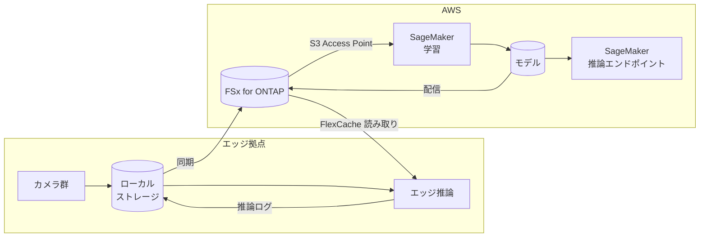

> 🌐 Language: **日本語** | [English](../../en/aws-patterns/02-edge-ai-sagemaker.md)

# Pattern 02: エッジ AI + SageMaker

> **成熟度**: 設計のみ / **最終確認**: 2026-08-19

集約したデータで自前のモデルを学習し、推論をクラウドかエッジに置く構成。
[Pattern 01](01-edge-ai-bedrock.md) の基盤モデルでは精度・レイテンシ・単価のいずれかが
合わない場合に検討します。

## 実装状況

| 経路の段 | このリポジトリ | 場所 |
|---|---|---|
| エッジ撮影 → ローカルストレージ | 実装あり | [`edge/raspberry-pi/camera/`](../../../edge/raspberry-pi/camera/) |
| 学習データの整備（ラベル付け、分割） | なし | — |
| SageMaker での学習 | なし | — |
| モデルの配置と推論 | なし | — |
| エッジへのモデル配信 | なし | — |
| 推論結果の収集と再学習 | 一部（フィードバック記録のみ） | [`cloud/ai/feedback_recorder/`](../../../cloud/ai/feedback_recorder/) |

**このリポジトリに SageMaker のコードはありません。** 設計として置いています。

## データフロー

1. 複数のカメラがローカルストレージに書き込む
2. 集約先へ同期する
3. SageMaker が S3 Access Point 経由で学習データを読む。データのコピーを作らない
4. 学習済みモデルを集約先の所定パスに書き戻す
5. クラウド推論はエンドポイント、エッジ推論はストレージ経由でモデルを参照する
6. 推論結果を戻し、次の学習データにする

## ストレージ

このパターンの中心はストレージ設計です。学習は「同じデータを何度も読む」ワークロードです。

| 用途 | 置き方 | 理由 |
|---|---|---|
| 生データ | ファイルストレージに一元化 | 学習データセットの版を切るときにコピーを作らない |
| 学習データセット | 生データへの参照 + マニフェスト | 実体を複製すると版が増えるほど容量が線形に増える |
| モデル成果物 | 集約先の専用パス | 配信経路を 1 つに保つ |
| 推論ログ | 生データと分けて保存 | 再学習の入力として扱いが違う |

**エッジへのモデル配信**には 2 つの考え方があります。

- **プッシュ**: 配布の仕組みでモデルをデバイスへ送る。デバイス側にモデルの実体が増える
- **参照**: エッジ側のストレージ経由でモデルを参照する。実体はストレージに 1 つ

参照方式は、ブロック単位でキャッシュする仕組みと組み合わせると、読まれた範囲だけが転送される
ことが期待できます。ただし推論ランタイムがモデルをどう読むかで転送量は変わり、
**この構成では未計測**です。

## AI ワークフロー

基盤モデルではなく自前モデルを選ぶ判断軸は 4 つです。どちらが優れているかではなく、
どの条件でどちらが合うかです。

| 軸 | 基盤モデル（Pattern 01）が合う | 自前モデル（このパターン）が合う |
|---|---|---|
| 学習データ | 少ない / ラベルがない | ラベル付きデータが集まっている |
| 判定の性質 | 説明文が欲しい、対象が多様 | 分類が固定で、境界が微妙 |
| レイテンシ | 秒単位で足りる | ミリ秒が必要、またはオフライン必須 |
| 単価の形 | 呼び出し単価を許容できる | 呼び出しが多く、単価より固定費が有利 |

学習と推論の配置も分けて決められます。学習はクラウド、推論はエッジという組み合わせが
このパターンの典型です。オンプレミス側のストレージとクラウドをまたいで推論する構成は
[AWS が構成例を公開しています](https://aws.amazon.com/blogs/storage/hybrid-ml-inferencing-on-amazon-eks-with-amazon-fsx-for-netapp-ontap-and-on-premises-netapp/)。

## セキュリティ

- **学習データの持ち出し範囲**。S3 Access Point 経由で読む構成は、データの実体を
  ファイルストレージに留めます。誰がどの範囲を読めるかは IAM とファイルシステム権限の
  両方で決まります（[2 層の認可](../s3ap-compatibility-matrix.md)）
- **モデル成果物の保護**。モデルは学習データの情報を含みます。生データと同じ分類で扱います
- **エッジ側のモデル改変**。参照方式ならストレージ側の権限で読み取り専用にできます
- **推論ログに写る内容**。画像そのものを残すか、特徴量だけにするかで分類が変わります

## コストの考え方

| 費用を駆動するもの | 効き方 |
|---|---|
| 学習の頻度と規模 | 学習インスタンスの稼働時間。データ量ではなくエポックと並列度で決まる |
| 学習データの持ち方 | 実体を複製すると容量が版数に比例する。参照方式なら増えない |
| 推論の配置 | クラウド推論はエンドポイントの常時稼働。エッジ推論はデバイス側の固定費 |
| モデル配信の方式 | プッシュはデバイス台数 × モデルサイズの転送。参照は読まれた範囲のみ |
| データ転送 | 学習データをリージョン間で動かすと転送費が乗る |

## 前提と制約

- **このリポジトリに実装はありません。** 設計として読んでください
- **S3 Access Point 経由で SageMaker が学習データを読む構成は、AWS の対応サービス一覧に
  含まれています**（[出典](https://docs.aws.amazon.com/fsx/latest/ONTAPGuide/using-access-points-with-aws-services.html)）。
  ただし S3 AP 側の制約（条件付き書き込み不可、イベント通知なし）は学習パイプラインの
  組み方に影響します
- **エッジ推論の実行基盤は別に決める必要があります。** Greengrass のコンポーネントとして
  動かす場合の詳細は [Pattern 09](09-edge-agentic-ai.md) にあります
- **モデル配信のキャッシュ効率は未計測です。** 「読まれた範囲だけ転送される」は仕組みからの
  期待であって、この構成での測定値ではありません
- **SageMaker の一部機能は新規顧客に非開放になっています。** ラベリングやモデル監視の機能を
  設計に入れる前に、対象機能の提供状況を確認してください
  （[サービスの提供状況](../../agent/service-lifecycle.md)）

## 参考

- [Hybrid ML inferencing on Amazon EKS with FSx for ONTAP and on-premises NetApp](https://aws.amazon.com/blogs/storage/hybrid-ml-inferencing-on-amazon-eks-with-amazon-fsx-for-netapp-ontap-and-on-premises-netapp/)
- [Hybrid patterns for deployment (AWS whitepaper)](https://docs.aws.amazon.com/whitepapers/latest/hybrid-machine-learning/hybrid-patterns-for-deployment.html)
- [Using access points with AWS services](https://docs.aws.amazon.com/fsx/latest/ONTAPGuide/using-access-points-with-aws-services.html)
- 関連: [Pattern 01](01-edge-ai-bedrock.md)（基盤モデルで始める） /
  [Pattern 09](09-edge-agentic-ai.md)（エッジ側の実行基盤）
