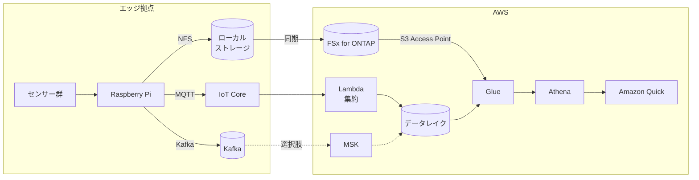

> 🌐 Language: **日本語** | [English](../../en/aws-patterns/03-industrial-iot-analytics.md)

# Pattern 03: 産業 IoT 分析

> **成熟度**: 実装あり（一部） / **最終確認**: 2026-08-19

センサーが出す時系列データをイベントバスに流し、データレイクに落として SQL で分析する構成。
「まず溜めて、後から問いを立てる」形の分析に向きます。

## 実装状況

| 経路の段 | このリポジトリ | 場所 |
|---|---|---|
| センサー読み取り → イベント生成 | 実装あり | [`edge/raspberry-pi/sensors/`](../../../edge/raspberry-pi/sensors/) |
| Kafka への publish（切断時バッファ付き） | 実装あり | [`edge/raspberry-pi/common/`](../../../edge/raspberry-pi/common/) |
| MQTT 経由の取り込み | 実装あり | [`cloud/iot_ingestion/`](../../../cloud/iot_ingestion/) |
| データレイクの基盤（S3 / Kinesis / Glue / SNS） | 実装あり | [`cloud/ingestion/template.yaml`](../../../cloud/ingestion/template.yaml) |
| Glue クローラ + Athena クエリ | 実装あり | [`usecases/ontap-telemetry-analytics/`](../../../usecases/ontap-telemetry-analytics/) |
| MSK の構築 | なし（Kafka はオンプレ VM 前提） | [kafka-integration](../kafka-integration.md) |
| Iceberg テーブルとしての取り込み | なし | 下記「取り込み経路の選択」 |

## データフロー

1. センサー値を読み、イベントとして構造化する
2. 低頻度・小サイズのテレメトリは MQTT、高頻度や波形などまとまったデータは Kafka に流す
3. Lambda が集約してデータレイクに書く。1 件ごとに書くとオブジェクト数が増えるため、
   時間窓でまとめる
4. 大きなペイロード（波形、画像）はファイルストレージに置き、イベントには参照だけを持たせる
5. Glue でスキーマを起こし、Athena で SQL を書く
6. 可視化は Amazon Quick（ap-northeast-1 で利用可能）

## ストレージ

**イベントとペイロードを分けます。** イベントは小さく大量で、ペイロードは大きく少ない。
同じ置き方をすると片方が非効率になります。

| 種別 | 置き方 | パーティション |
|---|---|---|
| イベント（メタデータ） | 列指向形式でまとめ書き | 日時 + デバイス ID |
| ペイロード（波形、画像） | ファイルストレージ | デバイス ID + 日時の階層 |
| 集計済み | 別テーブル | 分析の粒度に合わせる |

パーティション設計を後から変えるのは高くつきます。詳細は
[データスキーマ設計](../data-schema-design.md) にあります。

### 取り込み経路の選択

Kafka のイベントをデータレイクに落とす方法は複数あります。対称に並べます。

| 経路 | 向く条件 | trade-off |
|---|---|---|
| Lambda で集約して書く | 変換ロジックを自分で持ちたい。コンシューマが 1 つ | 集約窓・リトライ・重複排除を自前で実装する |
| MSK Express brokers の streaming table | Kafka トピックをそのまま Iceberg テーブルとして持ちたい | Kafka が MSK であることが前提。テーブル形式が Iceberg に決まる |
| ストリーム処理基盤を挟む | 集計や結合をストリームで行いたい | 運用対象が 1 つ増える |

MSK Express brokers は Kafka トピックのレコードを Parquet として書き、テーブルに commit します
（[出典](https://docs.aws.amazon.com/AmazonS3/latest/userguide/s3-tables-streaming-msk.html)）。
コネクタのパイプラインを別に運用しない形になります。

## AI ワークフロー

このパターン自体は分析基盤です。AI は 2 つの入り方があります。

- **蓄積データからの学習**: Athena で作った集計を学習データにする（[Pattern 02](02-edge-ai-sagemaker.md)）
- **異常検知**: 時系列の異常を検出する。設備の状態監視が目的なら、産業機器向けの
  マネージド異常検知を使う選択もあります。ただし予知保全向けの一部サービスは
  sunset になっているため、提供状況を先に確認してください
  （[サービスの提供状況](../../agent/service-lifecycle.md)）

## セキュリティ

- **デバイス由来の識別子を信用しない。** デバイス ID や MQTT トピックの階層は publisher が
  決めます。パス・S3 キー・SQL に到達する前に検証します。実装は
  [`cloud/iot_ingestion/identifiers.py`](../../../cloud/iot_ingestion/identifiers.py)
- **Glue カタログとデータの権限を二重管理にしない。** Lake Formation のテーブル権限は
  背後の S3 データへのアクセスにも及ぶ拡張が入っています（[セキュリティ設計](../security-design.md)）
- **デバイス認証**。証明書ベースにし、デバイス単位で失効できるようにします
- **OT ネットワークとの境界**。センサー側のネットワークとクラウド向けの経路を分離します

## コストの考え方

| 費用を駆動するもの | 効き方 |
|---|---|
| 書き込み単位の大きさ | 小さいオブジェクトを大量に作ると、リクエスト数とメタデータのオーバーヘッドが効く |
| スキャン量 | Athena はスキャンしたバイト数。パーティションと列指向形式で下がる |
| 保存期間と階層 | 古いデータを安価な階層に移すかどうか |
| Kafka の持ち方 | 自前運用は固定費、マネージドは構成に応じた月額 |
| 変換の置き場所 | Lambda の呼び出し回数か、ストリーム処理基盤の稼働時間か |

## 前提と制約

- **MSK の IaC はこのリポジトリにありません。** Kafka はオンプレミス VM 前提で書かれています
  （[kafka-integration](../kafka-integration.md)）
- **Data Firehose が S3 Access Point を受け付けるかは未検証です**
  （[§4](../s3ap-compatibility-matrix.md)）。Firehose のマネージドな Parquet 変換と
  バッファリングを前提にした設計は、この経路では取れない可能性があります
- **IoT Core の S3 アクションについても同様に未検証**です。このリポジトリは Lambda を
  経由する形を採っています
- **SFTP しか話せない既存システムがある場合**、AWS Transfer Family 経由で
  ファイルストレージに書く経路が使えます
  （[出典](https://docs.aws.amazon.com/en_us/transfer/latest/userguide/fsx-s3-access-points.html)）
- **ListObjectsV2 のレイテンシ**は S3 AP 経由でネイティブ S3 より遅くなります。倍率は
  この構成では未計測です

## 参考

- [Streaming tables with Amazon MSK](https://docs.aws.amazon.com/AmazonS3/latest/userguide/s3-tables-streaming-msk.html)
- [Query files with SQL using Amazon Athena (FSx for ONTAP)](https://docs.aws.amazon.com/fsx/latest/ONTAPGuide/tutorial-query-data-with-athena.html)
- [Access your FSx for ONTAP file systems with Transfer Family](https://docs.aws.amazon.com/en_us/transfer/latest/userguide/fsx-s3-access-points.html)
- 関連: [Pattern 04](04-near-realtime-manufacturing.md)（遅延を秒単位にする） /
  [Pattern 08](08-unified-namespace.md)（OT 側の名前空間から整える）
