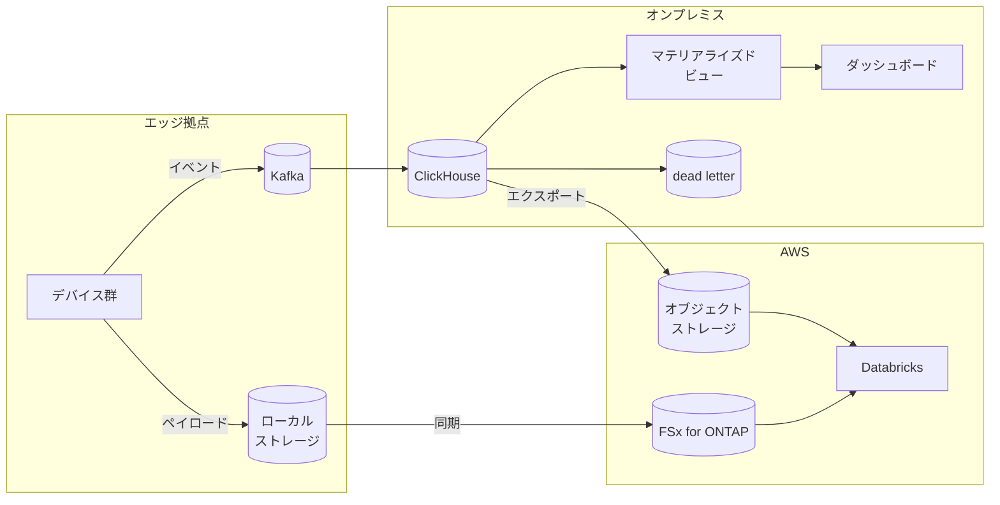

> 🌐 Language: **日本語** | [English](../../en/aws-patterns/04-near-realtime-manufacturing.md)

# Pattern 04: 準リアルタイム製造分析

> **成熟度**: 実装あり（一部） / **最終確認**: 2026-08-19

イベントバスから列指向データベースに直接取り込み、ダッシュボードの遅延を秒単位に保つ構成。
[Pattern 03](03-industrial-iot-analytics.md) のデータレイク経路では遅延が足りない場合に使います。

## 実装状況

| 経路の段 | このリポジトリ | 場所 |
|---|---|---|
| Kafka への publish | 実装あり | [`edge/raspberry-pi/common/`](../../../edge/raspberry-pi/common/) |
| ClickHouse の取り込みテーブル（Kafka engine） | 実装あり | [`cloud/clickhouse/ddl/`](../../../cloud/clickhouse/ddl/) |
| マテリアライズドビューとロールアップ | 実装あり | 同上 |
| 異常イベントと dead letter | 実装あり | 同上 |
| ダッシュボード定義 | 実装あり | [`cloud/clickhouse/grafana/`](../../../cloud/clickhouse/grafana/) |
| ClickHouse / Kafka の構築 | なし（オンプレ VM 前提） | [kafka-integration](../kafka-integration.md) |
| Databricks への受け渡し | なし | [databricks-integration](../databricks-integration.md) |

物理機材なしで経路を通すには [`local-demo/`](../../../local-demo/) を使います。

## データフロー

1. デバイスがイベントを Kafka に publish する
2. ClickHouse が Kafka engine テーブルで取り込む
3. マテリアライズドビューで集計を維持し、ダッシュボードはそれを読む
4. パースに失敗したメッセージは dead letter に落とし、取り込みを止めない
5. 集計済みの特徴量を定期的にエクスポートし、キュレーション層へ渡す
6. 大きなペイロードはファイルストレージ側に残し、参照でつなぐ

## ストレージ

このパターンでは**同じデータが 3 か所に別の形で存在します。** 役割を混ぜないことが要点です。

| 場所 | 保持するもの | 保持期間の考え方 |
|---|---|---|
| Kafka | 直近のイベント（再処理用） | 保持期間はリプレイしたい範囲で決める。永続化層ではない |
| ClickHouse | 分析用の生イベントと集計 | 生は短く、集計は長く。ロールアップで粒度を落とす |
| オブジェクト / ファイルストレージ | 長期保存とペイロード | ここが真実の源 |

**ClickHouse を真実の源にしない**のが判断の分かれ目です。列指向データベースは分析のための
読み取り最適化された複製として扱い、失っても再構築できる状態を保ちます。

## AI ワークフロー

このパターンは AI そのものより、AI に渡すデータの整形を担います。

- **特徴量の生成**: ロールアップで作った集計を、学習データの特徴量として渡す
- **即時判定との組み合わせ**: [Pattern 01](01-edge-ai-bedrock.md) の画像判定結果を
  イベントとして流し込み、センサー値と相関を見る
- **キュレーション層**: Bronze / Silver / Gold のような層構造で、生データと学習用データを分ける
  （[databricks-integration](../databricks-integration.md)）

### Iceberg テーブルとの使い分け

Kafka トピックを列指向データベースに入れる代わりに、Iceberg テーブルとして materialize する
経路もあります。対称に並べます。

| 観点 | ClickHouse に取り込む | Iceberg テーブルに materialize する |
|---|---|---|
| 向く用途 | 秒単位のダッシュボード、高頻度の集計クエリ | 複数エンジンから読む分析、長期保存 |
| 運用対象 | データベースの運用が増える | テーブル形式が Iceberg に決まる |
| 遅延 | 取り込みから集計まで短い | commit の間隔に依存する |
| 読み手 | ClickHouse のクライアント | Iceberg 対応エンジン全般 |

両方を持つ構成もあり得ます。ダッシュボードは列指向データベース、横断分析は Iceberg という
分担です。

## セキュリティ

- **オンプレミス側のデータベースの露出範囲**。ClickHouse をクラウドから読ませる場合、
  経路を閉域にするかエクスポート経由にするかを決めます
- **エクスポート先の権限**。キュレーション層が読む先の権限は、生データとは別に設計します
- **dead letter の中身**。パースに失敗したメッセージには想定外の値が入ります。
  ログに出す前に扱いを決めます
- **Kafka のトピック単位の認可**。コンシューマが読める範囲をトピックで区切ります

## コストの考え方

| 費用を駆動するもの | 効き方 |
|---|---|
| ClickHouse の保持期間 | ディスク容量に直接効く。ロールアップで生の保持を短くできる |
| Kafka の保持期間 | 同じくディスク。リプレイ要件で決まる |
| エクスポートの頻度 | 転送量とオブジェクト数。まとめると下がる |
| キュレーション層の計算 | クラスタの稼働時間。バッチ間隔で調整する |
| 二重持ち | 同じデータを 3 か所に持つ構成なので、どこを短くするかを決めておく |

## 前提と制約

- **ClickHouse と Kafka の構築はこのリポジトリの範囲外です。** オンプレミス VM 前提で
  設計されています
- **Unity Catalog の External Location に S3 Access Point を登録できるかは未検証です。**
  以前は「できない」と記載していましたが、機構の裏付けが取れなかったため断定を取り下げました
  （[databricks-integration](../databricks-integration.md)）。この判定によって、
  ファイルストレージから直接読むか、エクスポートを経由するかが変わります
- **ClickHouse のスケジュール実行機能は提供形態によって異なります。** 定期エクスポートを
  組む前に、使っている構成でスケジュール実行が可能かを確認してください
- **秒単位の遅延は測定していません。** 「秒単位に保つ」は設計目標であって、この構成での
  実測値ではありません

## 参考

- [databricks-integration](../databricks-integration.md) — 接続パスと Unity Catalog 設計
- [kafka-integration](../kafka-integration.md) — トポロジーとトピック設計
- [Streaming tables with Amazon MSK](https://docs.aws.amazon.com/AmazonS3/latest/userguide/s3-tables-streaming-msk.html)
- 関連: [Pattern 03](03-industrial-iot-analytics.md)（バッチ寄りの分析） /
  [Flexible AI Data Layer](../flexible-ai-data-layer.md)（テーブル形式とカタログの相互運用）
