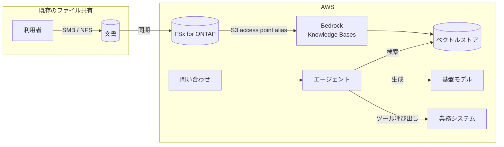

> 🌐 Language: **日本語** | [English](../../en/aws-patterns/05-agentic-rag.md)

# Pattern 05: エージェント型 RAG

> **成熟度**: 設計のみ（公式手順あり） / **最終確認**: 2026-08-19

ファイル共有に既にある文書を、コピーせずに生成 AI の参照元にする構成。
図面、作業手順書、検査報告といった既存資産が対象です。

## 実装状況

| 経路の段 | このリポジトリ | 場所 |
|---|---|---|
| 文書のファイルストレージへの集約 | なし | — |
| S3 Access Point の作成 | 一部（FSx のテンプレートはある） | [`cloud/fsxn/`](../../../cloud/fsxn/) |
| Knowledge Base の作成と同期 | なし | 下記の公式手順 |
| 検索とモデル呼び出し | なし | — |
| エージェントによる多段の検索 | なし | [Agentic AI on AWS](../agentic-ai-on-aws.md) |

**このリポジトリに実装はありません。** ただし **AWS が公式手順を公開しています**（下記）。
「概念」ではなく「設計のみ」としているのはそのためです。

## データフロー

1. 既存のファイル共有に文書が置かれている。利用者は SMB / NFS で使い続ける
2. 集約先へ同期する（または集約先を直接共有として使う）
3. S3 Access Point の alias を Knowledge Base のデータソースに指定する。
   Knowledge Bases は bucket 名の代わりに alias を受け付けます
4. 取り込み時にチャンク分割と埋め込みが行われ、ベクトルストアに入る
5. 問い合わせに対して検索し、取得した内容を根拠にモデルが回答する
6. 多段の判断が必要な場合、エージェントが検索とツール呼び出しを繰り返す

**単発の検索と、エージェントによる多段の検索は別物です。** 前者は 1 回の検索で
答えが決まる問い、後者は「まず何を調べるか」から決める必要がある問いに向きます。

## ストレージ

| 対象 | 置き方 | 注意 |
|---|---|---|
| 原本の文書 | ファイル共有のまま | コピーを作らないことがこのパターンの利点 |
| ベクトル表現 | ベクトルストア | 原本とは別のライフサイクル。原本削除時の扱いを決める |
| チャンクの中間生成物 | 取り込み処理が扱う | 保持するかは Knowledge Base の設定で決まる |
| アクセス記録 | 別に保存 | どの文書が根拠として使われたかの追跡に必要 |

**原本を消したときにベクトルが残る**問題を設計で扱ってください。文書の削除が
検索結果に反映されるまでの経路と間隔を決めます。

## AI ワークフロー

- **チャンク分割の粒度**が回答品質を最も左右します。図面や表を含む文書は、
  文章前提の分割で意味が壊れることがあります
- **根拠の提示**。どの文書のどこを参照したかを回答に添えられないと、
  利用者は検証できません
- **権限に応じた検索範囲**。全文書を無条件に検索させると、本来見えない情報が
  回答に混ざります。設計上の最大の落とし穴です
- **エージェント化する場合**、記憶（会話をまたぐ保持）とツール接続の設計が必要です。
  構成要素と判断材料は [Agentic AI on AWS](../agentic-ai-on-aws.md) にあります

## セキュリティ

**このパターンで最も注意が必要な点は、権限の非対称です。**

ファイル共有では、利用者ごとに見える文書が違います。しかし Knowledge Base が単一の
資格情報で全文書を取り込むと、検索結果はその区別を失います。結果として、
本来アクセスできない文書の内容が回答に現れる可能性があります。

対処の方向は 3 つあります。いずれも trade-off があります。

| 方向 | 効果 | trade-off |
|---|---|---|
| 権限境界ごとに Knowledge Base を分ける | 境界が明確 | 数が増えると運用が重い。文書が複数境界に属すと重複する |
| 検索結果に対して事後フィルタをかける | 単一 KB で済む | フィルタ実装の正しさに依存する。埋め込み自体は全文書から作られる |
| 取り込み対象を、共有可能な文書に限定する | 最も単純で安全 | 対象が狭まる |

加えて、S3 Access Point の認可は IAM とファイルシステム権限の 2 層で評価されます
（[出典](../s3ap-compatibility-matrix.md)）。Active Directory 統合環境での構成は
[AWS が手順を公開しています](https://aws.amazon.com/blogs/storage/enabling-ai-powered-analytics-on-enterprise-file-data-configuring-s3-access-points-for-amazon-fsx-for-netapp-ontap-with-active-directory/)。

## コストの考え方

| 費用を駆動するもの | 効き方 |
|---|---|
| 取り込む文書量 | 埋め込み生成の回数。初回同期が最も大きい |
| 再同期の頻度 | 差分だけを取り込めるかで変わる |
| ベクトルストアの構成 | 常時稼働の構成か、使用量課金かで形が変わる |
| 問い合わせ回数と入力量 | 検索で取得したチャンクは入力トークンとして課金対象 |
| チャンクサイズ | 大きいと 1 回の入力が増え、小さいと検索回数が増える |

## 前提と制約

- **AWS が公式手順を公開しています**:
  [Build a RAG application using Amazon Bedrock Knowledge Bases](https://docs.aws.amazon.com/fsx/latest/ONTAPGuide/tutorial-build-rag-with-bedrock.html)。
  データソースには S3 Access Point の alias を指定します
- **記述の食い違いがあります。** Bedrock 側のデータソースのドキュメントには
  汎用 S3 バケットのみ対応と記載がある一方、FSx for ONTAP ガイド側は alias 経由の手順を
  示しています（[Bedrock 側](https://docs.aws.amazon.com/bedrock/latest/userguide/s3-data-source-connector.html)）。
  構築時は FSx for ONTAP ガイドに従ってください
- **S3 AP はイベント通知に対応しません。** 文書の追加を検知して自動的に再同期する経路は
  そのままでは組めません。スケジュール同期か FPolicy を使います
- **ONTAP 9.17.1 以降、同一リージョン、同一アカウントが必要**です
  （[制約一覧](../s3ap-compatibility-matrix.md)）
- **ListObjectsV2 のレイテンシ**が取り込み時のクロールに影響しますが、
  この構成では未計測です

## 参考

- [Build a RAG application using Amazon Bedrock Knowledge Bases](https://docs.aws.amazon.com/fsx/latest/ONTAPGuide/tutorial-build-rag-with-bedrock.html)
- [Configuring S3 Access Points for FSx for ONTAP with Active Directory](https://aws.amazon.com/blogs/storage/enabling-ai-powered-analytics-on-enterprise-file-data-configuring-s3-access-points-for-amazon-fsx-for-netapp-ontap-with-active-directory/)
- [Connect a data source to your knowledge base](https://docs.aws.amazon.com/bedrock/latest/userguide/data-source-connectors.html)
- 関連: [Agentic AI on AWS](../agentic-ai-on-aws.md) /
  [Pattern 06](06-video-analytics.md)（映像を検索対象にする）
