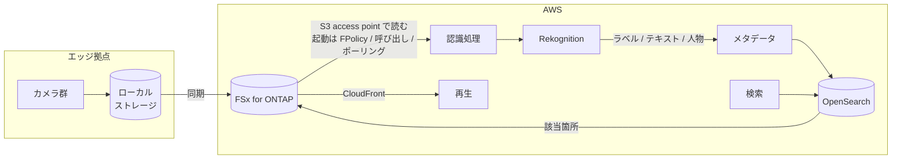

> 🌐 Language: **日本語** | [English](../../en/aws-patterns/06-video-analytics.md)

# Pattern 06: 映像分析

> **成熟度**: 設計のみ / **最終確認**: 2026-08-19

カメラ映像から画像認識でメタデータを抽出し、検索エンジンに索引して「後から探せる」状態を作る
構成。[Pattern 01](01-edge-ai-bedrock.md) が「今の 1 枚を判定する」のに対し、
こちらは「蓄積した映像から該当箇所を見つける」ことを目的にします。

## 実装状況

| 経路の段 | このリポジトリ | 場所 |
|---|---|---|
| カメラ撮影 → ローカルストレージ | 実装あり（静止画） | [`edge/raspberry-pi/camera/`](../../../edge/raspberry-pi/camera/) |
| 映像の保存と切り出し | なし | — |
| 画像・映像認識によるメタデータ抽出 | なし | — |
| 検索エンジンへの索引 | なし | — |
| 検索インターフェース | なし | — |
| 映像の配信 | なし | 下記「配信」 |

**このリポジトリに実装はありません。** 静止画の撮影と保存までが実装済みです。

## データフロー

1. カメラが映像または静止画をローカルストレージに書く
2. 集約先へ同期する
3. 新しいファイルに対して認識処理を起動する
4. ラベル、検出テキスト、時刻位置などのメタデータを抽出する
5. メタデータを検索エンジンに索引する。**映像そのものは索引しない**
6. 検索でヒットしたメタデータから、元の映像の該当箇所を参照する
7. 再生はコンテンツ配信経由で行う

**設計の要点は「重いものを索引しない」ことです。** 検索対象はメタデータで、
映像は参照先として置いたままにします。

## ストレージ

| 対象 | 置き方 | 理由 |
|---|---|---|
| 映像の原本 | ファイルストレージ | 大きく、書いたら基本読まない。容量課金が向く |
| 抽出メタデータ | 検索エンジン + 長期保存の複製 | 検索エンジンを真実の源にしない |
| サムネイル | 別パス | 一覧表示で頻繁に読まれる。原本とアクセス特性が違う |
| 配信用の変換済み | 必要なら別パス | 原本と混ぜない |

映像は時間経過でアクセス頻度が落ちます。階層化を最初から設計に入れてください。

## AI ワークフロー

抽出するメタデータの種類で設計が変わります。

| 抽出するもの | 使い方 | 注意 |
|---|---|---|
| ラベル（物体、シーン） | 「何が写っているか」での検索 | 信頼度の閾値を決める。低いと誤検出が索引に入る |
| 検出テキスト | ラベル、標識、伝票の読み取り | 向き・照明で精度が変わる |
| 人物・顔 | 追跡、入退管理 | **法規制と社内規程の確認が先。** 技術判断だけで進めない |
| 時刻位置 | 映像内の該当箇所へのジャンプ | メタデータに位置を持たせる設計が必要 |

**意味的な検索**（「赤いシャツの人」のような自然文での検索）まで進める場合、
抽出したメタデータを埋め込みに変換して検索する構成になります。AWS が
[構成例を公開しています](https://aws.amazon.com/blogs/machine-learning/semantic-image-search-for-articles-using-amazon-rekognition-amazon-sagemaker-foundation-models-and-amazon-opensearch-service/)。

## セキュリティ

- **人物が写る映像は扱いが変わります。** 顔や人物の検出を設計に入れる前に、
  適用される規制と組織の規程を確認してください。これは技術的判断ではありません。
  このドキュメントは論点の提示に留め、法的判断は示しません
- **検索インターフェースの権限**。誰がどの拠点・どの期間の映像を検索できるかを設計します。
  メタデータ側で絞る必要があります
- **配信経路の保護**。コンテンツ配信を使う場合、署名付きの仕組みで参照を制限します
- **保持期間の根拠**。映像は「とりあえず長く持つ」になりがちです。保持期間を決めた
  理由を書き残してください

## コストの考え方

| 費用を駆動するもの | 効き方 |
|---|---|
| 認識処理をかける単位 | 全フレームか、間隔を空けるか、動きがあったときだけか。最も効く調整点 |
| 映像の保存量 | 解像度 × フレームレート × 保持期間。階層化で下がる |
| 検索エンジンの構成 | 索引サイズとノード構成。メタデータのみなら映像量に比例しない |
| 配信量 | 再生される回数と映像サイズ |
| 変換処理 | 配信用の形式変換を行う場合の処理時間 |

## 前提と制約

- **このリポジトリに実装はありません。** 設計として読んでください
- **ファイル追加をイベントで起動できません。** S3 Access Point はイベント通知に対応しないため、
  認識処理の起点は FPolicy、書き込み側からの呼び出し、またはポーリングになります
  （[制約一覧](../s3ap-compatibility-matrix.md)）
- **S3 Access Point 経由の映像配信は AWS が手順を公開しています**
  （[出典](https://docs.aws.amazon.com/fsx/latest/ONTAPGuide/using-access-points-with-aws-services.html)）
- **エッジ側で映像を扱う場合、帯域が制約になります。** セルラー接続では映像の常時転送は
  現実的でないため、エッジで切り出すか、イベント時のみ転送する設計が必要です
- **旧世代のエッジ映像分析向けサービスの一部はサポートが終了しています。**
  設計に含める前に提供状況を確認してください
  （[サービスの提供状況](../../agent/service-lifecycle.md)）
- **ListObjectsV2 のレイテンシ**が大量ファイルの走査に影響しますが、この構成では未計測です

## 参考

- [Semantic image search using Rekognition, SageMaker foundation models and OpenSearch Service](https://aws.amazon.com/blogs/machine-learning/semantic-image-search-for-articles-using-amazon-rekognition-amazon-sagemaker-foundation-models-and-amazon-opensearch-service/)
- [Intelligently search media assets with Amazon Rekognition and OpenSearch](https://aws.amazon.com/blogs/architecture/intelligently-search-media-assets-with-amazon-rekognition-and-amazon-es/)
- [Using access points with AWS services](https://docs.aws.amazon.com/fsx/latest/ONTAPGuide/using-access-points-with-aws-services.html)
- 関連: [Pattern 01](01-edge-ai-bedrock.md)（その場での判定） /
  [Pattern 05](05-agentic-rag.md)（文書を検索対象にする）
