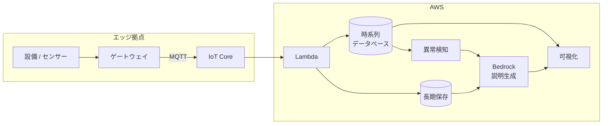

> 🌐 Language: **日本語** | [English](../../en/aws-patterns/07-digital-twin.md)

# Pattern 07: デジタルツイン

> **成熟度**: 実装あり（一部） / **最終確認**: 2026-08-19

設備の状態を時系列で保持し、現在値と履歴を可視化し、変化の説明を生成 AI に作らせる構成。
「今どうなっているか」と「なぜそうなったか」を同じ場所で見せることが目的です。

## 実装状況

| 経路の段 | このリポジトリ | 場所 |
|---|---|---|
| デバイス → IoT Core (MQTT) | 実装あり | [`cloud/iot_ingestion/`](../../../cloud/iot_ingestion/) |
| Lambda での集約と保存 | 実装あり | 同上 |
| 設備テレメトリの収集 | 実装あり（ストレージ機器の REST API） | [`edge/raspberry-pi/sensors/`](../../../edge/raspberry-pi/sensors/) |
| 時系列データベースへの格納 | なし | 下記「時系列データベースの選択」 |
| アセットモデル（設備の構造表現） | なし | [Pattern 08](08-unified-namespace.md) |
| 説明の生成 | なし | [Agentic AI on AWS](../agentic-ai-on-aws.md) |
| 可視化層 | なし | — |

## データフロー

1. 設備やセンサーの値をゲートウェイが収集し、MQTT で送る
2. Lambda が受け、時系列データベースと長期保存の両方に書く
3. 可視化層が現在値と直近の履歴を表示する
4. 異常検知が閾値超過やパターン逸脱を検出する
5. 検出時に、履歴と設備情報を渡して説明文を生成する
6. 生成した説明を可視化層に表示する

**時系列データベースと長期保存を分けます。** 前者は直近の高速な読み取り、
後者は監査と再学習のための保持です。役割が違います。

## ストレージ

| 対象 | 置き方 | 保持 |
|---|---|---|
| 現在値と直近の履歴 | 時系列データベース | 分析対象の期間（週〜月単位） |
| 長期の履歴 | 列指向形式で長期保存 | 監査・再学習の要件で決める |
| 設備の構造情報 | アセットモデルまたはマスタデータ | 変更履歴を持たせる |
| 生成した説明 | 検出イベントと紐づけて保存 | 後から「なぜそう判断したか」を辿るため |

**カーディナリティが設計を決めます。** 時系列データベースの多くは、系列数（デバイス ×
メトリック × タグの組み合わせ）が性能とサイジングを決めます。設備が増えたときに何が起きるかを
先に見積もってください。

### 時系列データベースの選択

**Amazon Timestream for LiveAnalytics は 2025-06-20 付で新規顧客のアクセスが終了しています**
（[出典](https://docs.aws.amazon.com/timestream/latest/developerguide/AmazonTimestreamForLiveAnalytics-availability-change.html)）。
既存顧客のワークロードは継続します。新規に構築する場合は選べません。

新規構築の選択肢を対称に並べます。

| 選択肢 | 向く条件 | trade-off |
|---|---|---|
| Amazon Timestream for InfluxDB | 時系列データベースの機能をそのまま使いたい。カーディナリティが 1000 万系列未満 | インスタンスのサイジングが必要。カーディナリティ上限を超えると性能が劣化する |
| ストリーミング → オブジェクトストレージ + Iceberg → SQL クエリ | 既に分析基盤があり、そこに寄せたい | 時系列特化の関数や直近値の高速取得は自前で組む |
| 列指向データベース（[Pattern 04](04-near-realtime-manufacturing.md)） | ダッシュボードの遅延を秒単位にしたい | データベースの運用が増える |

AWS は LiveAnalytics からの移行先として、カーディナリティが 1000 万未満なら
Timestream for InfluxDB を推奨としています
（[出典](https://docs.aws.amazon.com/timestream/latest/developerguide/timestream-influxdb-target.html)）。
より高いカーディナリティを扱う場合は InfluxDB 3 系の構成も選択肢になります
（[出典](https://docs.aws.amazon.com/timestream/latest/developerguide/influxdb3.html)）。

## AI ワークフロー

生成 AI の役割は**判定ではなく説明**です。異常の検出そのものは統計や機械学習で行い、
「何が起きて、何をすべきか」を人間が読める形にする部分を担わせます。

- **入力に何を渡すか**。時系列の抜粋、設備の構造情報、過去の類似事例。渡す情報が
  不足すると一般論しか返りません
- **生成物の扱い**。説明は補助的な情報であり、対処の決定そのものではありません。
  そう読めるように提示します
- **説明の再現性**。同じ入力で同じ説明が返るとは限りません。生成物を保存し、
  何を根拠にしたかを残します
- **エージェント化**。複数の設備をまたいだ原因の切り分けまで進めるなら、
  検索とツール呼び出しの設計が必要です（[Agentic AI on AWS](../agentic-ai-on-aws.md)）

## セキュリティ

- **デバイス由来の識別子を検証する。** デバイス ID やトピック階層は publisher 制御です。
  時系列データベースの系列キーに直接使うと、意図しない系列が作られます
- **制御系への書き戻し**。可視化から設備を操作する経路を作る場合、
  読み取りとは別の権限境界にします。デジタルツインは読み取り側から始めるのが安全です
- **設備構成情報の機密性**。どの設備が何台あるかは、それ自体が機密になる場合があります
- **生成した説明の保存先**。設備の異常内容を含むため、テレメトリと同じ分類で扱います

## コストの考え方

| 費用を駆動するもの | 効き方 |
|---|---|
| 送信間隔と系列数 | 書き込み回数。カーディナリティはサイジングにも効く |
| 時系列データベースの保持期間 | ストレージ。長期は別の層に落とす |
| インスタンス構成 | 常時稼働のため、サイジングが月額を決める |
| 説明生成の回数 | 異常検出のたびに呼ぶか、まとめて日次で作るか |
| 可視化層の利用者数 | 提供形態によってユーザー課金の場合がある |

## 前提と制約

- **時系列データベースは選び直しが必要です。** LiveAnalytics は新規顧客に開いていません（上記）
- **アセットモデル（設備の構造表現）はこのパターンの前提ですが、実装がありません。**
  OT 側の名前空間設計から入る場合は [Pattern 08](08-unified-namespace.md) を先に読んでください
- **IoT Core の S3 アクションが S3 Access Point を受け付けるかは未検証**です
  （[§4](../s3ap-compatibility-matrix.md)）。このリポジトリは Lambda 経由です
- **産業機器向けの一部の機能は新規顧客に非開放になっています。** 設備監視の機能を
  設計に入れる前に提供状況を確認してください
  （[サービスの提供状況](../../agent/service-lifecycle.md)）
- **可視化層は ap-northeast-1 で利用可能です**（AWS のリージョン別提供状況で確認、
  2026-08-19 時点）。他のリージョンで構築する場合は改めて確認してください

## 参考

- [Timestream for LiveAnalytics availability change](https://docs.aws.amazon.com/timestream/latest/developerguide/AmazonTimestreamForLiveAnalytics-availability-change.html)
- [Timestream for InfluxDB as a migration target](https://docs.aws.amazon.com/timestream/latest/developerguide/timestream-influxdb-target.html)
- [What is Timestream for InfluxDB?](https://docs.aws.amazon.com/timestream/latest/developerguide/timestream-for-influxdb.html)
- 関連: [Pattern 03](03-industrial-iot-analytics.md)（蓄積して SQL で分析） /
  [Pattern 08](08-unified-namespace.md)（設備の名前空間とモデル）
