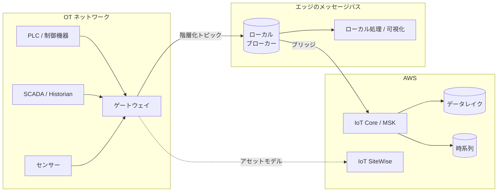

> 🌐 Language: **日本語** | [English](../../en/aws-patterns/08-unified-namespace.md)

# Pattern 08: 統合名前空間 / 産業データファブリック

> **成熟度**: 設計のみ / **最終確認**: 2026-08-19

機器ごとにばらばらの経路でデータが出ている状態を、単一のメッセージバス上の階層化された
名前空間に整える構成。**収集そのものが未整備な場合に、他のパターンより先に読む価値があります。**

このパターンは要求されたパターン 7 本に含まれておらず、調査から追加したものです。
このリポジトリは既に Kafka を汎用イベントバスとして使っていますが、
トピック設計と名前空間の原則が書かれていなかったため足しました。

## 実装状況

| 経路の段 | このリポジトリ | 場所 |
|---|---|---|
| イベントスキーマ（v3） | 実装あり | [`edge/raspberry-pi/common/event_schema.py`](../../../edge/raspberry-pi/common/event_schema.py) |
| Kafka への publish | 実装あり | 同上 |
| MQTT 経由の取り込み | 実装あり | [`cloud/iot_ingestion/`](../../../cloud/iot_ingestion/) |
| 階層化された名前空間の設計 | なし | 下記 |
| OT プロトコル（OPC UA 等）からの接続 | なし | — |
| アセットモデル | なし | — |
| デバイスのライフサイクル状態の表現 | なし | 下記 |

## 概念と実装の区別

**統合名前空間（Unified Namespace, UNS）は特定製品の機能ではなく設計概念です。**
すべてのシステム・デバイス・アプリケーションが互いに直接つながるのではなく、
単一の共有ブローカーに接続し、producer が publish して consumer が必要なものを subscribe する、
という構造を指します。

| 概念 | 出典 | AWS 上の実装手段 |
|---|---|---|
| 単一のメッセージバス上の階層化された単一ビュー | [UNS の定義](https://softwaretoolbox.com/resources/what-is-unified-namespace) / [Azure IoT Operations の UNS 構築手順](https://learn.microsoft.com/en-us/azure/iot-operations/discover-manage-assets/howto-build-unified-namespace) | MQTT ブローカー / IoT Core / MSK |
| 標準化されたトピック名前空間とデバイスの状態管理 | [Sparkplug B](https://softwaretoolbox.com/resources/what-is-sparkplug-b)（Eclipse Foundation の仕様） | トピック設計 + イベントスキーマ |
| 意味的なアセットモデリング | [OPC Foundation Cloud Reference Architecture](https://opcfoundation.org/wp-content/uploads/2025/04/OPCF-Cloud-Reference-Architecture-ONLINE.pdf) | IoT SiteWise のアセットモデル |
| エッジ-クラウド間の双方向ブリッジ | Azure IoT Operations の MQTT ブリッジ | IoT Core とローカルブローカー間のブリッジ |

AWS 側にも産業データファブリックの Guidance が公開されています
（[出典](https://aws.amazon.com/solutions/guidance/industrial-data-fabric-with-highbyte-intelligence-hub-on-aws/)）。

## データフロー



1. OT 側の機器がゲートウェイに接続する。機器ごとの独自プロトコルはここで吸収する
2. ゲートウェイが階層化されたトピックに publish する
3. ローカルのコンシューマ（可視化、制御ロジック）は同じバスから subscribe する
4. クラウドへはブリッジで橋渡しする。**すべてを送らない**のが要点
5. クラウド側で長期保存と時系列分析に分岐する

## 名前空間の設計

**トピック階層が名前空間そのものです。** 後から変えるとコンシューマ全体に影響するため、
最初に決めます。

階層に入れる要素の典型は次の順です。

```
<企業> / <サイト> / <エリア> / <ライン> / <セル> / <機器> / <データ種別>
```

決めることが 3 つあります。

| 決めること | 判断の材料 |
|---|---|
| 階層の深さ | 浅いと絞り込みができない。深いと機器の移設で変更が広範囲に及ぶ |
| 物理構成と論理構成のどちらを軸にするか | 物理は分かりやすいが再編で崩れる。論理は安定するが対応付けが必要 |
| データ種別を階層に入れるか、ペイロードに入れるか | 階層に入れると subscribe で絞れる。ペイロードなら階層が安定する |

### デバイスのライフサイクル状態

MQTT 単体では「デバイスが繋がっているか」がトピックから分かりません。Sparkplug B は
接続・切断を明示的なメッセージとして扱う仕組みを定義しています（birth / death certificate）。

このリポジトリのイベントスキーマ v3 には、この状態遷移の概念がありません。**破壊的変更は
行いません。** 取り入れる場合の差分として、追加検討項目を挙げます。

- トピック階層にサイト / エリア / ライン / 機器の階層を明示する
- デバイスの接続状態をイベントとして表現する
- 値が変化したときのみ送る方針（report by exception）を採るかどうか

現行スキーマの詳細は [データスキーマ設計](../data-schema-design.md) にあります。

## AI ワークフロー

名前空間が整うと、AI 側の設計が変わります。

- **文脈が入力に乗る**。「どの機器の値か」が構造から分かるため、モデルに渡す文脈を
  組み立てやすくなります
- **横断的な相関が取れる**。ライン単位、エリア単位の集約が名前空間の構造で表現できます
- **アセットモデルとの接続**。設備の構造情報を持つと、[Pattern 07](07-digital-twin.md) の
  説明生成に渡せる情報が増えます

## セキュリティ

- **OT ネットワークとの境界が最も重要です。** ゲートウェイが両側に足を持つため、
  ここが侵害されると制御系に到達しうる経路になります。一方向の通信に限定できるかを検討します
- **トピック単位の認可**。publish できるトピックと subscribe できるトピックを
  デバイスごとに絞ります。階層設計はこの認可の粒度も決めます
- **デバイス由来の値を検証する**。トピック階層は publisher が決めます。階層の要素を
  そのままパスや SQL に使う前に検証します
  （[`identifiers.py`](../../../cloud/iot_ingestion/identifiers.py)）
- **クラウドへ送る範囲**。すべてを送ると、OT 側の構成情報が丸ごと外に出ます。
  送る対象を明示的に選びます

## コストの考え方

| 費用を駆動するもの | 効き方 |
|---|---|
| クラウドへ送るメッセージ数 | ブリッジで絞るかどうかで桁が変わる |
| ブローカーの持ち方 | 自前運用は固定費、マネージドは接続数とメッセージ数 |
| ゲートウェイの台数 | エリアごとに置くか集約するか |
| 変化時のみ送る方針 | 定期送信より大幅に減るが、値が動く設備では効果が小さい |
| アセットモデルの規模 | モデル数とプロパティ数で課金される提供形態がある |

## 前提と制約

- **このリポジトリに名前空間設計の実装はありません。** Kafka の publish とスキーマは
  実装済みですが、階層設計と OT プロトコル接続はありません
- **OT プロトコルの接続は機器依存です。** 対応プロトコルはゲートウェイ製品や
  マネージドサービスによって異なります。既存機器の対応状況を先に確認してください
- **産業機器向けの一部機能は新規顧客に非開放になっています。** エッジ側の処理機能や
  可視化機能を設計に入れる前に提供状況を確認してください
  （[サービスの提供状況](../../agent/service-lifecycle.md)）
- **概念の出典が特定製品のドキュメントである場合、概念と製品実装は別物です。**
  上の表は概念と実装手段を分けて書いています
- **Sparkplug B を採用するかは決めていません。** 現行スキーマとの差分を提示するに留めています

## 参考

- [Guidance for Industrial Data Fabric on AWS](https://aws.amazon.com/solutions/guidance/industrial-data-fabric-with-highbyte-intelligence-hub-on-aws/)
- [Connecting an industrial universal namespace to AWS IoT SiteWise](https://aws.amazon.com/blogs/architecture/connecting-an-industrial-universal-namespace-to-aws-iot-sitewise-using-highbyte-intelligence-hub/)
- [MQTT-enabled V3 gateways for AWS IoT SiteWise Edge](https://docs.aws.amazon.com/en_us/iot-sitewise/latest/userguide/mqtt-enabled-v3-gateway.html)
- [Implementing a unified namespace with MQTT Sparkplug](https://www.hivemq.com/blog/implementing-unified-namespace-uns-mqtt-sparkplug/)
- 関連: [Pattern 03](03-industrial-iot-analytics.md)（収集後の分析） /
  [Pattern 07](07-digital-twin.md)（アセットモデルの利用）
