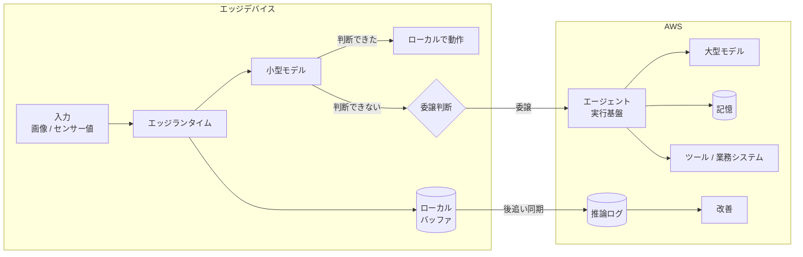

> 🌐 Language: **日本語** | [English](../../en/aws-patterns/09-edge-agentic-ai.md)

# Pattern 09: エッジ側エージェント AI

> **成熟度**: 設計のみ（公式 Guidance あり） / **最終確認**: 2026-08-19

判断の一部をデバイス上の小型モデルで完結させ、扱えないものだけをクラウドの大型モデルに
委譲する構成。ネットワークが不安定な環境、レイテンシ要求が厳しい工程、
データを外に出せない場所で検討します。

このパターンは要求された 7 本に含まれておらず、調査から追加したものです。
AWS が Greengrass でデバイス群にエージェントを配布する Guidance を公開しているため、
「概念」ではなく「設計のみ」としています。

## 実装状況

| 経路の段 | このリポジトリ | 場所 |
|---|---|---|
| エッジランタイムの導入 | なし | — |
| ローカルモデルの配置 | なし | — |
| ローカルでの推論 | なし | — |
| クラウドへの委譲判断 | なし | 下記 |
| クラウド側のエージェント実行基盤 | なし | [Agentic AI on AWS](../agentic-ai-on-aws.md) |
| 推論ログの収集 | 一部（フィードバック記録の枠組みのみ） | [`cloud/ai/feedback_recorder/`](../../../cloud/ai/feedback_recorder/) |

**このリポジトリに実装はありません。**

## データフロー

1. 入力をエッジランタイムが受け取る
2. まずローカルの小型モデルが判断を試みる
3. 判断できた場合はローカルで動作を完了する。クラウドへの往復がない
4. 判断できない場合、委譲するかを決める
5. 委譲したものはクラウドのエージェントが扱う。記憶とツール接続を使う
6. すべての推論ログはローカルにバッファし、接続時に同期する

**委譲を「エラー時のフォールバック」にしないでください。** ローカルで扱う範囲と
クラウドに渡す範囲は、設計時に決める分担です。

## ストレージ

| 対象 | 置き方 | 注意 |
|---|---|---|
| モデルファイル | エッジ側のストレージ経由で参照、またはデバイスへ配布 | 参照方式なら実体は 1 つ（[Pattern 02](02-edge-ai-sagemaker.md)） |
| 推論ログ | ローカルにバッファし、後追いで同期 | 接続断中も判断は続くため、記録が失われない経路が必要 |
| ローカルの状態 | デバイス上 | 再起動で失って良いものと、残すものを分ける |
| クラウド側の記憶 | エージェントの記憶機構 | セッションをまたぐ保持の設計は [Agentic AI on AWS](../agentic-ai-on-aws.md) |

## AI ワークフロー

**委譲の判断軸は 4 つです。** どれを重視するかで境界が動きます。

| 軸 | ローカルで扱う | クラウドに委譲する |
|---|---|---|
| レイテンシ | 応答が即時に必要 | 秒単位を許容できる |
| データの機密性 | 外に出せない | 送出が許容される |
| モデルの能力 | 分類・閾値判定など範囲が限定的 | 複数ステップの推論、広い知識が必要 |
| コスト | 呼び出しが高頻度で、固定費が有利 | 頻度が低く、呼び出し単価で足りる |

**判断の順序**: まず「外に出せるか」で切り、次にレイテンシ、最後に能力とコストで調整します。
機密性は技術的な調整では埋められないためです。

学術的な整理では、この振り分けを「ルーティング」として扱い、入力の難易度を推定して
小型・大型モデルに割り振る手法が検討されています
（[エッジ SLM とクラウド LLM の協調に関する survey](https://arxiv.org/html/2507.16731v1)）。
**ただしこれらの文献にある削減率や改善率は、この構成での測定値ではないため引用しません。**
判断軸の整理にのみ使っています。

## セキュリティ

- **デバイス上のモデルは持ち出される前提で考えます。** 物理的にアクセスされる環境では、
  モデルファイルが取得されうると想定します
- **委譲時に何を送るか**。画像そのものを送るか、抽出した特徴量だけを送るかで
  データの分類が変わります。機密性で切った境界を、実装で崩さないようにします
- **デバイスの資格情報**。長期キーを置かず、失効可能な仕組みにします
- **ローカルで完結した判断の監査**。クラウドを経由しない判断は、記録が同期されるまで
  外から見えません。監査要件がある場合、同期の遅延を許容できるかを確認します
- **エッジランタイムの更新経路**。モデルとコードの更新経路が、そのまま攻撃経路になりえます

## コストの考え方

| 費用を駆動するもの | 効き方 |
|---|---|
| 委譲率 | クラウドの呼び出し回数を直接決める。最も効く調整点 |
| デバイスのハードウェア | ローカル推論の固定費。台数に比例する |
| モデル配信の方式 | プッシュは台数 × モデルサイズ、参照は読まれた範囲のみ |
| ログ同期の量 | 全ログか、要約かで転送量が変わる |
| クラウド側の実行基盤 | サーバーレスか、自アカウントのインスタンスかで形が変わる |

## 前提と制約

- **このリポジトリに実装はありません。** 設計として読んでください
- **AWS が Guidance を公開しています**:
  [Deploying AI agents to device fleets using AWS IoT Greengrass](https://docs.aws.amazon.com/solutions/deploying-ai-agents-to-device-fleets-using-aws-iot-greengrass/)。
  ローカルの小型モデルを使う構成が扱われています
- **エッジランタイムの選択肢が広がっています。** リソース制約のあるデバイス向けの
  軽量ランタイムや、root 権限を必要としないインストールが提供されています
  （[出典](https://docs.aws.amazon.com/greengrass/v2/developerguide/greengrass-v2-whats-new.html)）。
  Raspberry Pi 5 (16GB) を前提にした既存の記述は、より小さいデバイスまで広げられる可能性があります
- **ローカルモデルの性能はこの構成で未計測です。** どのサイズのモデルがどのデバイスで
  実用的な応答時間になるかは、実機で測る必要があります
- **旧世代のエッジランタイムは sunset になっています。** 設計に含める前に提供状況を
  確認してください（[サービスの提供状況](../../agent/service-lifecycle.md)）
- **クラウド側のエージェント実行基盤は別に設計が必要です。** 構成要素は
  [Agentic AI on AWS](../agentic-ai-on-aws.md) にあります

## 参考

- [Deploying AI agents to device fleets using AWS IoT Greengrass](https://docs.aws.amazon.com/solutions/deploying-ai-agents-to-device-fleets-using-aws-iot-greengrass/)
- [Edge AI and global inference distribution (AWS Prescriptive Guidance)](https://docs.aws.amazon.com/prescriptive-guidance/latest/agentic-ai-serverless/edge-ai.html)
- [Perform machine learning inference (AWS IoT Greengrass)](https://docs.aws.amazon.com/greengrass/v2/developerguide/perform-machine-learning-inference.html)
- [Implement RAG while meeting data residency requirements using AWS hybrid and edge services](https://aws.amazon.com/blogs/machine-learning/implement-rag-while-meeting-data-residency-requirements-using-aws-hybrid-and-edge-services/)
- 関連: [Pattern 01](01-edge-ai-bedrock.md)（クラウドで判定する） /
  [Pattern 02](02-edge-ai-sagemaker.md)（モデルの学習と配信） /
  [Agentic AI on AWS](../agentic-ai-on-aws.md)
