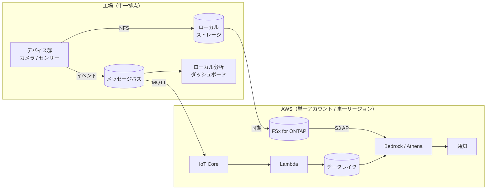

> 🌐 Language: **日本語** | [English](../../en/deployment-models/model-a-single-factory.md)

# Model A: 単一工場

> 最終確認: 2026-08-19

1 拠点、デバイス数台〜数十台。このリポジトリの実装が想定している規模です。

**この構成は実機テストが未完了です**（[README](../../../README.md#このリポジトリについて)）。
クラウド側は動作確認済み、エッジ側と ONTAP 連携は未検証です。

## データフロー

**経路が 2 本ある**のがこの構成の特徴です。ペイロード（画像、波形）はファイル経路、
イベント（メタデータ）はメッセージ経路。1 拠点でも分けます。理由は
[Pattern 03](../aws-patterns/03-industrial-iot-analytics.md) にあります。

## ストレージフロー

| 段 | 置き場所 | 保持の考え方 |
|---|---|---|
| 撮影・測定の直後 | エッジのローカルストレージ | 同期が終わるまで。ネットワーク断に耐える範囲 |
| 集約 | FSx for ONTAP | 分析対象の期間 |
| 分析用の構造化データ | データレイク | パーティションを日時 + デバイスで切る |
| 古いデータ | 安価な階層 | アクセス頻度が落ちた時点で移す |

**1 拠点では階層化を後回しにしがちです。** データが増えてから入れると、
既存パスの移行が必要になります。最初から階層化の設計を入れてください。

**拠点識別子を最初から入れる。** 1 拠点でも、イベントスキーマとストレージのパスに
拠点の識別子を持たせます。[Model B](model-b-multi-factory.md) へ移るときの
書き換え量が大きく変わります。

## AI ワークフロー

1 拠点では、AI の呼び出しをクラウドに集約するのが単純です。

| 判断 | この規模での既定 | 変える条件 |
|---|---|---|
| 推論の場所 | クラウド | ネットワークが不安定、レイテンシ要求が厳しい → [Pattern 09](../aws-patterns/09-edge-agentic-ai.md) |
| モデルの選択 | 基盤モデル（学習なし） | ラベル付きデータが集まった → [Pattern 02](../aws-patterns/02-edge-ai-sagemaker.md) |
| 呼び出しの段数 | 2 段（安価なモデルで絞る） | 異常率が高いと 2 段の効果が薄い |
| 人手フィードバック | 記録する | 記録しないと閾値もプロンプトも改善の根拠がない |

**この規模で最も効くのは撮影間隔の調整です。** モデルの選択より先に、
どの頻度で判定が必要かを決めてください。

## セキュリティ統制

全体は [セキュリティ設計](../security-design.md)。この規模で特に決めることを挙げます。

| 項目 | この規模での考え方 |
|---|---|
| ネットワーク分離 | OT 側とクラウド向け経路を分ける。デバイスから直接インターネットに出さない |
| デバイス認証 | 台数が少ないうちは手動プロビジョニングでも回る。ただし失効の手順は最初から決める |
| アカウント構成 | 単一アカウントで始めて構わない。ただし本番と検証は分ける |
| 権限の粒度 | 単一利用者前提で書ける。複数チームが使うなら [§15](../security-design.md) から設計 |
| データ分類 | 画像に製品形状が写る前提で分類する。1 拠点でも分類は必要 |

**この規模で見落としやすいのは失効の手順です。** デバイスが数台のうちは
手で登録できますが、1 台が侵害されたときに切り離す手順を決めていないと、
その時点で作業が始まります。

## コストの考え方

金額は [デプロイガイド](../deployment-guide.md)。ここでは何が費用を動かすか。

| 費用を駆動するもの | この規模での効き方 |
|---|---|
| 集約先の最小構成 | ファイルストレージは容量課金で、最小構成の固定費が支配的になりやすい |
| 撮影・測定の頻度 | AI 呼び出し回数に直結。最も効く調整点 |
| データレイクのスキャン量 | パーティション設計で下がる。1 拠点でも効く |
| 保持期間 | 階層化していないと線形に増える |
| 二重持ち | ペイロードをファイルとオブジェクトの両方に置かない |

**この規模では固定費の比率が高くなります。** デバイス数が少ないため、
使用量に比例する部分よりも、集約先やマネージドサービスの最小構成が効きます。
小さく始める場合、まず [`local-demo/`](../../../local-demo/) で経路を確認してから
クラウド側を作ると、無駄な稼働を避けられます。

## 前提と制約

- **実機テストが未完了です。** エッジ側の性能・信頼性は未検証です
- **単一デバイス構成しか検証していません。** 複数デバイスの同時運用は未検証です
- **Kafka / ClickHouse はオンプレミス VM 前提**で、IaC はありません
  （[kafka-integration](../kafka-integration.md)）
- **ONTAP 連携はモックテストのみ**です。FPolicy、SnapMirror、S3 AP の
  実環境での動作は未確認です
- **S3 Access Point には ONTAP 9.17.1 以降が必要**です
  （[制約一覧](../s3ap-compatibility-matrix.md)）
- **デバイスのプロビジョニング自動化は未実装**です。台数が増えるとここが先に問題になります

## 参考

- [デプロイガイド](../deployment-guide.md) — 実際の構築手順
- [パターンカタログ](../aws-patterns/README.md) — AI 経路の選択
- [セキュリティ設計](../security-design.md)
- [Model B: 複数工場](model-b-multi-factory.md) — 拠点が増えるときの差分
