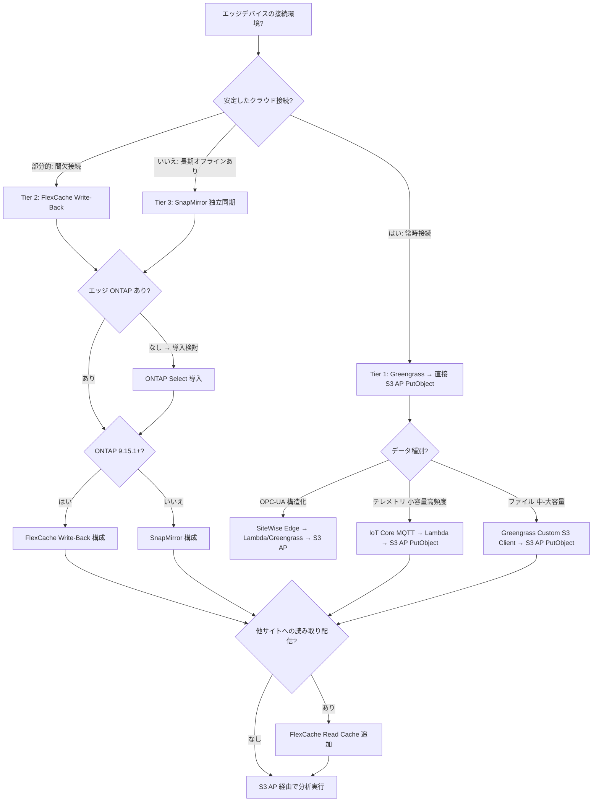

> 🌐 Language: **日本語** | [English](../en/iot-greengrass-flexcache-integration.md)

# AWS IoT サービス × FSx for ONTAP S3 Access Points / FlexCache 連携シナリオ

> 作成日: 2026-07-27
> プロジェクト: edge-to-cloud-ai
> 親プロジェクト: [fsxn-lakehouse-integrations](https://github.com/Yoshiki0705/fsxn-lakehouse-integrations)
> 関連ドキュメント: [S3 AP + FlexCache / SnapMirror 設計考慮事項](https://github.com/Yoshiki0705/fsxn-lakehouse-integrations/blob/main/docs/ja/s3ap-flexcache-snapmirror-considerations.md)

---

## エグゼクティブサマリ

**S3 標準バケットを介さず、FSx for ONTAP S3 Access Points を直接のデータインジェスト先とする**ことで、IoT/エッジワークロード特有の課題（小ファイル大量書き込みのオーバーヘッド、クロスリージョン転送コスト、ストレージ二重持ち）を解決する。さらに **FlexCache write-back (ONTAP 9.15.1+)** をエッジローカルの書き込みバッファとして活用し、オフライン耐性と低遅延ローカル書き込みを両立させる。

**主要な結論:**

1. **FSx for ONTAP S3 AP が唯一のデータ集約点** — S3 標準バケットを経由しない。PutObject で直接 FSx for ONTAP ボリュームに書き込み、同一データに NFS/SMB/S3 でマルチプロトコルアクセス
2. **FlexCache write-back がエッジ書き込みバッファ** — エッジ側 ONTAP (ONTAP Select / FAS / AFF) の FlexCache Cache Volume に write-back モードで書き込み、非同期で Origin (FSx for ONTAP) にフラッシュ。オフライン耐性 + ローカル速度の書き込み
3. **FlexCache read cache がデータバースト配信** — Origin に集約されたデータを他拠点の GPU/HPC ワークロードに低遅延で読み取り配信
4. **Greengrass カスタム S3 クライアントコンポーネント** — Stream Manager (S3 バケット専用) ではなく、AWS SDK 直接利用で S3 AP ARN へ PutObject する専用コンポーネント

---

## 1. S3 標準バケットが IoT ワークロードで問題となる理由

### 1.1 S3 標準バケットの課題

| 課題 | 詳細 | IoT への影響 |
|------|------|-------------|
| オブジェクト単位課金 | PUT $0.005/1000リクエスト、GET $0.0004/1000リクエスト | 1秒1回の書き込み × 100デバイス = 月 ~$13 (PUT のみ) + 読み取り側 |
| 小ファイル非効率 | オブジェクトメタデータオーバーヘッド、整合性チェック | 1KB テレメトリ × 数百万回 = メタデータ比率が本体データを上回る |
| クロスリージョン転送 | $0.02/GB (リージョン間 S3 レプリケーション) | マルチサイト配信時にオブジェクト単位で転送コスト発生 |
| ストレージ二重持ち | S3 + FSx for ONTAP に同一データ → DataSync コピー必要 | ストレージコスト 2x + 転送遅延 |
| LIST 性能劣化 | プレフィックス内オブジェクト数増加で LIST レスポンス遅延 | 時系列 IoT データの探索性が悪化 |
| ファイルシステムセマンティクス欠如 | ロック/ディレクトリ構造/ACL/マルチプロトコル非対応 | NFS/SMB クライアントからのアクセスに変換レイヤー必要 |

### 1.2 FSx for ONTAP S3 AP がこれらを解決する仕組み

| S3 標準バケットの課題 | FSx for ONTAP S3 AP での解決 |
|----------------------|------------------------------|
| オブジェクト単位課金 | FSx for ONTAP は容量課金 (SSD/HDD)。API コール数による追加課金なし |
| 小ファイル非効率 | ONTAP のインライン重複排除 + 圧縮で小ファイルを効率格納。B-tree ベースのファイルシステムメタデータ |
| クロスリージョン転送 | FlexCache: アクセスされたブロックのみキャッシュ (差分転送)。SnapMirror: ブロックレベル差分レプリケーション |
| ストレージ二重持ち | S3 AP = FSx for ONTAP ボリュームそのもの。中間バケット不要 |
| LIST 性能 | ONTAP ディレクトリ B-tree により、数百万ファイルでも高速な readdir。S3 AP の ListObjectsV2 はこれを利用 |
| ファイルシステムセマンティクス | NFS/SMB/S3 マルチプロトコル。同一データに同時アクセス可能 |

---

## 2. アーキテクチャ全体像

```
┌─────────────────────────────────────────────────────────────────────────────────────┐
│                        FSx for ONTAP (Origin) — 唯一のデータ集約点                    │
│                                                                                     │
│  Volume: /iot-data                                                                  │
│    ├── S3 Access Point ──────> Athena / Glue ETL / SageMaker / Bedrock              │
│    ├── NFS mount ────────────> EC2 / ECS / Lambda (処理)                            │
│    └── FlexCache Origin ─────> 複数サイトへ read cache 配信                          │
│                                                                                     │
└───────────┬─────────────────────────────────┬───────────────────────────────────────┘
            │                                 │
     書き込み経路 (Ingest)              読み取り配信 (Burst)
            │                                 │
  ┌─────────┼─────────────────┐    ┌──────────┼──────────────────────────┐
  │         │                 │    │          │                          │
  ▼         ▼                 ▼    ▼          ▼                          ▼
┌────────┐ ┌────────────────┐ ┌──────────┐ ┌──────────────┐ ┌──────────────────────┐
│Tier 1  │ │Tier 2          │ │Tier 3    │ │On-Prem ONTAP │ │FSx for ONTAP         │
│Direct  │ │FlexCache       │ │SnapMirror│ │FlexCache     │ │(別リージョン)         │
│S3 AP   │ │Write-Back      │ │Edge→Cloud│ │Read Cache    │ │FlexCache Read Cache  │
│Write   │ │(エッジ書込み)  │ │(独立同期)│ │ → GPU 推論   │ │ → 分析ジョブ         │
└────────┘ └────────────────┘ └──────────┘ └──────────────┘ └──────────────────────┘
    │              │                │
    │              │                │
    ▼              ▼                ▼
┌────────────────────────────────────────────────────────┐
│              Edge / IoT Devices                         │
│                                                        │
│  ┌──────────────────┐  ┌────────────────────────────┐  │
│  │ IoT Greengrass   │  │ ONTAP Select / FAS (Edge)  │  │
│  │ Custom S3 Client │  │ FlexCache Cache Volume     │  │
│  │ Component        │  │ (write-back mode)          │  │
│  │  → PutObject     │  │  → NFS local write         │  │
│  │    to S3 AP ARN  │  │  → async flush to Origin   │  │
│  └──────────────────┘  └────────────────────────────┘  │
│                                                        │
│  ┌──────────────────┐  ┌────────────────────────────┐  │
│  │ IoT Core MQTT    │  │ Sensors / Cameras / PLCs   │  │
│  │  → Lambda        │  │  → NFS/SMB write to edge   │  │
│  │  → PutObject     │  │    ONTAP                   │  │
│  │    to S3 AP      │  │                            │  │
│  └──────────────────┘  └────────────────────────────┘  │
└────────────────────────────────────────────────────────┘
```

> **図中の SageMaker について**: S3 Access Point 経由の接続は未検証です。AWS が手順を
> 公開しているのは Athena / AWS Lambda / AWS Glue / Bedrock Knowledge Bases /
> EMR Serverless / CloudFront / Transfer Family で、SageMaker はこの一覧にありません
> （[S3 AP 互換性と制約](./s3ap-compatibility-matrix.md)）。

---

## 3. 書き込み経路 (Ingest Tier) 詳細

### Tier 1: S3 AP への直接書き込み（Greengrass カスタムコンポーネント）

**対象**: 安定したネットワーク接続を持つエッジデバイス

```
[Edge Device]                              [AWS Cloud]
┌───────────────────────────────┐          ┌────────────────────────────────┐
│ IoT Greengrass V2             │          │ FSx for ONTAP                  │
│ ┌───────────────────────────┐ │   HTTPS  │ Volume: /iot-data              │
│ │ Custom S3 Client Component│ │─────────>│   S3 AP: arn:aws:s3:region:    │
│ │  - Sensor data read       │ │ PutObject│       account:accesspoint/     │
│ │  - Local buffer (disk)    │ │          │       iot-ingest-ap            │
│ │  - Parquet/JSON serialize │ │          │                                │
│ │  - boto3 PutObject        │ │          │   同一ファイルに NFS/SMB で     │
│ │    → S3 AP ARN            │ │          │   即座にアクセス可能            │
│ │  - Retry with backoff     │ │          └────────────────────────────────┘
│ └───────────────────────────┘ │
│                               │
│ ┌───────────────────────────┐ │
│ │ ML Inference Component    │ │
│ │  - Edge prediction        │ │
│ │  - Results → MQTT         │ │
│ └───────────────────────────┘ │
└───────────────────────────────┘
```

**Stream Manager を使わない理由:**
- Greengrass Stream Manager は S3 バケット名を要求する（access point ARN を受け付ける記述が
  見つからない）。**このプロジェクトでは未検証**（[互換性と制約](./s3ap-compatibility-matrix.md) §4）
- カスタムコンポーネントで boto3 (Python) / AWS SDK を使い、S3 AP ARN を直接ターゲットに PutObject を実行
- ローカルディスクバッファ + エクスポネンシャルバックオフでオフライン耐性を自前実装

**IoT Core MQTT → Lambda → S3 AP 経路:**
- テレメトリ（小容量・高頻度）は IoT Core MQTT で送信
- IoT Core ルールエンジン → Lambda 関数 → Lambda 内で PutObject to S3 AP
- Amazon Data Firehose は S3 バケット ARN を要求する。**未検証**（[互換性と制約](./s3ap-compatibility-matrix.md) §4）のため、
  この構成では使わない

> **コスト最適化に関する補足**: Amazon Data Firehose を使わないことで Firehose の処理料金 ($0.029/GB) を回避。Lambda のコストは呼び出し回数ベースだが、IoT Core ルールで集約バッチ処理（Basic Ingest + バッチウィンドウ）と組み合わせることでコスト最適化可能。

### Tier 2: FlexCache Write-Back（エッジローカル書き込み → 非同期 Origin フラッシュ）

**対象**: 間欠的なネットワーク接続 / 低遅延ローカル書き込みが必要なエッジ環境

```
[Edge Site (Factory / Field)]                    [AWS Cloud]
┌─────────────────────────────────────────┐      ┌──────────────────────────────┐
│ ONTAP (Select / FAS / AFF C-Series)     │      │ FSx for ONTAP (Origin)       │
│                                         │      │                              │
│ FlexCache Cache Volume (write-back)     │      │ Origin Volume: /iot-data     │
│   /iot-cache                            │      │   ├── S3 AP → Analytics      │
│     ├── NFS mount ← IoT Devices         │      │   ├── NFS → EC2 処理         │
│     ├── NFS mount ← Greengrass          │      │   └── FlexCache Origin       │
│     └── NFS mount ← SCADA / Ignition   │      │                              │
│                                         │      └──────────────────────────────┘
│ Write-back flush ──────────────────────────────────────────>│
│ (非同期、ブロックレベル差分)            │         (WAN / VPN / Direct Connect)
│                                         │
│ ┌─────────────────────────────────────┐ │
│ │ 応答: エッジで確定（未計測）        │ │
│ │ Origin フラッシュ: 非同期 (30-90s)  │ │
│ │ オフライン時: ローカル書き込み継続   │ │
│ │ 再接続後: 差分フラッシュ自動再開    │ │
│ └─────────────────────────────────────┘ │
└─────────────────────────────────────────┘
         ▲
         │ NFS mount
┌────────┴───────────────────────────────┐
│ IoT Devices / Greengrass / PLCs        │
│  - Sensors (温度/振動/電流)            │
│  - Cameras (品質検査画像)              │
│  - SCADA Historian (CSV/Parquet)       │
│  - 3D Printer (Gcode + Quality logs)  │
└────────────────────────────────────────┘
```

**FlexCache Write-Back の IoT における価値:**

| 特性 | 効果 |
|------|------|
| ローカル書き込み応答 | WAN の往復を待たずに応答が返る（LAN 内の書き込み応答時間。この構成では未計測） |
| 非同期 Origin フラッシュ | WAN 帯域が限られていてもローカル書き込み性能に影響なし |
| オフライン耐性 | ネットワーク断でもローカルキャッシュへの書き込み継続 |
| ブロックレベル差分転送 | オブジェクト単位転送の S3 レプリケーションより遥かに効率的 |
| インライン重複排除/圧縮 | 小ファイル大量書き込みのストレージ効率を最大化 |
| XLD (排他ロック委任) | ファイル単位の書き込み一貫性を保証 |

**要件:**
- Origin (FSx for ONTAP) と Cache (エッジ ONTAP) の両方が ONTAP 9.15.1 以上
  （[FlexCache write-back の相互運用性](https://docs.netapp.com/us-en/ontap/flexcache-writeback/flexcache-write-back-interoperability.html)）
- ただし NetApp は **9.15.1 では write-back に必要な修正が揃っておらず本番ワークロードには推奨しない**としており、
  最新の P リリースの利用を推奨している（[ガイドライン](https://docs.netapp.com/us-en/ontap/flexcache-writeback/flexcache-write-back-guidelines.html) /
  [FAQ](https://docs.netapp.com/us-en/ontap/flexcache-writeback/faq-flexcache-write-back.html)）。バージョン選定時は 9.15.1 を下限として扱い、実際にはより新しい版を選ぶ
- SVM 間ピアリング + クラスタ間ネットワーク (VPN / Direct Connect)
- 同一ファイルへの同時書き込みは XLD により 1 Cache のみ許可 — デバイス分離ディレクトリ設計で回避

> **オフライン耐性に関する補足**: S3 標準バケットへの書き込みはネットワーク断で失敗する。
> FlexCache write-back では書き込みがエッジ ONTAP の安定ストレージに確定した時点で
> クライアントに応答が返るため、ネットワーク断中も書き込みを継続できる。再接続後は
> ブロックレベルの差分で Origin にフラッシュされる。ただし Origin に届く前のデータは
> エッジ側にしか存在しないため、キャッシュ側のディスク障害では失われる。エッジ側の
> RAID / HA 構成が前提になる。

### Tier 3: SnapMirror（エッジ独立ストレージ → クラウド同期）

**対象**: 完全に独立したエッジストレージが必要な環境（長期オフライン、大容量ローカル処理）

```
[Edge Site]                              [AWS Cloud]
┌──────────────────────────────┐         ┌──────────────────────────────┐
│ ONTAP Select / FAS           │         │ FSx for ONTAP (SnapMirror    │
│                              │         │  Destination → break → RW)   │
│ Source Volume: /edge-data    │         │                              │
│   ├── NFS ← IoT Devices     │ SnapMirror│ Dest Volume: /edge-sync    │
│   ├── Local ML inference     │ ────────>│   ├── S3 AP → Analytics    │
│   └── Local analytics       │ (5min+)  │   └── FlexCache → sites    │
│                              │         │                              │
│ SnapMirror schedule: 5-60min │         └──────────────────────────────┘
└──────────────────────────────┘
```

**FlexCache write-back vs SnapMirror の使い分け:**

| 比較軸 | FlexCache Write-Back | SnapMirror |
|--------|---------------------|------------|
| データモデル | Cache ← Origin (Origin が権威) | Source → Destination (Source が権威) |
| 書き込み先 | Cache に書き込み → Origin にフラッシュ | Source に書き込み → Destination に複製 |
| Origin/Dest の読み書き | Origin: 読み書き可 / Cache: 読み書き可 | Source: 読み書き可 / Dest: 読み取り専用 (break まで) |
| S3 AP 利用 | Origin 側のみ (= FSx for ONTAP 側) | Source 側のみ。Dest は break 後に付与可能 |
| オフライン耐性 | ローカル書き込み継続、再接続後に自動フラッシュ | SnapMirror 更新停止、再接続後に再開 |
| 適合シナリオ | エッジ → クラウド集約 (Origin がクラウド) | エッジが独立マスター、クラウドはレプリカ |
| ONTAP バージョン要件 | 9.15.1+ (両側) | 9.x (互換性広い) |

---

## 4. 読み取り配信 (Burst) — FlexCache Read Cache

Origin (FSx for ONTAP) に集約されたデータを、複数拠点のワークロードに低遅延で配信する。

```
                    FSx for ONTAP (Origin)
                    Volume: /iot-data
                    ├── S3 AP → Athena / Glue / SageMaker / Bedrock
                    └── FlexCache Origin
                            │
         ┌──────────────────┼──────────────────────────────────┐
         │                  │                  │                │
         ▼                  ▼                  ▼                ▼
  ┌──────────────┐  ┌──────────────┐  ┌──────────────┐  ┌──────────────┐
  │ On-Prem ONTAP│  │ FSx for ONTAP│  │ CVO (GCP)    │  │ Edge ONTAP   │
  │ (工場 A)     │  │ (ap-north-1) │  │ GPU cluster  │  │ (Jetson+NFS) │
  │ Cache Vol    │  │ Cache Vol    │  │ Cache Vol    │  │ Cache Vol    │
  │ write-around │  │ write-around │  │ write-around │  │ write-around │
  │  → GPU推論   │  │  → 分析Job   │  │  → ML学習    │  │  → Model ref │
  └──────────────┘  └──────────────┘  └──────────────┘  └──────────────┘
```

> **図中の SageMaker について**: S3 Access Point 経由の接続は未検証です。AWS が手順を
> 公開しているのは Athena / AWS Lambda / AWS Glue / Bedrock Knowledge Bases /
> EMR Serverless / CloudFront / Transfer Family で、SageMaker はこの一覧にありません
> （[S3 AP 互換性と制約](./s3ap-compatibility-matrix.md)）。

**Read Cache の IoT ユースケース:**

| 配信先 | データ種別 | FlexCache 効果 |
|--------|-----------|---------------|
| 工場 GPU サーバー | 品質検査画像 + 推論用データ | WAN 帯域節約、ローカル速度でバッチ推論 |
| 別リージョン SageMaker | 学習データセット | リージョン間転送をキャッシュで最小化 |
| マルチクラウド GPU | 大規模学習データ | ONTAP 統一データファブリックで配信 |
| エッジ AI デバイス | ML モデルファイル (GGUF等) | 数十 GB モデルをアクセスブロック単位で効率配信 |
| QA チーム WS | 品質画像データベース | ローカル速度で画像ブラウジング |

> **モデル配信に関する補足**: FlexCache はファイル全体ではなくアクセスされたブロック単位で
> キャッシュする。この性質から、大きなモデルファイルでも実際に読まれた範囲だけが転送される
> ことが期待できる。ただし推論ランタイムがモデルをどう読むか（全体を mmap するか、
> 逐次読むか）で転送量は変わり、**この構成では未計測**。OTA デプロイの代替として NFS 経由で
> 参照する設計自体は、ストレージの二重持ちを避けられる。

---

## 5. エッジ / キャッシュ側の課題と追加サービス

### 5.1 エッジ側の課題マトリクス

| 課題 | S3 標準バケット経由での問題 | FSx for ONTAP S3 AP + FlexCache での解決 | 追加考慮サービス |
|------|--------------------------|----------------------------------------|----------------|
| オフライン耐性 | 書き込み即座に失敗 | FlexCache write-back: ローカル書き込み継続 | ONTAP Select (エッジ ONTAP) |
| 小ファイル効率 | オブジェクト単位オーバーヘッド | ONTAP インライン重複排除 + 圧縮 | FabricPool (コールドデータ階層化) |
| ローカル処理 | S3 GET でクラウドから取得 | NFS ローカルマウントで即座にアクセス | Greengrass ML Inference |
| 帯域制約 | オブジェクト全体転送 | FlexCache ブロック差分 / SnapMirror 差分 | SORACOM Canal (閉域接続) |
| マルチプロトコル | S3 API のみ | NFS + SMB + S3 同時アクセス | IoT SiteWise (OPC-UA → 構造化) |
| データ重力 | クラウド↔エッジ往復 | エッジ ONTAP でローカル処理完結 | Greengrass コンポーネントによるモデル配布 |

### 5.2 追加サービスの位置づけ

```
┌─────────────────── エッジ ────────────────────┐   ┌─────────── クラウド ──────────────┐
│                                               │   │                                  │
│  ┌─────────────────────────────────────────┐  │   │  ┌────────────────────────────┐  │
│  │ ONTAP Select (ソフトウェア定義ONTAP)    │  │   │  │ FSx for ONTAP              │  │
│  │  - 汎用 x86 サーバー上で動作           │  │   │  │  - Origin (集約)           │  │
│  │  - FlexCache write-back 対応           │  │   │  │  - S3 AP (分析アクセス)    │  │
│  │  - SnapMirror 対応                     │  │   │  │  - FlexCache Origin        │  │
│  │  - 最小 1TB から拡張可能               │  │   │  │  - FabricPool (階層化)     │  │
│  └─────────────────────────────────────────┘  │   │  └────────────────────────────┘  │
│                                               │   │                                  │
│  ┌─────────────────────────────────────────┐  │   │  ┌────────────────────────────┐  │
│  │ IoT Greengrass V2                       │  │   │  │ AWS Analytics / AI          │  │
│  │  - Custom S3 Client (PutObject→S3 AP)  │  │   │  │  - Athena (SQL on S3 AP)   │  │
│  │  - ML Inference (SageMaker Neo)        │  │   │  │  - Glue ETL (S3 AP R/W)    │  │
│  │  - IoT Core MQTT (テレメトリ)          │  │   │  │  - SageMaker (学習)        │  │
│  └─────────────────────────────────────────┘  │   │  │  - Bedrock (生成AI分析)    │  │
│                                               │   │  │  - Rekognition (画像)      │  │
│  ┌─────────────────────────────────────────┐  │   │  └────────────────────────────┘  │
│  │ IoT SiteWise Edge Gateway               │  │   │                                  │
│  │  - OPC-UA → 構造化時系列データ         │  │   │  ┌────────────────────────────┐  │
│  │  - Greengrass 上で動作                 │  │   │  │ IoT Core                    │  │
│  │  - エッジ ONTAP NFS に書き込み可能     │  │   │  │  - MQTT Broker              │  │
│  └─────────────────────────────────────────┘  │   │  │  - Rules → Lambda → S3 AP  │  │
│                                               │   │  │  - Device Shadow            │  │
│  ┌─────────────────────────────────────────┐  │   │  │  - Device Defender          │  │
│  │ SORACOM (セルラー接続)                  │  │   │  └────────────────────────────┘  │
│  │  - Air: LTE-M / NB-IoT / 4G            │  │   │                                  │
│  │  - Canal: VPC 閉域接続                 │  │   │  ┌────────────────────────────┐  │
│  │  - Funnel: Kinesis 直結 (テレメトリ)   │  │   │  │ Lambda (集約/変換)          │  │
│  └─────────────────────────────────────────┘  │   │  │  - IoT Core → PutObject    │  │
│                                               │   │  │    to S3 AP                │  │
│  ┌─────────────────────────────────────────┐  │   │  │  - バッチ集約 (30s窓)      │  │
│  │ FabricPool (ONTAP 階層化)               │  │   │  │  - Parquet 変換            │  │
│  │  - SSD (パフォーマンス層)              │  │   │  └────────────────────────────┘  │
│  │  - S3 互換 (キャパシティ層)            │  │   │                                  │
│  │  - コールド IoT データを自動階層化     │  │   └──────────────────────────────────┘
│  └─────────────────────────────────────────┘  │
└───────────────────────────────────────────────┘
```

### 5.3 FabricPool による IoT データ階層化

IoT データは時間経過とともにアクセス頻度が低下する。FabricPool を使い、SSD 層からキャパシティ層 (S3 互換ストレージ) へ自動階層化することで、FSx for ONTAP のコストを最適化。

| データ鮮度 | 階層 | アクセスパターン |
|-----------|------|----------------|
| 直近 24h | SSD (パフォーマンス) | リアルタイム分析、エッジ ML データ |
| 1-30 日 | SSD (ホット部分) / 容量プール | ダッシュボード、トレンド分析 |
| 30 日+ | 容量プール (自動階層化) | アーカイブ、コンプライアンス |

> **階層化に関する補足**: FSx for ONTAP の容量プールストレージは SSD 層の約 1/5 のコスト。IoT データの大部分は「書き込んで数日アクセスした後はアーカイブ」パターンのため、FabricPool の自動階層化で大幅なコスト削減が見込める。

---

## 6. ユースケース別実装シナリオ

### 6.1 製造品質検査（3D プリント / 外観検査）

| 項目 | 内容 |
|------|------|
| エッジデバイス | Raspberry Pi 5 + カメラ / NVIDIA Jetson |
| エッジストレージ | ONTAP Select (FlexCache write-back) |
| 書き込み経路 | Camera → Greengrass → NFS write to edge ONTAP Cache Vol → async flush to FSx Origin |
| クラウド分析 | Bedrock Claude Vision (S3 AP 経由 GetObject) / Rekognition |
| FlexCache 読み取り | 品質画像データベースを QA チームのオンプレ WS に配信 |
| データ階層化 | 30日以上の画像 → FabricPool 容量プールへ自動移行 |

### 6.2 設備予知保全（振動/温度/電流テレメトリ）

| 項目 | 内容 |
|------|------|
| エッジデバイス | Raspberry Pi 5 + ADXL345/MAX6675/ACS712 |
| テレメトリ経路 | MQTT → IoT Core → Lambda (30s バッチ集約 + Parquet 化) → PutObject to S3 AP |
| 大容量データ | Greengrass Custom Component → PutObject to S3 AP (波形データ等) |
| エッジ推論 | Greengrass ML Inference (SageMaker Neo モデル) → 異常スコア → MQTT |
| クラウド学習 | SageMaker が Origin データを読んで再学習。**S3 AP を直接データソースにできるかは未検証**で、通らない場合は Glue / EMR Serverless で読む |
| モデル配信 | 新モデル → Origin `/models/` → FlexCache read cache → エッジ NFS 参照 |

### 6.3 OPC-UA / SCADA データ統合（Ignition + SiteWise）

| 項目 | 内容 |
|------|------|
| データソース | PLC (Siemens/三菱/Allen-Bradley) + Ignition Historian |
| エッジゲートウェイ | SiteWise Edge (Greengrass 上) + Ignition OPC-UA |
| エッジストレージ | ONTAP FAS (on-prem) — Ignition Historian DB + NFS ファイルストア |
| クラウド同期 | SnapMirror (エッジ ONTAP → FSx for ONTAP) / FlexCache write-back |
| クラウド分析 | S3 AP 経由で Athena (統計分析) + Bedrock (異常説明)。SageMaker (予知保全) は S3 AP 接続が未検証 |
| マルチサイト | FlexCache read cache で他工場のエンジニアリング部門にデータ配信 |

### 6.4 エッジ AI エージェント（GGUF モデル配信）

| 項目 | 内容 |
|------|------|
| エッジデバイス | NVIDIA Jetson Orin / x86 + GPU |
| モデル格納 | FSx for ONTAP Origin `/models/{name}/latest.gguf` |
| モデル配信 | FlexCache read cache → エッジ ONTAP NFS mount → Jetson がモデルロード |
| 推論ログ回収 | エッジ ONTAP FlexCache write-back → Origin → S3 AP → 分析 |
| 更新サイクル | Origin にモデル更新 → Cache は次回アクセスで最新版取得 (Cache Miss パス) |

> **OTA 代替に関する補足**: 従来の OTA デプロイ (Greengrass コンポーネントとしてモデル配信) は、数十 GB の GGUF モデルではデプロイ時間が問題になる。FlexCache NFS マウントなら、モデルの実際に使われる部分のみが順次キャッシュフィルされ、全体転送を待たずに推論開始可能。

---

## 7. 選択フローチャート



---

## 8. ディレクトリ設計（S3 AP + FlexCache 最適化）

```
/iot-data/                              ← FSx for ONTAP Origin Volume root (S3 AP attached)
  ├── ingest/                           ← IoT デバイスからの書き込み先
  │   └── {device-id}/                  ← デバイス別分離 (XLD 競合回避)
  │       └── year={YYYY}/
  │           └── month={MM}/
  │               └── day={DD}/
  │                   └── hour={HH}/
  │                       ├── {uuid}.parquet   ← テレメトリバッチ
  │                       ├── {uuid}.jpg       ← 品質検査画像
  │                       └── ...
  ├── processed/                        ← Glue ETL / Lambda 加工済み (S3 AP 経由 R/W)
  │   └── {use-case}/
  │       └── year={YYYY}/month={MM}/
  │           └── *.parquet
  ├── models/                           ← ML モデル (S3 AP 経由で書き込み。SageMaker から直接は未検証)
  │   └── {model-name}/
  │       ├── latest.gguf              ← FlexCache read cache でエッジ配信
  │       └── v{X.Y.Z}/
  └── reference/                        ← マスターデータ (低頻度更新)
      └── device-registry.json
```

**設計ルール:**

1. **デバイス別ディレクトリ分離**: FlexCache write-back の XLD (排他ロック委任) はファイル単位で 1 Cache に付与される。デバイスごとにディレクトリを分けることで XLD 競合を回避
2. **Hive パーティション形式**: S3 AP 経由の Athena クエリでパーティションプルーニングが自動適用
3. **FlexGroup constituent 分散**: 多数のサブディレクトリにより FlexGroup 内の各 constituent に均等分散 → FlexCache 効率向上
4. **`/models/` は読み取り専用配信**: FlexCache read cache の最適ユースケース。write-around モードで配信

---

## 9. アンチパターン

| パターン | 問題 | 対策 |
|----------|------|------|
| S3 標準バケットを Landing Zone として経由 | オブジェクト課金 + ストレージ二重持ち + DataSync 遅延 | FSx for ONTAP S3 AP に直接 PutObject |
| Greengrass Stream Manager で S3 AP に書き込み | S3 バケット名を要求する（未検証、[詳細](./s3ap-compatibility-matrix.md) §4） | カスタム S3 クライアントコンポーネント (boto3) |
| Amazon Data Firehose → S3 AP | S3 バケット ARN を要求する（未検証、[詳細](./s3ap-compatibility-matrix.md) §4） | IoT Core → Lambda → PutObject to S3 AP |
| SageMaker のデータソースに S3 AP を直接指定 | AWS の対応サービス一覧に無い（未検証、[詳細](./s3ap-compatibility-matrix.md)） | Glue / EMR Serverless で読んで学習用データセットを作る |
| FlexCache Cache 側に S3 AP を attach | ONTAP S3 NAS バケットは Origin FlexVol/FlexGroup のみ対応 | S3 AP は Origin 側にのみ付与 |
| 同一ファイルを複数 Cache から write-back | XLD 競合 → パフォーマンス劣化 | デバイスごとにディレクトリ分離設計 |
| 全デバイスを単一ディレクトリに書き込み | FlexGroup constituent 偏り + FlexCache キャッシュ効率低下 | デバイスID + 時間パーティションで分散 |
| FlexCache write-back で TTL を極短設定 | Origin フラッシュ頻度増加 → WAN 帯域圧迫 | デフォルト設定 (30-90s) を活用 |
| エッジ ONTAP なしで FlexCache write-back を計画 | FlexCache はエッジ側に ONTAP (Cache) が必須 | ONTAP Select / FAS / AFF C-Series を検討 |
| GGUF モデルを OTA でデプロイ | 数十 GB のデプロイ = 長時間 + ストレージ二重持ち | FlexCache read cache 経由で NFS 参照 |

---

## 10. FAQ / よくある誤解

### Q1: Greengrass Stream Manager で FSx for ONTAP S3 AP に直接アップロードできますか?

**A**: **確認できていない。** Stream Manager の `S3ExportTaskDefinition` は S3 バケット名を
要求し、access point ARN を受け付けるという記述は見つかっていないが、このプロジェクトでは
実際に試していない（[互換性と制約](./s3ap-compatibility-matrix.md) §4）。この構成では Greengrass カスタムコンポーネントで
boto3 を使い S3 AP ARN に PutObject する経路を採っている。その場合、ローカルディスクバッファと
リトライは自前実装になる。

### Q2: IoT Core ルールから直接 FSx for ONTAP S3 AP に書き込めますか?

**A**: IoT Core の S3 ルールアクションは S3 バケット名を指定する形式で、S3 AP ARN を直接指定する機能は現時点でドキュメントに記載がない。推奨は Lambda ルールアクション経由: IoT Core → Lambda → boto3 PutObject to S3 AP ARN。

### Q3: Amazon Data Firehose から FSx for ONTAP S3 AP に配信できますか?

**A**: **確認できていない。** Firehose の S3 Destination は `BucketARN` を要求しており、
access point ARN が通るかは未検証（[互換性と制約](./s3ap-compatibility-matrix.md) §4）。この構成では Lambda で集約して
S3 AP に PutObject する経路を採っている。Kafka を経由する場合は、MSK Express brokers の
streaming tables で Iceberg テーブルとして materialize する経路も選択肢になる。

### Q4: FlexCache write-back はどの ONTAP バージョンから使えますか?

**A**: 下限は ONTAP 9.15.1 で、Origin と Cache の両方がその版以降である必要がある
（[相互運用性](https://docs.netapp.com/us-en/ontap/flexcache-writeback/flexcache-write-back-interoperability.html)）。
ただし下限を満たすだけでは足りない。NetApp は 9.15.1 について「write-back に必要な修正と改善が
すべて入っておらず、本番ワークロードには推奨しない」と明記しており、最新の P リリースを推奨している
（[ガイドライン](https://docs.netapp.com/us-en/ontap/flexcache-writeback/flexcache-write-back-guidelines.html)）。
本番を想定するなら 9.15.1 ちょうどを選ばない。

### Q5: FlexCache write-back でネットワーク断が発生した場合、データは失われますか?

**A**: いいえ。write-back モードではデータはまずエッジ側キャッシュの安定ストレージにコミットされる。ネットワーク断が発生しても、ローカルへの書き込みは継続可能。再接続後にブロックレベル差分で Origin にフラッシュされる。ただし、キャッシュ側のローカルディスク障害でデータロスの可能性があるため、エッジ側 ONTAP の RAID / HA 構成は検討が必要。

### Q6: S3 AP 経由の書き込み (PutObject) と NFS 経由の書き込みは同一ボリュームで共存できますか?

**A**: はい。FSx for ONTAP S3 AP は ONTAP S3 NAS バケット機構に基づいており、同一ボリューム上で NFS/SMB/S3 が同時アクセス可能。ただし同一ファイルへの同時書き込み (S3 PutObject + NFS write) は最後の書き込みが勝つ (last-writer-wins)。ディレクトリ設計でアクセスパスを分離することを推奨。

### Q7: エッジに ONTAP がない場合はどうすればよいですか?

**A**:
- **接続が安定**: Greengrass カスタム S3 クライアントコンポーネントで S3 AP に直接 PutObject (Tier 1)
- **オフライン耐性が必要**: ONTAP Select の導入を検討（汎用 x86 サーバー上、最小 1TB）。FlexCache write-back でエッジバッファ + クラウド集約を実現
- **小規模 PoC**: Greengrass のローカルディスクバッファ + リトライで簡易的なオフライン耐性を確保

---

## 11. 段階的導入ステップ

### Phase 1: S3 AP 直接 Ingest PoC（1-2 週間）

- [ ] FSx for ONTAP 単一ボリューム作成 + S3 AP attach
- [ ] Raspberry Pi 5 + Greengrass V2 セットアップ
- [ ] カスタム S3 クライアントコンポーネント開発 (boto3 PutObject → S3 AP ARN)
- [ ] S3 AP 経由で Athena クエリ確認
- [ ] IoT Core MQTT → Lambda → S3 AP PutObject のテレメトリ経路確認

### Phase 2: FlexCache 読み取り配信（1-2 週間）

- [ ] 別リージョン or オンプレ ONTAP に FlexCache Cache Volume 作成
- [ ] write-around モードで NFS マウント + 読み取り確認
- [ ] TTL 設定検証 (Origin 書き込み → Cache 可視化タイミング)
- [ ] Cache Hit Rate モニタリング設定

### Phase 3: FlexCache Write-Back エッジバッファ（2-4 週間）

- [ ] エッジ側に ONTAP Select 導入 (or 既存 FAS 利用)
- [ ] FlexCache Cache Volume を write-back モードで作成
- [ ] IoT デバイス → NFS → write-back Cache → Origin フラッシュの E2E 検証
- [ ] ネットワーク断シミュレーション → ローカル書き込み継続確認
- [ ] 再接続後の差分フラッシュ検証

### Phase 4: ML フィードバックループ（2-4 週間）

- [ ] SageMaker が S3 AP 経由で学習データを読めるかを確認（未検証。通らなければ Glue / EMR Serverless 経由に切り替える）
- [ ] 学習済みモデルを S3 AP 経由で Origin `/models/` に書き込み
- [ ] FlexCache read cache → エッジ ONTAP → NFS mount → Jetson モデルロード確認
- [ ] Greengrass ML Inference → IoT Core → Lambda → S3 AP のフィードバック確認

### Phase 5: 本番化 + 階層化（4-8 週間）

- [ ] FabricPool 設定 (30日+ データを容量プールへ自動階層化)
- [ ] マルチデバイス Fleet Provisioning + IoT Device Defender
- [ ] ONTAP export-policy + S3 AP IAM ポリシーによる多層防御
- [ ] CloudWatch + ONTAP REST API による FlexCache / SnapMirror モニタリング

---

## 12. 事例・参考情報

### FSx for ONTAP S3 AP 関連

| 参考資料 | 概要 |
|----------|------|
| [Accessing your data via Amazon S3 access points (AWS Docs)](https://docs.aws.amazon.com/fsx/latest/ONTAPGuide/accessing-data-via-s3-access-points.html) | S3 AP の PutObject / GetObject / ListObjectsV2 サポート確認 |
| [S3 AP + FlexCache / SnapMirror 設計考慮事項](https://github.com/Yoshiki0705/fsxn-lakehouse-integrations/blob/main/docs/ja/s3ap-flexcache-snapmirror-considerations.md) | FlexCache 読み取り配信とディレクトリ設計のガイドライン |
| [FSx for ONTAP now integrates with Amazon S3 (AWS Blog)](https://aws.amazon.com/blogs/aws/amazon-fsx-for-netapp-ontap-now-integrates-with-amazon-s3-for-seamless-data-access) | S3 AP 機能の概要とユースケース |
| [Build ETL pipelines using AWS Glue (AWS Docs)](https://docs.aws.amazon.com/fsx/latest/ONTAPGuide/tutorial-transform-data-with-glue.html) | Glue が S3 AP 経由で FSx for ONTAP データを読み書き |
| [Process files serverlessly using Lambda (AWS Docs)](https://docs.aws.amazon.com/fsx/latest/ONTAPGuide/tutorial-process-files-with-lambda.html) | Lambda が S3 AP 経由で直接ファイル処理 |

### FlexCache Write-Back 関連

| 参考資料 | 概要 |
|----------|------|
| [ONTAP FlexCache write-back overview (NetApp Docs)](https://docs.netapp.com/us-en/ontap/flexcache-writeback/flexcache-write-back-overview.html) | write-back モードの仕組みと要件 |
| [FlexCache write-back architecture (NetApp Docs)](https://docs.netapp.com/us-en/ontap/flexcache-writeback/flexcache-write-back-architecture.html) | XLD とデータフラッシュの技術詳細 |
| [Replicating your data with FlexCache (AWS Docs)](https://docs.aws.amazon.com/fsx/latest/ONTAPGuide/using-flexcache.html) | FSx for ONTAP での FlexCache 構成 (write-back 含む) |
| [FlexCache hotspot remediation (NetApp Docs)](https://docs.netapp.com/us-en/ontap/flexcache-hot-spot/flexcache-hotspot-remediation-overview.html) | HPC ワークロード向け FlexCache 設計 |

### IoT / エッジ関連

| 参考資料 | 概要 |
|----------|------|
| [Cost-effectively ingest IoT data into S3 using Greengrass (AWS Prescriptive Guidance)](https://docs.aws.amazon.com/prescriptive-guidance/latest/patterns/cost-effectively-ingest-iot-data-directly-into-amazon-s3-using-aws-iot-greengrass.html) | Greengrass カスタムコンポーネントの Parquet 化パターン (S3 AP への応用元) |
| [Guidance for Industrial Data Fabric on AWS](https://aws.amazon.com/solutions/guidance/industrial-data-fabric-on-aws/) | IoT SiteWise + Greengrass の製造データ収集フレームワーク |
| [Synchronize manufacturing operational data (NetApp Blog)](https://www.netapp.com/blog/synchronize-manufacturing-operational-data-aws-cloud/) | Ignition + ONTAP + AWS の OT/IT データ統合 |
| [Deploying AI Agents to Device Fleets using Greengrass (AWS Docs)](https://docs.aws.amazon.com/solutions/deploying-ai-agents-to-device-fleets-using-aws-iot-greengrass/) | GGUF モデルのエッジデプロイパターン |
| [ONTAP Select overview (NetApp Docs)](https://docs.netapp.com/us-en/ontap-select/concept_ots_overview.html) | エッジ向けソフトウェア定義 ONTAP |

---

## 13. 今後の検討事項

1. **Greengrass S3 AP クライアントコンポーネントの実装**: boto3 PutObject + ローカルバッファ + リトライのテンプレート化
2. **FlexCache write-back パフォーマンス検証**: IoT ワークロード (小ファイル大量 / 画像ファイル) での書き込みレイテンシ + Origin フラッシュ遅延計測
3. **ONTAP Select on Raspberry Pi 5 / Jetson の可能性調査**: ARM 対応状況の確認（現時点では x86 のみ → 小型 x86 Edge サーバーが必要）
4. **Lambda バッチ集約の最適ウィンドウ検証**: IoT Core → Lambda の呼び出し頻度 vs S3 AP PutObject のオブジェクトサイズトレードオフ
5. **IoT Core Basic Ingest と S3 AP の組み合わせ**: ルールエンジンのメッセージブローカー回避でコスト削減
6. **FlexCache write-back + FabricPool の組み合わせ**: エッジ→クラウド→階層化の End-to-End データライフサイクル管理

---

## Related Documents

- [S3 AP + FlexCache / SnapMirror 設計考慮事項](https://github.com/Yoshiki0705/fsxn-lakehouse-integrations/blob/main/docs/ja/s3ap-flexcache-snapmirror-considerations.md)
- [ONTAP × IoT × AWS Analytics/AI ユースケース調査](./use-case-research.md)
- [データスキーマ設計](./data-schema-design.md)
- [セキュリティ設計](./security-design.md)
- [デモシナリオ](./demo-scenarios.md)
