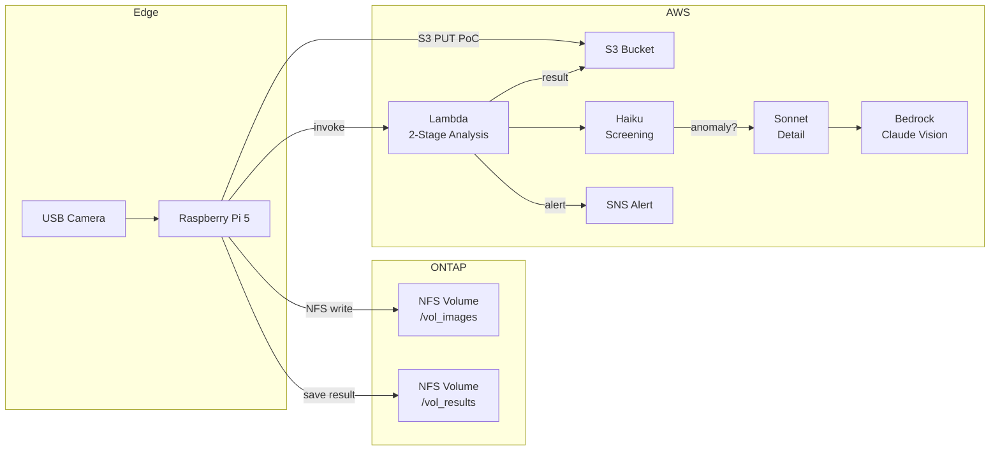

# Use Case: 3D Print Quality Monitoring

> カメラ画像を ONTAP に保存し、Bedrock Claude Vision で印刷品質を自動検査する

## アーキテクチャ

## 使用パターン

- **Pattern A** (FPolicy → Lambda): 本番構成
- **PoC shortcut**: Pi → S3 直接 + Lambda invoke（SnapMirror 設定前）

## コード

| ファイル | 場所 | 役割 |
|---------|------|------|
| `simple_capture.py` | [edge/raspberry-pi/camera/](../../edge/raspberry-pi/camera/simple_capture.py) | 撮影 → NFS 保存 → Lambda invoke |
| `handler.py` (image_analyzer) | [cloud/ai/image_analyzer/](../../cloud/ai/image_analyzer/handler.py) | 2段階 AI 分析 (Haiku + Sonnet) |
| `handler.py` (feedback) | [cloud/ai/feedback_recorder/](../../cloud/ai/feedback_recorder/handler.py) | 精度フィードバック記録 |
| `template.yaml` | [cloud/ingestion/](../../cloud/ingestion/template.yaml) | 共有インフラ (S3, Kinesis, IAM, Glue) |

## 前提条件

- Raspberry Pi 5 (16GB) + USB カメラ (4K)
- ONTAP 9.13.1+ (NFS ボリューム作成済み)
- AWS アカウント (Bedrock Claude モデルアクセス有効化済み)
- Pi ↔ ONTAP 間の有線 LAN 接続

## デモ手順

→ [demo-guide.md](./demo-guide.md)

## 検証結果

- プロンプト精度: 9/9 (100%) — 実画像 + テキストシナリオ
- 2段階分析コスト: ~$40/月 (vs 単一モデル $259/月)
- レイテンシ: Haiku ~1.4s + Sonnet ~7.2s

## 関連

- [FSx-for-ONTAP-S3AccessPoints-Serverless-Patterns / event-driven-fpolicy](https://github.com/Yoshiki0705/FSx-for-ONTAP-S3AccessPoints-Serverless-Patterns/tree/main/event-driven-fpolicy) — FPolicy → Lambda の基盤パターン
- [FSx-for-ONTAP-S3AccessPoints-Serverless-Patterns / manufacturing-analytics](https://github.com/Yoshiki0705/FSx-for-ONTAP-S3AccessPoints-Serverless-Patterns/tree/main/manufacturing-analytics) — 製造業分析パターン
