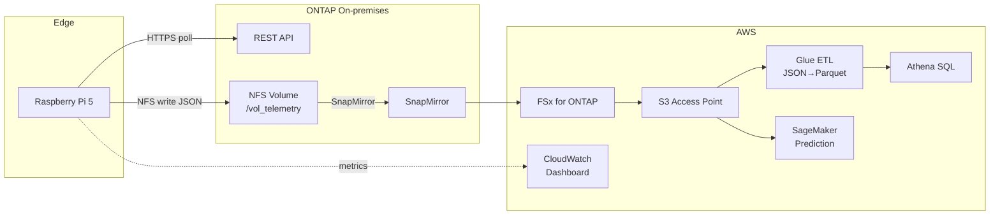

# Use Case: ONTAP Telemetry Analytics

> ONTAP REST API からパフォーマンスメトリクスを収集し、容量予測・異常検知を行う

## アーキテクチャ



## 使用パターン

- **Pattern C** (REST API → 収集): テレメトリ収集
- **Pattern B** (SnapMirror → S3 AP): クラウド分析

## コード

| ファイル | 場所 | 役割 |
|---------|------|------|
| `ontap_telemetry.py` | [edge/raspberry-pi/sensors/](../../edge/raspberry-pi/sensors/ontap_telemetry.py) | REST API ポーリング → NFS 保存 |
| `glue_etl_job.py` | [cloud/processing/](../../cloud/processing/glue_etl_job.py) | JSON → Parquet 変換 (Glue ETL) |
| `template.yaml` | [cloud/ingestion/](../../cloud/ingestion/template.yaml) | 共有インフラ |

## 収集メトリクス

| エンドポイント | メトリクス |
|--------------|-----------|
| `/api/cluster/metrics` | IOPS (read/write/total), throughput, latency |
| `/api/storage/volumes` | capacity_used, capacity_total, used_percent |
| `/api/cluster/nodes` | cpu_utilization, memory_utilization |

## 前提条件

- Raspberry Pi 5 (16GB) — ONTAP と同一 LAN
- ONTAP 9.13.1+ (REST API 有効、サービスアカウント作成済み)
- AWS アカウント (Athena, Glue, SageMaker)

## デモ手順

→ [demo-guide.md](./demo-guide.md)

## 分析例 (Athena SQL)

```sql
-- 日次の容量トレンド
SELECT
  date_format(event_timestamp, '%Y-%m-%d') AS date,
  volume_name,
  avg(capacity_used_pct) AS avg_used_pct,
  max(capacity_used_pct) AS max_used_pct
FROM processed_ontap_metrics
WHERE year = '2026'
GROUP BY 1, 2
ORDER BY 1;
```

## 関連

- [FSx-for-ONTAP-S3AccessPoints-Serverless-Patterns / manufacturing-analytics](https://github.com/Yoshiki0705/FSx-for-ONTAP-S3AccessPoints-Serverless-Patterns/tree/main/manufacturing-analytics) — 製造業分析パターン
