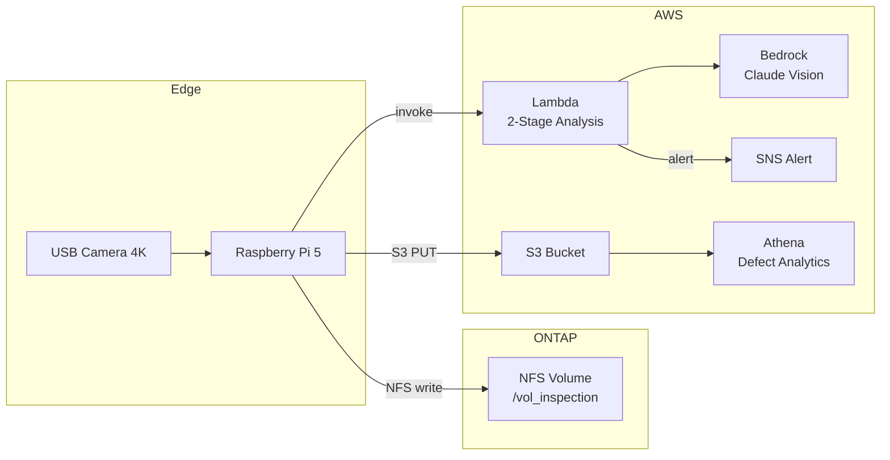

# Use Case: Visual Inspection (Manufacturing)

> 製造ラインの完成品をカメラで撮影し、傷・変色・寸法異常を自動検出する

## アーキテクチャ



## 3d-print-quality との違い

このユースケースは `3d-print-quality` と**同じ Lambda コード**を使い、**プロンプトのみ変更**して動作する。
コードの再利用性を示す例。

| 項目 | 3d-print-quality | visual-inspection |
|------|-----------------|-------------------|
| 検査対象 | 印刷中の3Dプリント | 完成品（金属/樹脂部品） |
| 欠陥タイプ | 糸引き、層間剥離 | 傷、変色、バリ、寸法異常 |
| プロンプト | 3Dプリント専用 | 製造品外観検査専用 |
| Lambda コード | **同一** | **同一** |
| インフラ | **同一** | **同一** |

## プロンプト（検査用）

```
You are a manufacturing quality inspector. Analyze this image of a finished product.

Check for:
1. Scratches - surface scratches or abrasions
2. Discoloration - color variations, stains, oxidation
3. Burrs - excess material on edges
4. Dimensional anomaly - visible warping or deformation
5. Surface roughness - uneven surface finish
6. Contamination - foreign particles or debris

Respond in JSON:
{"status": "pass"|"fail", "confidence": 0.0-1.0, "defects": [{"type": "...", "severity": "minor|major|critical", "location": "...", "description": "..."}], "recommendation": "...", "quality_score": 0-100}
```

## コード

3d-print-quality の Lambda をそのまま使用。プロンプトは Lambda 環境変数 `ANALYSIS_PROMPT` で切り替え可能。

| ファイル | 場所 | 備考 |
|---------|------|------|
| `handler.py` | [../3d-print-quality/lambda/](../3d-print-quality/lambda/handler.py) | 共通 Lambda |
| `template.yaml` | [./template.yaml](./template.yaml) | プロンプト環境変数のみ異なる |

## デプロイ

```bash
aws cloudformation deploy \
  --template-file usecases/visual-inspection/template.yaml \
  --stack-name visual-inspection \
  --parameter-overrides file://usecases/visual-inspection/params/poc.json \
  --capabilities CAPABILITY_NAMED_IAM
```
