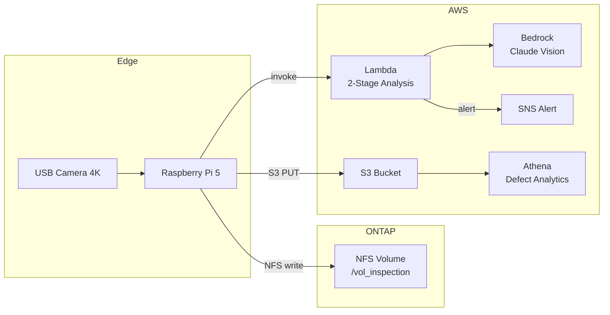

# Use Case: Visual Inspection (Manufacturing)

> 製造ラインの完成品をカメラで撮影し、傷・変色・寸法異常を自動検出する

## アーキテクチャ



## 3d-print-quality との違い

このユースケースは `3d-print-quality` と**同じ Lambda コード**を使い、**プロンプトのみ変更**して動作する。
コードの再利用性を示す例。

| 項目 | 3d-print-quality | visual-inspection |
|------|-----------------|-------------------|
| 検査対象 | 印刷中の3Dプリント | 完成品（金属/樹脂部品） |
| 欠陥タイプ | 糸引き、層間剥離 | 傷、変色、バリ、寸法異常 |
| プロンプト | 3Dプリント専用（ハンドラの既定値） | 製造品外観検査専用（テンプレートが環境変数で上書き） |
| Lambda コード | **同一** | **同一** |
| インフラ | **同一** | **同一** |

## プロンプト（検査用）

プロンプトは [`template.yaml`](./template.yaml) の `SCREENING_PROMPT` / `DETAIL_PROMPT` が
単一の真実の源である。ここには転記しない。転記すると片方だけが更新される。

応答形式はハンドラが読む語彙に合わせる必要がある。`status`（`anomaly_detected` のときだけ
通知）、`confidence`、`anomalies` の 3 つ。この対応は
[`scripts/check_lambda_env_contract.py`](../../scripts/check_lambda_env_contract.py) が
検査する。

> **訂正**: このドキュメントは以前、プロンプトを本文に転記し、`status` に `"pass"` /
> `"fail"` を返す形式を記載していた。**誤りである。** ハンドラは `anomaly_detected` しか
> 通知条件として見ないため、その形式では欠陥を検出しても通知されない。また「プロンプトは
> 環境変数 `ANALYSIS_PROMPT` で切り替え可能」とも書いていたが、その名前の環境変数は
> 存在しなかった。ハンドラはプロンプトをモジュール定数で固定しており、このユースケースを
> デプロイすると 3D プリント用プロンプトが動いていた。

## コード

3d-print-quality と同じ Lambda を使用する。プロンプトはテンプレートが環境変数として渡す。

| ファイル | 場所 | 備考 |
|---------|------|------|
| `handler.py` | [cloud/ai/image_analyzer/](../../cloud/ai/image_analyzer/handler.py) | 共通 Lambda（両ユースケースで同一） |
| `template.yaml` | [./template.yaml](./template.yaml) | プロンプトと Athena クエリが異なる |
| `design.md` | [./design.md](./design.md) | 3d-print-quality との差分のみ |
| `demo-guide.md` | [./demo-guide.md](./demo-guide.md) | 置き換える手順のみ |

必須の上書きは [`usecases/handler-map.txt`](../handler-map.txt) が宣言している。

## 検証状態

実機で確認していない。段階と根拠は[検証状態](../../docs/ja/verification-status.md)にある。
3d-print-quality 側で測った判定精度はこのユースケースの根拠にならない（対象物も欠陥の
種類も違う）。

## デプロイ

```bash
aws cloudformation deploy \
  --template-file usecases/visual-inspection/template.yaml \
  --stack-name visual-inspection \
  --parameter-overrides file://usecases/visual-inspection/params/poc.json \
  --capabilities CAPABILITY_NAMED_IAM
```
